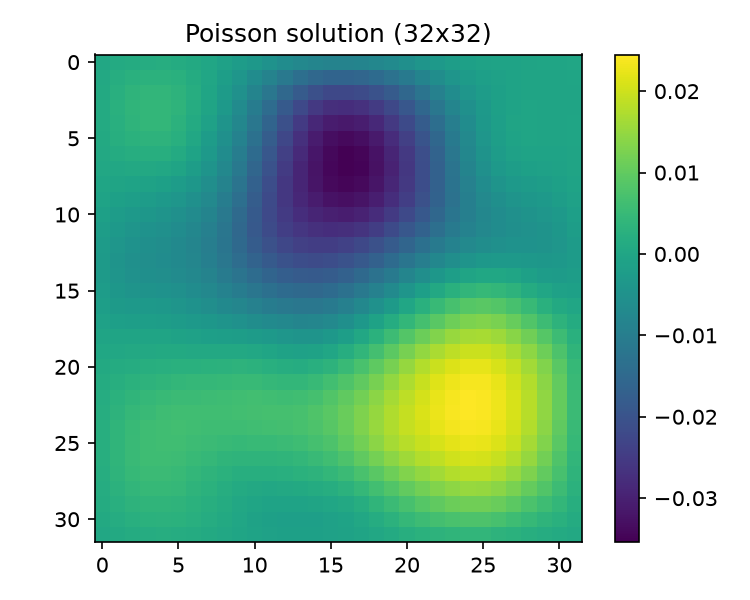
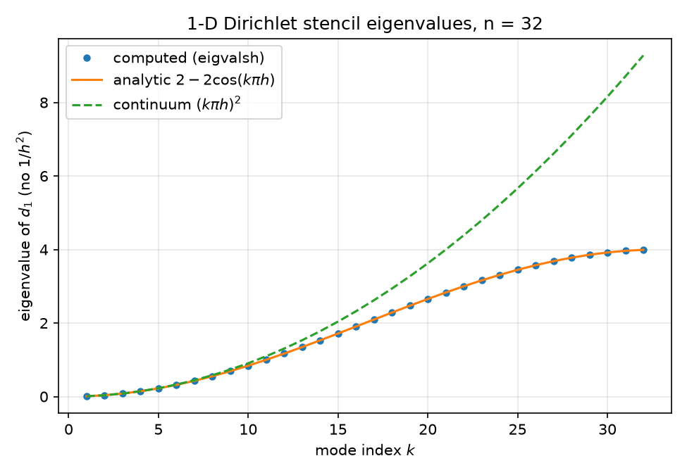
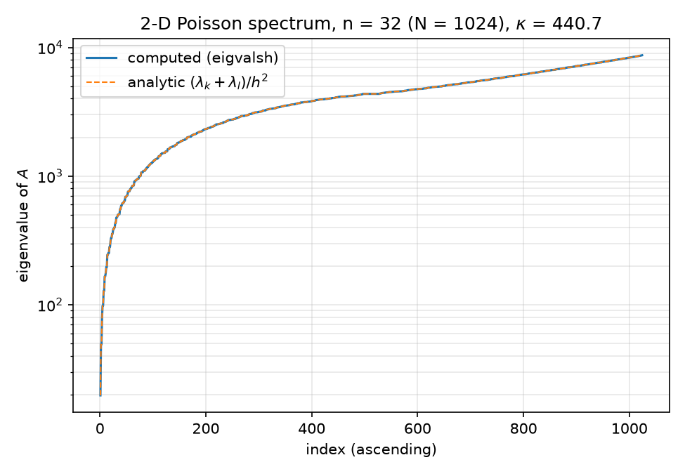

# 01 — Code Walkthrough

Complete construct-by-construct walkthrough of every piece of code in the repo: the Mathematica reference program, the Python port (with an explicit accounting of every place the port deviates and why the results are statistically equivalent but not bit-identical), and the two auxiliary Mathematica scripts. The mathematics behind the code is covered in the sibling reports — [02-eigenvalues.md](02-eigenvalues.md) (spectra), [03-gaussian-random-fields.md](03-gaussian-random-fields.md) (the GRF right-hand side), [04-krylov-and-pcg.md](04-krylov-and-pcg.md) (CG/PCG/FCG theory), [05-classical-preconditioners.md](05-classical-preconditioners.md), [06-neural-preconditioner.md](06-neural-preconditioner.md), [07-nystrom-preconditioning.md](07-nystrom-preconditioning.md), and [08-results.md](08-results.md) (all numbers in context). This report is about *the code itself*.

## 0. Repo map

```
mathematica/
  poisson_pcg.wls      # the reference program: problem + GRF + functional PCG (this report, §1)
  eigen_check.wls      # analytic-spectrum verification (§4; math in report 02)
  nystrom_pcg.wls      # randomized Nystrom preconditioner in Wolfram (§5; math in report 07)
python/
  poisson.py           # operators + GRF RHS — port of poisson_pcg.wls setup (§2.1)
  pcg.py               # pcg (classical) + flexible_pcg (Notay) (§2.2)
  preconditioners.py   # identity / jacobi / ilu factories (§2.3)
  nystrom.py           # NystromPreconditioner class (§6; full treatment in report 07)
  neural/
    npo.py             # NAMG-lite network + NPOPreconditioner wrapper (§6; report 06)
    train_npo.py       # NPO training (report 06)
    eval_npo.py        # NPO vs CG evaluation (report 06)
  experiments/
    run_baseline.py    # CG vs Jacobi baseline — port of poisson_pcg.wls driver (§2.4)
    spectra.py         # eigenvalue verification — Python analogue of eigen_check.wls (report 02)
    run_nystrom.py     # Nystrom ranks 16..256 + exact preconditioned kappa (report 07)
    npo_spectrum.py    # column-linearized NPO spectrum (report 06)
    run_all.py         # consolidated benchmark -> results/results.json (report 08)
results/               # *.json summaries + npo_checkpoint.pt
figures/               # all PNGs; mma_* are Mathematica exports
```

---

## 1. The Mathematica reference: [mathematica/poisson_pcg.wls](../mathematica/poisson_pcg.wls)

A single `wolframscript` file that (i) builds the 5-point discrete Laplacian on a $32\times32$ interior grid, (ii) samples a Gaussian-random-field right-hand side, (iii) solves with CG and Jacobi-PCG using a purely functional PCG written around `NestWhile`, and (iv) exports three figures (`figures/mma_source_grf.png`, `figures/mma_solution.png`, `figures/mma_convergence.png`).

### 1.1 Problem setup (lines 26–36): `Band`, `SparseArray`, `KroneckerProduct`

```wolfram
n = 32;
h = 1.0/(n + 1);

d1 = SparseArray[
  {Band[{1, 1}] -> 2.0, Band[{2, 1}] -> -1.0, Band[{1, 2}] -> -1.0},
  {n, n}];
id = IdentityMatrix[n, SparseArray];

A = (KroneckerProduct[d1, id] + KroneckerProduct[id, d1])/h^2;
```

- **`Band[{i, j}] -> v`** inside `SparseArray` fills the diagonal band *starting* at position $(i,j)$ and stepping by $(+1,+1)$ with the constant `v`. So `Band[{1,1}] -> 2.0` is the main diagonal, `Band[{2,1}] -> -1.0` the first subdiagonal, `Band[{1,2}] -> -1.0` the first superdiagonal. Result: the tridiagonal $[-1, 2, -1]$ second-difference stencil for a homogeneous Dirichlet problem on $n$ interior nodes, **without** the $1/h^2$ scaling:

$$
d_1 = \begin{pmatrix} 2 & -1 & & \\ -1 & 2 & -1 & \\ & \ddots & \ddots & \ddots \\ & & -1 & 2 \end{pmatrix} \in \mathbb{R}^{n\times n}.
$$

  The values are written as machine reals (`2.0`, not `2`) so the `SparseArray` is packed real from the start — no exact-integer arithmetic leaks into the solver.
- **`IdentityMatrix[n, SparseArray]`** — the second argument requests a sparse representation (a long-standing form, available since at least the 11.3-era releases); a dense identity would make the Kronecker products dense $1024\times1024$ blocks.
- **`KroneckerProduct` sum.** The 2-D operator is the standard tensor-sum construction
$$
A \;=\; \frac{1}{h^2}\left(d_1 \otimes I \;+\; I \otimes d_1\right) \in \mathbb{R}^{n^2 \times n^2},
$$
  which is exactly the 5-point stencil $\frac{1}{h^2}[4u_{ij} - u_{i\pm1,j} - u_{i,j\pm1}]$ acting on grid functions flattened with the **first index slowest** (Mathematica `Flatten` order = row-major = C order; flat index $k = i\,n + j$). The tensor-sum structure is what makes the eigenvalues separable, $\Lambda_{k,l} = (\lambda_k + \lambda_l)/h^2$ — verified numerically in [eigen_check.wls](../mathematica/eigen_check.wls) (§4) and derived in [02-eigenvalues.md](02-eigenvalues.md). $A$ is SPD with **constant diagonal** $4/h^2 = 4\cdot 33^2 = 4356$; this single fact drives the Jacobi-equals-CG result in §1.4.

### 1.2 Gaussian random field RHS (lines 40–48)

```wolfram
alpha = 2.0;
tau = 3.0;
freqs = N@RotateRight[Range[-n/2, n/2 - 1], n/2]*n;
spectrum = 1.0/(Outer[Plus, freqs^2, freqs^2] + tau^2)^(alpha/2.0);
SeedRandom[42];
noise = RandomVariate[NormalDistribution[], {n, n, 2}] . {1, I};
grfRaw = Re@InverseFourier[noise*spectrum, FourierParameters -> {-1, -1}];
b = Standardize@Flatten@grfRaw;
grf = ArrayReshape[b, {n, n}];
```

This samples a mean-zero GRF with Matérn-like spectral density $(\vert k\vert ^2+\tau^2)^{-\alpha/2}$, the RHS distribution used for Poisson benchmarks in the FNO paper (Li et al., ICLR 2021), and the training/test distribution for the NPO ([06-neural-preconditioner.md](06-neural-preconditioner.md)). The math is in [03-gaussian-random-fields.md](03-gaussian-random-fields.md); here is what each construct does:

- **The frequency grid `RotateRight` trick.** `Range[-n/2, n/2-1]` is $[-16,-15,\dots,15]$. `RotateRight[list, n/2]` moves the **last** $n/2 = 16$ elements to the front, giving
$$
[\,0, 1, \dots, 15,\; -16, -15, \dots, -1\,],
$$
  i.e. exactly the DFT frequency-bin ordering (`numpy.fft.fftfreq(n)*n` ordering): non-negative frequencies first, then the negative ones. This is required because `InverseFourier` consumes coefficients in standard DFT bin order, not in "sorted frequency" order. The whole list is then multiplied by `n` (so the entries are $\{0, n, 2n, \dots\} \cup \{-n^2/2, \dots\}$) and wrapped in `N@` to force machine reals. The `*n` scaling only changes the *effective* $\tau$ (the spectrum shape parameter); it is reproduced verbatim in the port.
- **`spectrum`** — `Outer[Plus, freqs^2, freqs^2]` is the $n\times n$ matrix $f_x^2 + f_y^2 = \vert k\vert ^2$; the spectrum is $(\vert k\vert ^2+\tau^2)^{-\alpha/2}$ elementwise, with $\alpha = 2$, $\tau = 3$.
- **Complex white noise via a dot with `{1, I}`.** `RandomVariate[NormalDistribution[], {n, n, 2}]` draws an $n\times n\times 2$ real standard-normal tensor; dotting the last axis with `{1, I}` forms $\xi = \xi_{\mathrm{re}} + i\,\xi_{\mathrm{im}}$ — an $n\times n$ complex circular Gaussian with $\mathbb{E}\vert \xi\vert ^2 = 2$. This is a compact idiom for complex noise: one `RandomVariate` call, one `Dot`, and the draw order (all reals for the field, real/imag interleaved along the last axis) is fully determined — which matters for RNG-reproducibility of the Mathematica run itself. Note the noise is **not** Hermitian-symmetrized, so `InverseFourier` of `noise*spectrum` is genuinely complex; the `Re@` projection is what makes the field real (this halves the variance relative to a Hermitian construction — irrelevant here because of the final standardization; see [03-gaussian-random-fields.md](03-gaussian-random-fields.md)).
- **`FourierParameters -> {-1, -1}` conventions.** Mathematica's transforms are a two-parameter family $\{a, b\}$:
$$
\text{Fourier: } v_s = \frac{1}{n^{(1-a)/2}} \sum_{r=1}^{n} u_r\, e^{2\pi i\, b\,(r-1)(s-1)/n},
\qquad
\text{InverseFourier: } u_r = \frac{1}{n^{(1+a)/2}} \sum_{s=1}^{n} v_s\, e^{-2\pi i\, b\,(r-1)(s-1)/n}.
$$
  With $a = -1$, $b = -1$: `InverseFourier` has prefactor $n^{-(1+a)/2} = n^0 = 1$ (**no normalization**) and kernel $e^{+2\pi i (r-1)(s-1)/n}$ (**plus sign**, because $b=-1$ flips the inverse kernel's sign). So `InverseFourier[..., FourierParameters -> {-1,-1}]` is the *unnormalized* synthesis DFT — the same kernel as `numpy.fft.ifft2` but **larger by the factor $n^2$** (NumPy divides by $n$ per axis). $\{-1,-1\}$ is not one of Wolfram's named conventions ($\{0,1\}$ default, $\{-1,1\}$ "data analysis", $\{1,-1\}$ "signal processing"): it borrows the signal-processing kernel sign $b=-1$ but, via $a=-1$, puts the entire $1/n$-per-axis normalization on `Fourier` instead of splitting it. The default $\{0,1\}$ would give a $1/\sqrt{n}$ symmetric normalization and a minus-sign inverse kernel.
- **`Standardize@Flatten@grfRaw`** — flatten row-major, then `Standardize` subtracts the mean and divides by the **sample** standard deviation (the $1/(m-1)$ estimator). Two consequences: (i) any overall constant — including the $n^2$ FFT normalization and the $\mathrm{Re}$-projection variance factor — is annihilated, and (ii) the Python port must use `ddof=1`, not NumPy's default `ddof=0` (§2.1). The standardized flat vector `b` is the RHS; `grf` reshapes it back only for plotting.

### 1.3 The functional PCG (lines 57–74): `PCGSolve`

```wolfram
PCGSolve[matA_, vecB_, precondFunc_, maxIter_ : 1000, tol_ : 10^-10] :=
  Module[{bNorm = Norm[vecB], pcgStep, result},
    pcgStep[{x_, r_, p_, rz_, _}] :=
      Module[{Ap = matA . p, aStep, xNew, rNew, zNew, rzNew, relRes},
        aStep = rz/(p . Ap);          (* alpha_k = (r.z)/(p.Ap) *)
        xNew = x + aStep*p;
        rNew = r - aStep*Ap;
        relRes = Norm[rNew]/bNorm;
        Sow[relRes];
        zNew = precondFunc[rNew];
        rzNew = rNew . zNew;
        {xNew, rNew, zNew + (rzNew/rz)*p, rzNew, relRes}];
    result = Reap[
      Sow[1.0];
      NestWhile[pcgStep,
        {0.*vecB, vecB, precondFunc[vecB], vecB . precondFunc[vecB], 1.0},
        (#[[5]] > tol &), 1, maxIter]];
    {result[[1, 1]], result[[2, 1]]}];
```

This is Saad's Algorithm 9.1 (PCG) written with **no mutable state**: the entire iteration is a pure function `pcgStep` from a 5-tuple to a 5-tuple, driven by `NestWhile`. Dissection:

- **The state tuple $\{x, r, p, rz, \mathit{relres}\}$.** Everything CG needs to advance one step: the iterate $x_k$, residual $r_k = b - Ax_k$, search direction $p_k$, the cached inner product $rz = r_k^\top z_k = r_k^\top M^{-1} r_k$ (avoids recomputing it in both $\alpha_k$ and $\beta_k$ — it is the *denominator* of the next $\beta$), and the last relative residual — carried **solely so the halting predicate can see it** (note the input pattern `{x_, r_, p_, rz_, _}` deliberately ignores slot 5 with a blank `_`: the step never reads it, only writes it).
- **`pcgStep` as a local downvalue.** `pcgStep` is a `Module`-local symbol given a delayed definition on the tuple pattern. Per application it does exactly one sparse matvec (`Ap = matA . p`), one preconditioner apply (`precondFunc[rNew]`), two inner products (`p.Ap`, `rNew.zNew`), and three AXPYs — the canonical PCG cost. The recurrences implemented:
$$
\alpha_k = \frac{r_k^\top z_k}{p_k^\top A p_k},\quad
x_{k+1} = x_k + \alpha_k p_k,\quad
r_{k+1} = r_k - \alpha_k A p_k,\quad
z_{k+1} = M^{-1} r_{k+1},\quad
\beta_k = \frac{r_{k+1}^\top z_{k+1}}{r_k^\top z_k},\quad
p_{k+1} = z_{k+1} + \beta_k p_k .
$$
  The $\beta$ is the standard PCG ("Fletcher–Reeves-form") ratio of successive $r^\top z$ products; see [04-krylov-and-pcg.md](04-krylov-and-pcg.md) for why this is only valid when $M$ is a *fixed SPD linear operator* — the precise property the neural preconditioner violates ([06-neural-preconditioner.md](06-neural-preconditioner.md)).
- **`Sow`/`Reap` residual collection.** Rather than threading a growing list through the state (which would make each step $O(\text{hist})$ in rewriting), the step `Sow`s one scalar `relRes` per iteration into the dynamically-scoped `Reap` surrounding the `NestWhile`. `Sow[1.0]` before the loop seeds the history with the $k=0$ value $\Vert r_0\Vert /\Vert b\Vert  = 1$ (since $x_0=0 \Rightarrow r_0=b$). `Reap[expr]` returns `{expr, {sownLists}}`; hence `result[[1, 1]]` is the first component of the final state tuple ($x$) and `result[[2, 1]]` the flat list of sown residuals. **Convention: iterations performed = `Length[resHist] - 1`** — used in the driver's `Length[resNone] - 1` and preserved verbatim in the Python port.
- **`NestWhile` as the driver / halting semantics.** `NestWhile[f, init, test, 1, maxIter]` repeatedly applies `f` while `test` — applied to the most recent `1` result (the fourth argument) — returns `True`, but at most `maxIter` times. The predicate is `(#[[5]] > tol &)`: continue while the state's 5th slot (last relres) exceeds `tol`. Two subtleties: (i) the test is evaluated on the **initial** state too, so a `b` with `relres = 1.0 <= tol` would return immediately with zero iterations — irrelevant in practice but semantically clean; (ii) when `maxIter` is exhausted, `NestWhile` simply returns the current state — no error — so a non-converged run is distinguishable only by its final relres (the Python port makes the same choice; `run_all.py` records an explicit `converged` flag instead).
- **Initial state** `{0.*vecB, vecB, precondFunc[vecB], vecB . precondFunc[vecB], 1.0}`: $x_0 = 0$ (written `0.*vecB` so it stays a packed real array of the right shape), $r_0 = b$, $p_0 = z_0 = M^{-1}b$, $rz_0 = b^\top M^{-1} b$, relres $=1$. Note `precondFunc[vecB]` is evaluated twice here (once for $p_0$, once inside the inner product) — a 1-extra-apply inefficiency at setup that the Python port removes by storing `z`.
- **One "wasted" preconditioner apply at the end.** The step computes `zNew = precondFunc[rNew]` *before* the halting test can see the new relres, so the final iteration performs an $M$-apply whose result is never used. The Python port has the identical property (it appends `relres`, computes `z = M(r)`, updates `p`, and only then breaks) — deliberate, to keep the two residual histories aligned index-by-index.
- **Defaults**: `maxIter_ : 1000`, `tol_ : 10^-10`. `10^-10` is an exact rational; comparing a machine real against it is fine (it gets numericized in the comparison). The Python port uses `tol=1e-10` but `maxiter=2000` — see the divergence table in §3.

### 1.4 The solves (lines 78–88) and the Jacobi construction

```wolfram
{xNone, resNone} = PCGSolve[A, b, Identity];
...
invDiag = 1.0/Normal[Diagonal[A]];
{xJacobi, resJacobi} = PCGSolve[A, b, invDiag*# &];
```

- Plain CG is PCG with `precondFunc = Identity` — the built-in identity *function*, cute and exact.
- **`Normal[Diagonal[A]]` — the sparse-background gotcha.** `Diagonal[A]` of a `SparseArray` is itself a `SparseArray` with background (default) element `0.`. Evaluating `1.0/sparseVector` would map the *background* through the reciprocal too, producing `ComplexInfinity` on any structurally-unstored entry. `Normal` densifies first so the elementwise reciprocal is safe. (Here the diagonal is the constant 4356 and dense anyway, but the idiom is written defensively — and it matters for `variable_poisson_2d` where the port applies the same construction to a genuinely non-constant diagonal.)
- The Jacobi preconditioner is the closure `invDiag*# &`, i.e. $z = D^{-1} r$ elementwise. Since $D = (4/h^2) I$ **exactly** for this operator, Jacobi is a positive scalar multiple of the identity, and PCG iterates are invariant under positive scaling of $M$ — so Jacobi-PCG must reproduce plain CG *iteration-for-iteration up to float rounding*. The Python run confirms this to machine precision: both take **116 iterations**, final relres `6.666547523655469e-11` (none) vs `6.666547523655465e-11` (Jacobi), max residual-history deviation `4.441e-16` (from [results/baseline.json](../results/baseline.json)). Full discussion in [05-classical-preconditioners.md](05-classical-preconditioners.md).
- Line 88 prints `Norm[xNone - xJacobi]` as a direct solution-mismatch check.

### 1.5 Figures (lines 93–116)

Wolfram 15.0 has no built-in `"Viridis"` color function, so lines 93–97 build one as a `Blend` over nine sampled matplotlib-viridis anchors (`RGBColor[0.267, 0.005, 0.329]` … `RGBColor[0.993, 0.906, 0.144]`) — purely cosmetic, to make  visually comparable with the matplotlib default in . Exports: `ArrayPlot` of the GRF and of the reshaped Jacobi solution, and a `ListLogPlot` of both residual histories (), each at `ImageResolution -> 150` to match the Python `dpi=150`.

---

## 2. The Python port

### 2.1 [python/poisson.py](../python/poisson.py) — operators and GRF

**`laplacian_1d(n)`** (lines 18–40): `scipy.sparse.diags([-1s, 2s, -1s], offsets=[-1,0,1], format="csr")` — the exact `Band` construction of §1.1. Returns CSR.

**`poisson_2d(n)`** (lines 43–68): `h = 1/(n+1)`, then

```python
a = (sp.kron(d1, eye) + sp.kron(eye, d1)) / h**2
```

— literally the `KroneckerProduct` line. The module docstring (lines 9–11) pins down the flattening convention: matrices act on grid functions flattened row-major (C order), flat index $k = i\,n + j$ with the first axis slowest — **the same as Mathematica's `Flatten`** — so the operator, RHS, and any reshape-for-plotting agree between the two languages with no permutation.

**`variable_poisson_2d(n, contrast=100.0)`** (lines 71–128): new in the port (no Mathematica counterpart) — a finite-volume discretization of $-\nabla\!\cdot(a\nabla u)$ with the piecewise coefficient $a = 1$ for $x<\tfrac12$, $a = \text{contrast}$ for $x\ge\tfrac12$. Construction:

- nodal coefficients `a_nodes = where(x < 0.5, 1, contrast)` at $x_i = ih$ (lines 111–112);
- **harmonic-mean face transmissibilities** in $x$ (lines 116–119):
$$
w_{i+1/2} = \frac{2\,a_i\,a_{i+1}}{a_i + a_{i+1}},
$$
  the flux-continuity-preserving average at a material interface (LeVeque, Sec. 2.15); boundary faces copy the adjacent nodal value since $a$ is constant near each boundary;
- the $x$-direction tridiagonal `tx = diags([-w[1:-1], w[:-1]+w[1:], -w[1:-1]])` (lines 121–125): row $i$ has diagonal $w_{i-1/2}+w_{i+1/2}$ and off-diagonals $-w_{i\pm 1/2}$;
- because $a$ depends only on $x$, the $y$-direction stencil at row $i$ is just $a_i \cdot [-1,2,-1]$, so the assembly is the Kronecker sum (line 127)
$$
A = \frac{1}{h^2}\Bigl(T_x \otimes I + \operatorname{diag}(a)\otimes d_1\Bigr).
$$

The purpose is stated in the docstring (lines 94–96): with contrast 100, $\operatorname{diag}(A)$ jumps from $(2\cdot 1 + 2\cdot 1)/h^2 = 4356$ in the $a{=}1$ region to $(2\cdot 100 + 2\cdot 100)/h^2 = 435{,}600$ in the $a{=}100$ region, so Jacobi is no longer a scalar multiple of the identity and becomes a real preconditioner: 137 vs 771 iterations, a 5.6× reduction ([results/results.json](../results/results.json), `variable`; analysis in [05-classical-preconditioners.md](05-classical-preconditioners.md) and [08-results.md](08-results.md)).

**`grf_rhs(n, alpha=2.0, tau=3.0, seed=42)`** (lines 131–184) — the port of §1.2, with the three deliberate deviations documented in its `Notes` block (lines 147–157):

```python
f = np.roll(np.arange(-n // 2, n // 2), n // 2) * n
spectrum = 1.0 / (f[:, None] ** 2 + f[None, :] ** 2 + tau**2) ** (alpha / 2.0)
rng = np.random.default_rng(seed)
noise = rng.standard_normal((n, n, 2)) @ np.array([1.0, 1.0j])
field = np.real(np.fft.ifft2(noise * spectrum))
flat = field.ravel()
return (flat - flat.mean()) / flat.std(ddof=1)
```

Line-by-line correspondence:

| Mathematica | Python | note |
|---|---|---|
| `RotateRight[Range[-n/2, n/2-1], n/2]*n` | `np.roll(np.arange(-n//2, n//2), n//2) * n` | `np.roll(·, +k)` also moves the last $k$ elements to the front — identical output `[0..15, -16..-1]*32` |
| `Outer[Plus, freqs^2, freqs^2]` | `f[:,None]**2 + f[None,:]**2` | broadcasting = `Outer[Plus, ...]` |
| `RandomVariate[...,{n,n,2}] . {1,I}` | `rng.standard_normal((n,n,2)) @ [1, 1j]` | same construction, **different RNG stream** |
| `Re@InverseFourier[·, FourierParameters->{-1,-1}]` | `np.real(np.fft.ifft2(·))` | same $e^{+2\pi i k\cdot x}$ kernel; differ by the constant $n^2$ (Mathematica unnormalized, NumPy divides by $n^2$) |
| `Standardize@Flatten@grfRaw` | `(flat - flat.mean()) / flat.std(ddof=1)` | `ravel()` is row-major = `Flatten`; `ddof=1` = sample std = `Standardize` |

Why the $n^2$ and $\mathrm{Re}$ factors don't matter: both are overall positive constants on the field, and the final standardization maps the field affinely to mean 0 / sample-std 1, so *any* overall scaling cancels exactly. The only non-cancelling difference is the RNG stream itself — see §3.

### 2.2 [python/pcg.py](../python/pcg.py) — `pcg` and `flexible_pcg`

**`pcg(A, b, M=None, tol=1e-10, maxiter=2000)`** (lines 15–81) is the imperative transliteration of `PCGSolve`, one Mathematica state-slot per Python local:

| `PCGSolve` | `pcg` (line) | |
|---|---|---|
| `{0.*vecB, vecB, precondFunc[vecB], vecB.precondFunc[vecB], 1.0}` | `x = zeros; r = b.copy(); z = M(r); p = z.copy(); rz = r @ z` (61–65) | init; the port computes `M(b)` **once** (the .wls evaluates it twice) |
| `Ap = matA . p` | `Ap = A @ p` (68) | one matvec |
| `aStep = rz/(p . Ap)` | `alpha = rz / (p @ Ap)` (69) | |
| `xNew = x + aStep*p; rNew = r - aStep*Ap` | lines 70–71 | |
| `relRes = Norm[rNew]/bNorm; Sow[relRes]` | `res_hist.append(norm(r)/bnorm)` (72–73) | `res_hist = [1.0]` (line 59) plays `Sow[1.0]`; iterations = `len(res_hist) - 1` |
| `zNew = precondFunc[rNew]; rzNew = rNew.zNew` | `z = M(r); rz_new = r @ z` (74–75) | same "wasted" final apply as the .wls (§1.3) |
| `zNew + (rzNew/rz)*p` | `p = z + (rz_new/rz) * p` (76) | Fletcher–Reeves-form $\beta$ |
| `NestWhile[..., #[[5]] > tol &, 1, maxIter]` | `for _ in range(maxiter): ...; if relres <= tol: break` (67, 78–79) | continue-while `> tol` ≡ break-when `<= tol`; both cap at `maxiter` and return silently on non-convergence |

`M=None` maps to an identity lambda (line 55); `b` is coerced to float64 (line 57). The only semantic difference from `NestWhile` is that the Python loop never tests the *initial* state — harmless since `res_hist[0] = 1.0 > tol` for any meaningful tolerance. Neither implementation guards `bnorm == 0`.

**`flexible_pcg(A, b, M, ...)`** (lines 84–141) is identical except for one line — the search-direction update (line 134):

```python
beta = (z_new @ (r_new - r)) / rz  # Polak-Ribiere (Notay 2000)
```

i.e. $\beta_k = z_{k+1}^\top (r_{k+1} - r_k) / (z_k^\top r_k)$, the Polak–Ribière form of Notay, *Flexible Conjugate Gradients*, SIAM J. Sci. Comput. 22(4), 2000. It subtracts the stale component $z_{k+1}^\top r_k$ that the Fletcher–Reeves ratio silently assumes is zero — an assumption that holds only for a fixed SPD $M$ and is *false* for the ReLU-bearing NPO. The cost is one extra stored vector (`r` is kept alongside `r_new`, lines 130–136). Consequence in the results: FCG+NPO converges in **30** iterations while plain PCG+NPO stalls at relres `9.653e-06` after 2000 iterations ([results/results.json](../results/results.json), `fcg_npo` / `cg_npo`); the mechanism is dissected in [04-krylov-and-pcg.md](04-krylov-and-pcg.md) and [06-neural-preconditioner.md](06-neural-preconditioner.md).

### 2.3 [python/preconditioners.py](../python/preconditioners.py)

Three factories, each returning a callable $z = M(r) \approx A^{-1} r$ — the exact interface of `precondFunc` in the .wls:

- **`identity()`** (line 11): `lambda r: r`. Provided for symmetry; `pcg(M=None)` is the same thing.
- **`jacobi(A)`** (lines 22–41): `inv_diag = 1.0 / A.diagonal()` then `lambda r: r * inv_diag` — the port of `invDiag*# &`. SciPy's `.diagonal()` returns a dense ndarray, so the `Normal[...]` densification gotcha of §1.4 does not arise. The docstring (lines 25–29) restates the scalar-multiple-of-identity fact for `poisson_2d`.
- **`ilu(A, **kw)`** (lines 44–60): `scipy.sparse.linalg.spilu(A.tocsc(), **kw)` (SuperLU incomplete LU; CSC required) wrapped as `lambda r: fac.solve(np.asarray(r, dtype=np.float64))`. With `spilu` defaults this is by far the strongest classical option in the suite: **5 iterations** to `6.212e-13`, solve wall `0.00024 s` plus `0.00100 s` setup ([results/results.json](../results/results.json), `cg_ilu`; discussion in [05-classical-preconditioners.md](05-classical-preconditioners.md)). No Mathematica counterpart.

### 2.4 [python/experiments/run_baseline.py](../python/experiments/run_baseline.py) — the driver port

Port of the .wls driver (§1.4) plus verification the Mathematica script lacks. Flow of `main()` (lines 34–108):

1. `A = poisson_2d(32)`, `b = grf_rhs(32, alpha=2.0, tau=3.0, seed=42)` (lines 36–37).
2. `pcg(A, b, M=None)` and `pcg(A, b, M=jacobi(A))` (lines 39–40); iteration counts via `len(res) - 1` (lines 42–43) — the `Length[resHist] - 1` convention.
3. **Direct-solve verification** (lines 50–53): `spla.spsolve(A.tocsc(), b)` and relative errors. From [results/baseline.json](../results/baseline.json): `relerr_vs_spsolve_none = 5.3995e-12`, `relerr_vs_spsolve_jacobi = 5.3995e-12`.
4. **Jacobi≡CG check** (lines 57–59): max elementwise deviation between the two residual histories over their common length — `4.441e-16`, i.e. two ULPs at scale 1; recorded into the JSON `note`.
5. Figures (lines 66–89):  (semilogy of both histories), ,  (both via `field.reshape(n, n)` — valid because of the shared row-major convention).
6. JSON summary → [results/baseline.json](../results/baseline.json) (lines 91–107): 116/116 iterations, final relres `6.666547523655469e-11` / `6.666547523655465e-11`. These records are bit-identical to the `canonical.cg_none` / `cg_jacobi` entries later produced by `run_all.py` in [results/results.json](../results/results.json) — the whole pipeline is deterministic (fixed seeds, single-threaded sparse matvecs).

Boilerplate worth noting: `matplotlib.use("Agg")` before pyplot (headless safety, lines 20–22) and `sys.path.insert(0, ...parents[1])` (line 27) so `python/` modules import without packaging.

---

## 3. Divergence ledger: every place the port differs, and why results match statistically but not bit-for-bit

| # | Divergence | Mathematica | Python | Consequence |
|---|---|---|---|---|
| 1 | **RNG** | `SeedRandom[42]` → Wolfram's default generator (ExtendedCA-family); draw order fixed by the single `{n,n,2}` `RandomVariate` | `np.random.default_rng(42)` → PCG64 | **The one real divergence.** The two `b` vectors are different samples from the *same* distribution (the pipeline after the raw draws is exactly equivalent, items 2–4). Hence Mathematica iteration counts need not equal Python's 116; they agree statistically (same $\kappa(A)$, same GRF law). No cross-language bit-match is possible or claimed — [results/*.json](../results/results.json) numbers all come from the Python runs. |
| 2 | **FFT normalization** | `InverseFourier[·, {-1,-1}]`: prefactor 1 | `np.fft.ifft2`: prefactor $1/n^2$ | Same $e^{+2\pi i k\cdot x}$ kernel; pure constant factor $n^2$, annihilated by standardization. Zero statistical effect. |
| 3 | **Std-dev estimator** | `Standardize` uses sample std ($m{-}1$) | `flat.std(ddof=1)` | Matched deliberately; NumPy's default `ddof=0` divisor is *smaller* by $\sqrt{1023/1024}$, so using it would rescale `b` up by $\sqrt{1024/1023}$ — still harmless for CG iterates (scale invariance) but would break bit-level determinism *within* Python between the two choices. |
| 4 | **Flattening order** | `Flatten` row-major | `ravel()` row-major (C order) | Matched exactly; no permutation anywhere. |
| 5 | **`maxiter` default** | 1000 | 2000 | Immaterial for converging runs (max observed: 771). The larger cap exists so the deliberately-failing `cg_npo` run can demonstrate its stall at 2000 iterations ([08-results.md](08-results.md)). |
| 6 | **tol type / halting test** | exact rational `10^-10`; `NestWhile` continues while `relres > tol`, tests initial state | float `1e-10`; `break` when `relres <= tol`, never tests initial state | Logically identical for `res_hist[0] = 1.0`; same histories index-by-index. |
| 7 | **Setup $M$-applies** | `precondFunc[vecB]` evaluated twice at init | `z = M(r)` once, reused | Cost-only; identical numbers. |
| 8 | **Extras with no .wls counterpart** | — | `variable_poisson_2d`, `ilu`, `flexible_pcg`, `spsolve` verification, `NystromPreconditioner` (Python class), NPO | Additive; the shared subset (CG/Jacobi on the canonical problem) is the correspondence surface. |

Bottom line: **within Python** everything is bit-deterministic (fixed seeds; reruns reproduce [results/baseline.json](../results/baseline.json), [results/nystrom.json](../results/nystrom.json), [results/npo_eval.json](../results/npo_eval.json) exactly). **Across languages** items 2–4 and 6–7 are exact equivalences; item 1 (RNG) is the sole source of discrepancy and is irreducible without implementing one RNG inside the other.

---

## 4. [mathematica/eigen_check.wls](../mathematica/eigen_check.wls) — brief

Rebuilds `d1` and `A` exactly as in §1.1, then verifies against closed forms (derivations in [02-eigenvalues.md](02-eigenvalues.md)):

- **1-D** (lines 29–32): `Eigenvalues[Normal[d1]]` vs $\lambda_k = 2 - 2\cos\!\big(k\pi/(n{+}1)\big)$, compared after `Sort` on both sides.
- **2-D** (lines 35–38): dense `Eigenvalues[Normal[A]]` ($1024\times1024$ — fine at this size) vs the tensor sums `Flatten@Outer[Plus, lam1d, lam1d]/h^2`.
- **Condition number** (lines 41–45): `Max/Min` of the computed spectrum vs the analytic $\kappa(A) = \cot^2\!\big(\pi/(2(n{+}1))\big)$ — algebraically the same as the $\sin^2$-ratio form used in the Python analogue [python/experiments/spectra.py](../python/experiments/spectra.py).

The Python counterpart's verified numbers ([results/spectra.json](../results/spectra.json)): 1-D max deviation `2.220e-15`, 2-D max deviation `2.728e-11` (consistent with $\sim 10^4$-magnitude eigenvalues at float64), $\kappa$ computed `440.6885603835139` vs analytic `440.6885603836582`, asymptote $4(n{+}1)^2/\pi^2 = 441.36$.

## 5. [mathematica/nystrom_pcg.wls](../mathematica/nystrom_pcg.wls) — brief

Same problem setup and the *verbatim* `PCGSolve` (lines 22–60), plus a Wolfram implementation of the randomized Nyström preconditioner of Frangella–Tropp–Udell (https://arxiv.org/abs/2110.02820); full math in [07-nystrom-preconditioning.md](07-nystrom-preconditioning.md). `NystromPreconditioner[matA, ell, seed]` (lines 72–94):

- Gaussian sketch `Omega` ($N\times\ell$), `Y = A.Omega`; stabilization shift `nu = Sqrt[N] $MachineEpsilon ||Y||_F`; `Ynu = Y + nu*Omega`.
- Core factorization: `CholeskyDecomposition` of the explicitly **symmetrized** `(Omega^T.Ynu + (Omega^T.Ynu)^T)/2` (line 81–82) — symmetric only in exact arithmetic, so symmetrization protects the Cholesky.
- `B = Ynu.C^{-1}` via a triangular `LinearSolve` on the transpose (line 84), then thin `SingularValueDecomposition`; eigenvalues `lams = Max[0, sigma^2 - nu]` with exact-zero directions dropped (lines 86–89).
- The apply (line 93) is Eq. (5.3) at $\mu = 0$: $P^{-1}r = \lambda_\ell\, U(\Lambda^{-1}(U^\top r)) + (r - U U^\top r)$. (Equation numbering is the SIAM version's, matching [python/nystrom.py](../python/nystrom.py): the $P$/$P^{-1}$ pair is the third numbered equation of their §5 — eq. (17) of the continuously-numbered arXiv v3 — and $P$ alone is Eq. (1.3). The .wls header's citation has been corrected accordingly; "(5.2)" is the *optimal* low-rank preconditioner's condition number, not this formula.)
- **Slot-syntax gotcha** (comment, lines 91–92): the apply closure is written with `#`/`&` rather than `Function[r, ...]`, because a named parameter `r` would collide with the pattern variable `r_` used inside `PCGSolve`'s `pcgStep` — a Wolfram scoping hazard the code sidesteps by using slots.

Differences from the Python [python/nystrom.py](../python/nystrom.py) class worth flagging (details in [07-nystrom-preconditioning.md](07-nystrom-preconditioning.md)): the Python version follows Algorithm 2.1 more strictly — it **orthonormalizes the sketch** (`np.linalg.qr(omega)`, [python/nystrom.py](../python/nystrom.py) line 105) where the .wls uses the raw Gaussian `Omega`; its shift is `np.spacing(||Y||_F)` (one ULP) vs the .wls's $\sqrt{N}\,\varepsilon\,\Vert Y\Vert _F$; and it has the paper's Cholesky-failure fallback loop (`nu *= 100`, retry ×4, lines 113–124) plus a `mu > 0` generalization and a degenerate-rank guard. The .wls script runs only $\ell = 128$; the Python experiment sweeps ranks 16/64/128/256 and additionally computes the exact preconditioned condition numbers by dense eigensolves (439.62 / 434.52 / 426.58 / 407.46 vs unpreconditioned 440.69, [results/nystrom.json](../results/nystrom.json)) — the "Nyström is marginally *worse* than plain CG here" story (123/123/122/119 iterations vs 116) is told in [07-nystrom-preconditioning.md](07-nystrom-preconditioning.md) and [08-results.md](08-results.md).

## 6. The rest of `python/` — one paragraph each, with pointers

- **[python/nystrom.py](../python/nystrom.py)** — `NystromPreconditioner` class: Algorithm 2.1 steps 1–9 annotated line-by-line in the constructor (lines 103–129), the $\mu=0$ eigenvalue-drop policy (lines 135–148, rationale in the class docstring lines 53–62), and the $O(N\cdot\text{rank})$ apply `P^{-1}r = U(d \odot U^\top r) + r` with $d_i = (\lambda_\ell+\mu)/(\lambda_i+\mu) - 1$ (lines 150–172). The module docstring's "honest expectation" paragraph (lines 13–21) predicts the flat-top-spectrum failure mode before the experiment confirms it. → [07-nystrom-preconditioning.md](07-nystrom-preconditioning.md).
- **[python/neural/npo.py](../python/neural/npo.py)** — the NAMG-lite `NPO` network (lift + coordinate channels, pre/post 3×3-conv ReLU relaxations, learned-coarse-query cross-attention restriction, coarse self-attention + FFN, cross-attention prolongation with residual coarse-grid correction; forward pass lines 122–168) and the `NPOPreconditioner` wrapper (unit-norm normalization → float32 network → rescale, making the map positively 1-homogeneous; lines 205–229). The $\hat A = h^2 A$ training-scale trick (comment lines 47–53) exploits PCG's scale invariance in $M$. Toy-scale reimplementation of NPO, Li et al., https://arxiv.org/abs/2502.01337. → [06-neural-preconditioner.md](06-neural-preconditioner.md).
- **[python/neural/train_npo.py](../python/neural/train_npo.py)** — dataset of GRF RHSs (seeds 100–139) plus CG-residual snapshots at iterations (1,2,4,8,16,32,64) captured by a `_RecordingIdentity` preconditioner shim (lines 64–77); three scale-free losses (condition Eq. 9, residual Eq. 10, data loss with exact sparse-LU targets); 400 epochs, warmup + cosine LR. Writes `results/npo_checkpoint.pt` and [results/npo_training_history.json](../results/npo_training_history.json). → [06-neural-preconditioner.md](06-neural-preconditioner.md).
- **[python/neural/eval_npo.py](../python/neural/eval_npo.py)** — held-out seed-42 problem; CG vs FCG(NPO) vs plain-PCG(NPO) (the last recorded deliberately as a negative control); writes [results/npo_eval.json](../results/npo_eval.json) and . → [06-neural-preconditioner.md](06-neural-preconditioner.md).
- **[python/experiments/spectra.py](../python/experiments/spectra.py)** — Python analogue of `eigen_check.wls` plus the $\kappa(n)\sim 4(n{+}1)^2/\pi^2$ scaling study over $n\in\{8,16,32,64,128\}$ (analytic formula only, lines 83–87); writes [results/spectra.json](../results/spectra.json) and figures , , . → [02-eigenvalues.md](02-eigenvalues.md).
- **[python/experiments/run_nystrom.py](../python/experiments/run_nystrom.py)** — rank sweep with exact preconditioned spectra via the closed-form $P^{-1/2} = I + U(\sqrt{s}-1)U^\top$ symmetrization (`preconditioned_spectrum`, lines 39–66 — chosen over nonsymmetric `eig` to guarantee real eigenvalues) and the optimal-rank-$\ell$ deflation reference $\kappa_{\text{opt}} = \lambda_{\ell+1}/\lambda_{\min}$ (line 104). → [07-nystrom-preconditioning.md](07-nystrom-preconditioning.md).
- **[python/experiments/npo_spectrum.py](../python/experiments/npo_spectrum.py)** — column linearization $\tilde M[:,j] = M_\theta(e_j)$ over all 1024 basis vectors, nonsymmetric `eig` of $\tilde M A$, plus nonsymmetry ($\Vert \tilde M - \tilde M^\top\Vert _F/\Vert \tilde M\Vert _F$) and nonlinearity ($\Vert \tilde M b - M_\theta(b)\Vert /\Vert M_\theta(b)\Vert $) diagnostics; writes [results/npo_spectrum.json](../results/npo_spectrum.json) and . → [06-neural-preconditioner.md](06-neural-preconditioner.md).
- **[python/experiments/run_all.py](../python/experiments/run_all.py)** — the consolidated benchmark behind [results/results.json](../results/results.json): the full method matrix on the canonical problem, the variable-coefficient Jacobi contrast, per-method `run_method` records (`iterations / final_relres / wall_time_s / setup_time_s / relerr_vs_spsolve / converged`, lines 58–94), five sanity checks with the Nyström strict-monotonicity check deliberately *report-only* (lines 176–196 — ranks 16 and 64 tie at 123 iterations, so `nystrom_strictly_decreasing_with_rank` is `false` while the asserted non-increasing-with-overall-decrease check passes), hard `assert` on the other four (lines 254–261), and . → [08-results.md](08-results.md).
