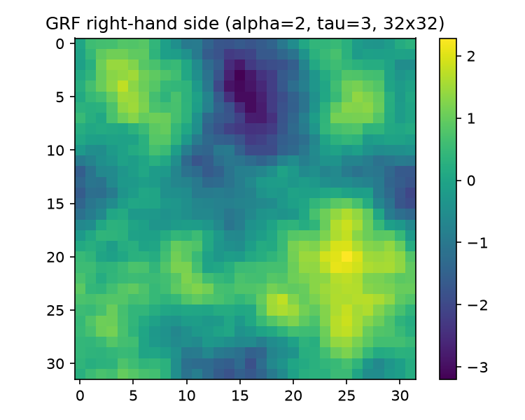
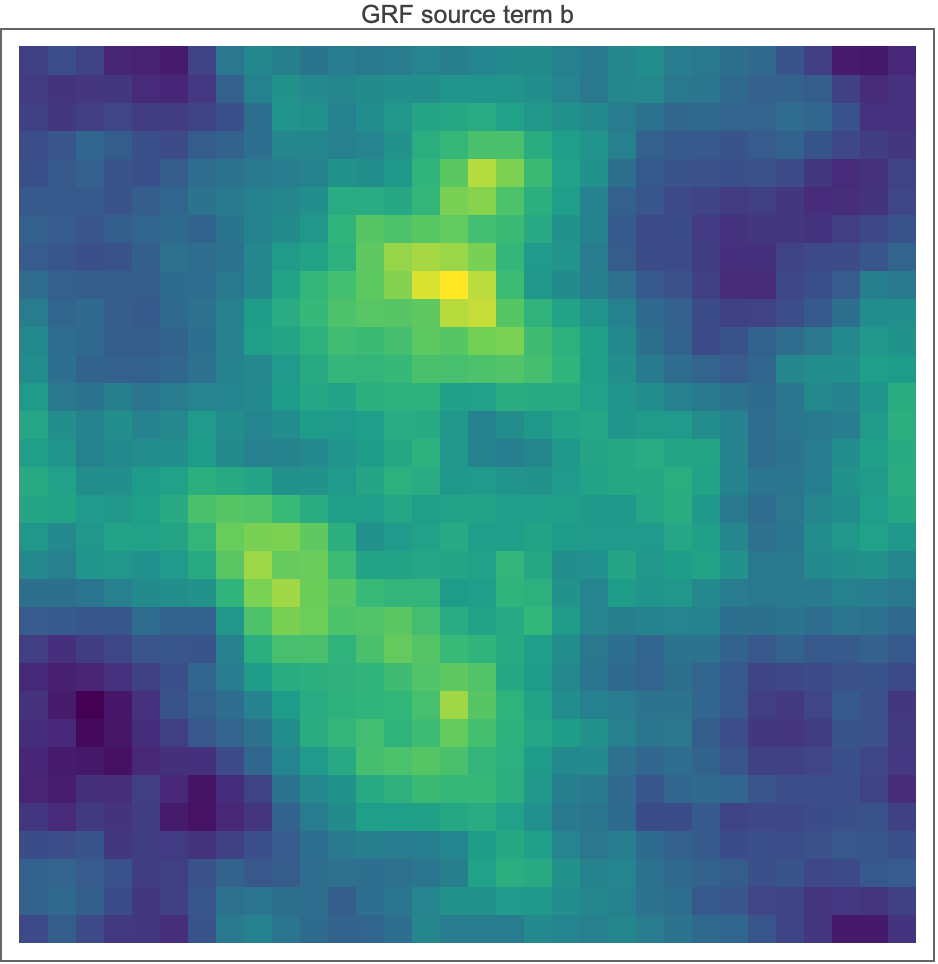

# 03 — The Gaussian-Random-Field Right-Hand Side

Every experiment in this repo solves $Ax=b$ with the same right-hand side family: a mean-zero Gaussian random field (GRF) with Matérn-type power spectrum, synthesized spectrally via the FFT. This report derives the construction line by line, explains the two non-obvious design choices (the `* n` frequency scaling and the `Re(IFFT)` of *non*-Hermitian complex noise), gives the Matérn-covariance interpretation of $(\alpha, \tau)$, and quantifies the torus-vs-Dirichlet-box mismatch.

Code under discussion:

- Python: `grf_rhs` in [python/poisson.py](../python/poisson.py) (def at line 131; the whole computation is lines 176–184 — seven statements).
- Mathematica reference: [mathematica/poisson_pcg.wls](../mathematica/poisson_pcg.wls) lines 40–47.

Context: this GRF family is the de-facto standard data distribution for neural-operator PDE benchmarks. The FNO paper (Li et al., *Fourier Neural Operator for Parametric PDEs*, ICLR 2021, [arXiv:2010.08895](https://arxiv.org/abs/2010.08895)) builds its Darcy coefficients on the base GRF $\mathcal N\!\big(0,(-\Delta+9I)^{-2}\big)$ — exactly $\alpha=2,\tau=3$ in the notation below — though the coefficients themselves are the *pushforward* $\psi_\#\,\mathcal N\big(0,(-\Delta+9I)^{-2}\big)$ of that field through a binary threshold map (so they are piecewise-constant, not Gaussian). The NPO paper ([arXiv:2502.01337](https://arxiv.org/abs/2502.01337), Sec. 5.1.2) says only that its right-hand sides are sampled "from a Gaussian Random Field (GRF)" mapped onto the same mesh as $A$ — it does not specify the spectrum or the sampling method. The defaults `alpha=2.0, tau=3.0` in `grf_rhs` follow the FNO convention as the concrete instantiation of that underspecified choice. See [06-neural-preconditioner.md](06-neural-preconditioner.md) for how 40 draws of this field (seeds 100–139) form the NPO training set, and [08-results.md](08-results.md) for everything solved against the canonical seed-42 draw.

---

## 1. The pipeline at a glance

Mathematica ([poisson_pcg.wls](../mathematica/poisson_pcg.wls) L40–47):

```wolfram
alpha = 2.0; tau = 3.0;
freqs    = N@RotateRight[Range[-n/2, n/2 - 1], n/2]*n;
spectrum = 1.0/(Outer[Plus, freqs^2, freqs^2] + tau^2)^(alpha/2.0);
SeedRandom[42];
noise    = RandomVariate[NormalDistribution[], {n, n, 2}] . {1, I};
grfRaw   = Re@InverseFourier[noise*spectrum, FourierParameters -> {-1, -1}];
b        = Standardize@Flatten@grfRaw;
```

Python port ([python/poisson.py](../python/poisson.py) L176–184):

```python
f = np.roll(np.arange(-n // 2, n // 2), n // 2) * n
spectrum = 1.0 / (f[:, None] ** 2 + f[None, :] ** 2 + tau**2) ** (alpha / 2.0)

rng = np.random.default_rng(seed)
noise = rng.standard_normal((n, n, 2)) @ np.array([1.0, 1.0j])
field = np.real(np.fft.ifft2(noise * spectrum))

flat = field.ravel()  # row-major, matching Mathematica Flatten
return (flat - flat.mean()) / flat.std(ddof=1)
```

In math: with $k=(k_1,k_2)\in\{-n/2,\dots,n/2-1\}^2$ integer wavenumbers,

$$
b(x) \;\propto\; \operatorname{Re}\!\Big[\sum_{k} \underbrace{\big(n^2\vert k\vert ^2+\tau^2\big)^{-\alpha/2}}_{S_k}\, Z_k\, e^{2\pi i\, k\cdot x/n}\Big],
\qquad Z_k = G^{(1)}_k + i\,G^{(2)}_k,\;\; G^{(j)}_k \overset{iid}{\sim}\mathcal N(0,1),
$$

followed by exact removal of the spatial mean and rescaling to unit sample variance. Sections 2–6 unpack each factor.

The port is distribution-exact but not draw-exact: NumPy's PCG64 stream under `default_rng(42)` cannot bit-match Mathematica's `SeedRandom[42]` stream, so [figures/grf_field.png](../figures/grf_field.png) and [figures/mma_source_grf.png](../figures/mma_source_grf.png) show two *different samples of the same distribution*. That is fine for the experiments — each language's suite is internally self-consistent — but it is why the two figures don't look identical.

---

## 2. The frequency grid: fftshifted ordering and the `* n` scaling

### 2.1 Ordering

`Range[-n/2, n/2-1]` is $[-16,\dots,15]$ for $n=32$; `RotateRight[..., n/2]` cyclically shifts by 16, giving

$$
[\,0,\,1,\,\dots,\,15,\,-16,\,-15,\,\dots,\,-1\,]
$$

— exactly the standard DFT ordering (DC in slot 0, positive frequencies first, then negatives), i.e. the *inverse* of `fftshift`. NumPy reproduces it with `np.roll(np.arange(-n//2, n//2), n//2)` ([poisson.py](../python/poisson.py) L176); it equals `np.fft.fftfreq(n) * n`. This ordering is mandatory because `ifft2` (and `InverseFourier`) index Fourier coefficients in DFT order — building `spectrum` on a shifted grid without unshifting would scramble which noise mode gets which amplitude. Verified numerically: the array starts `[0, 32, 64, ...]` and ends `[..., -64, -32]` after the `* n` scaling, with the unpaired Nyquist frequency $-n/2$ sitting at index 16 (`f[16] = -512`).

### 2.2 What the `* n` actually does

After scaling, the spectral amplitude at integer mode $k$ is

$$
S_k = \big(n^2 k_1^2 + n^2 k_2^2 + \tau^2\big)^{-\alpha/2}
    = n^{-\alpha}\Big(\vert k\vert ^2 + \big(\tfrac{\tau}{n}\big)^2\Big)^{-\alpha/2}.
$$

Two consequences, one trivial and one substantive:

1. **The prefactor $n^{-\alpha}$ is irrelevant.** It is a global constant, annihilated by the final standardization (Sec. 6).
2. **The effective mass parameter is $\tau_{\mathrm{eff}}=\tau/n = 3/32 = 0.09375$, not $\tau=3$.** The Matérn "knee" — the wavenumber below which the spectrum flattens — sits at $\vert k\vert \approx\tau_{\mathrm{eff}}\approx 0.094$, *below the first resolvable nonzero mode* $\vert k\vert =1$. So on every mode the field actually contains, the spectrum is a nearly pure power law $\vert k\vert ^{-\alpha}$: the relative flattening at $k=(1,0)$ is $\tau^2/n^2 = 9/1024 \approx 0.88\%$. Concretely (verified): $S_{(0,1)}/S_{(0,2)} = 3.974$ versus exactly $4$ for a pure $\vert k\vert ^{-2}$ law.

Compare the FNO-paper normalization, which uses angular wavenumbers: amplitude $\propto(4\pi^2\vert k\vert ^2+\tau^2)^{-\alpha/2}$, i.e. $\tau_{\mathrm{eff}} = \tau/2\pi \approx 0.477$ and a $\tau^2/4\pi^2 \approx 23\%$ flattening at mode 1. The `* n` convention here (with $n=32 \approx 5.1\times 2\pi$) therefore produces a *smoother, longer-range* field than FNO's at the same $(\alpha,\tau)$ — effectively scale-free across the resolved band. Same family, slightly different point in it; nothing downstream depends on this distinction since every experiment uses the one convention consistently.

The DC entry $S_{(0,0)} = \tau^{-\alpha} = 1/9 \approx 0.1111$ is enormous relative to its neighbors — $S_{(0,0)}/S_{(0,1)} = (n^2+\tau^2)/\tau^2 \cdot \ldots = 1033/9 = 114.8$ in amplitude, and the DC mode carries $99.95\%$ of the raw spectral energy $\sum_k S_k^2$ (verified: $\sum S_k^2 = 1.2351\times10^{-2}$, of which $S_{(0,0)}^2 = 1/81 = 1.2346\times10^{-2}$). This would be alarming except that a DC Fourier mode is a *spatial constant*, and `Standardize` subtracts the sample mean — which for a band-limited periodic field equals the DC component exactly (Sec. 6). So the huge DC amplitude is created and then exactly destroyed; only the $\vert k\vert \ge 1$ modes survive into $b$.

---

## 3. The power spectrum as a Matérn covariance

### 3.1 Covariance operator

A mean-zero Gaussian field with Fourier *amplitudes* $S_k \propto (\vert k\vert ^2+\tau^2)^{-\alpha/2}$ has *power spectral density* $S_k^2 \propto (\vert k\vert ^2+\tau^2)^{-\alpha}$, i.e. covariance operator

$$
C = \sigma^2\big({-\Delta} + \tau^2 I\big)^{-\alpha}
$$

on the torus (where $-\Delta$ has Fourier symbol $\vert k\vert ^2$ in the wavenumber units used — with the code's `* n` scaling the symbol is $n^2\vert k\vert ^2$, which just rescales $\tau$ per Sec. 2.2). This is exactly the base measure $\mu = \mathcal N\big(0, (-\Delta + 9I)^{-2}\big)$ that the FNO paper pushes through a threshold map to make its Darcy coefficients; the NPO paper (Sec. 5.1.2) specifies only an unqualified "Gaussian Random Field" for its right-hand sides.

### 3.2 Whittle–Matérn dictionary

The Whittle–Matérn covariance in $d$ dimensions with smoothness $\nu$ and inverse length-scale $\tau$ has spectral density

$$
\hat C(\xi) \;\propto\; \big(\vert \xi\vert ^2 + \tau^2\big)^{-(\nu + d/2)},
$$

so matching exponents gives

$$
\boxed{\;\nu = \alpha - \tfrac{d}{2}\;}\qquad\Rightarrow\qquad \nu = 2 - 1 = 1 \;\text{ for }\; \alpha=2,\ d=2 .
$$

Interpretation of the two knobs:

- **$\alpha$ controls smoothness.** Sobolev regularity of samples: $\mathbb E\,\Vert b\Vert _{H^s}^2 \propto \sum_k (1+\vert k\vert ^2)^s (\vert k\vert ^2+\tau^2)^{-\alpha} < \infty \iff 2(\alpha - s) > d$, i.e. samples lie a.s. in $H^s$ for every $s < \alpha - d/2 = 1$ and *not* in $H^1$. Equivalently Matérn $\nu=1$: continuous, but not mean-square differentiable (that requires $\nu>1$). By elliptic regularity the exact solution $u = A^{-1}b$ then sits (formally, modulo box-corner caveats) two derivatives higher, in $H^{3-\varepsilon}$ — a smooth-looking blob, cf. [figures/solution_field.png](../figures/solution_field.png).
- **$\tau$ controls correlation length**, roughly $\ell \sim 1/\tau_{\mathrm{eff}}$ in domain units. With the code's $\tau_{\mathrm{eff}} = \tau/n \approx 0.094 \ll 1$ the correlation length exceeds the domain: the field is dominated by its few lowest modes.

### 3.3 Measured correlation structure (seed-42 draw, $n=32$)

From the exact covariance formula of Sec. 4, the theoretical lag-1 (one grid cell) correlation after DC removal is $0.9698$; matching sample statistics from the actual `grf_rhs(32)` draw:

| quantity | value |
|---|---|
| corr(row 0, row 16) — half-domain separation | $0.330$ |
| corr(row 0, row 31) — wrap-around neighbors on the torus | $0.972$ |
| $\min b$, $\max b$ (after standardization) | $-3.200$, $+2.283$ |
| sample mean, sample std (ddof=1) | $2.8\times10^{-17}$, $1.000000$ |

The $0.972$ wrap-around correlation is the periodicity artifact discussed in Sec. 7.

Why this matters for the solver benchmarks: a $\vert k\vert ^{-\alpha}$-weighted $b$ concentrates energy in the *low* end of $A$'s spectrum — precisely the eigenmodes CG resolves last (see [02-eigenvalues.md](02-eigenvalues.md) for the eigenstructure and [04-krylov-and-pcg.md](04-krylov-and-pcg.md) for the convergence consequences). A white-noise $b$ would flatter the solvers; the GRF is the harder and more physical choice, and it is what the neural preconditioner is trained on, so train/test distributions match by construction.

---

## 4. Complex white noise and why `Re(IFFT)` of *non*-Hermitian noise is legitimate

### 4.1 The construction

`rng.standard_normal((n, n, 2)) @ [1, 1j]` ([poisson.py](../python/poisson.py) L180) builds

$$
Z_k = G^{(1)}_k + i\,G^{(2)}_k,\qquad G^{(1)},G^{(2)} \overset{iid}{\sim} \mathcal N(0,1),
$$

a **circularly-symmetric** complex Gaussian array: $\mathbb E[Z_k \bar Z_l] = 2\,\delta_{kl}$ and, crucially, vanishing pseudo-covariance $\mathbb E[Z_k Z_l] = 0$. Note what it is *not*: it is not Hermitian-symmetric ($Z_{-k} \ne \bar Z_k$), so `ifft2(noise * spectrum)` is a genuinely complex field, and the code simply takes its real part (L181).

A textbook spectral sampler instead enforces $Z_{-k}=\bar Z_k$ (with real DC and Nyquist modes) so the IFFT is real by construction. The `Re` shortcut skips all of that bookkeeping — including the fiddly special-casing of the self-conjugate modes $k\in\{0,n/2\}^2$ (recall the unpaired Nyquist frequency at index $n/2$, Sec. 2.1). The question is whether the result is still a stationary GRF with the right spectrum.

### 4.2 Derivation: it is, with exactly half the variance

Write the complex field ($\mathcal F^{-1}$ = `ifft2`, kernel $e^{+2\pi i k\cdot x/n}$, prefactor $1/n^2$):

$$
F(x) = \frac{1}{n^2}\sum_k S_k Z_k\, e^{2\pi i k\cdot x/n}, \qquad b_{\text{raw}}(x) = \operatorname{Re} F(x).
$$

Using $\operatorname{Re}a = \tfrac12(a+\bar a)$ and the two moment identities ($\mathbb E[Z_k\bar Z_l]=2\delta_{kl}$, $\mathbb E[Z_kZ_l]=0$):

$$
\mathbb E\big[F(x)\overline{F(y)}\big] = \frac{2}{n^4}\sum_k S_k^2\, e^{2\pi i k\cdot(x-y)/n},
\qquad
\mathbb E\big[F(x)F(y)\big] = \frac{1}{n^4}\sum_k S_k^2\,\mathbb E[Z_k^2]\,e^{\cdots} = 0 .
$$

Because $S_k$ depends on $k$ only through $\vert k\vert ^2$ (with the wrapped DFT frequencies, $f_j^2 = f_{n-j}^2$), the first sum is invariant under $k\to -k$ and hence real. Expanding $\operatorname{Re}F(x)\operatorname{Re}F(y) = \tfrac14(F(x)+\bar F(x))(F(y)+\bar F(y))$ and using both identities:

$$
\operatorname{Cov}\big(b_{\text{raw}}(x),\, b_{\text{raw}}(y)\big)
= \tfrac12 \operatorname{Re}\,\mathbb E\big[F(x)\overline{F(y)}\big]
= \frac{1}{n^4}\sum_k S_k^2 \cos\!\big(2\pi k\cdot(x-y)/n\big).
$$

This depends on $x-y$ only — **stationary on the torus** — and equals **exactly half** the covariance of the full complex field, which is the covariance a Hermitian-symmetrized sampler would deliver. The same computation for the cross-moment gives $\mathbb E[\operatorname{Re}F(x)\operatorname{Im}F(y)] = -\tfrac12\operatorname{Im}\mathbb E[F(x)\overline{F(y)}] = 0$ (the expectation is real), so $\operatorname{Re}F$ and $\operatorname{Im}F$ are jointly Gaussian and uncorrelated, hence **independent iid copies of the same GRF**. Taking the real part doesn't distort anything; it merely discards an independent duplicate sample, at the cost of a factor $\tfrac12$ in variance — and that factor is a global constant erased by `Standardize` one line later, so it is exactly harmless.

Monte-Carlo verification (400 fresh draws, $n=32$, seeds 1000–1399 via `np.random.default_rng(1000+k)`, averaging the spatial variance of each draw):

| quantity | theory | measured |
|---|---|---|
| per-point variance of $\operatorname{Re}F$ after mean removal, $\big(\sum_k S_k^2 - S_0^2\big)/n^4$ | $5.399\times10^{-12}$ | $5.59\times10^{-12}$ |
| spatial variance of $\operatorname{Im}F$ | same | $5.21\times10^{-12}$ |
| $\mathbb E\,\overline{\vert F\vert ^2}$ vs $2\times$ Re-variance incl. DC ($2\sum S_k^2/n^4 = 2.356\times10^{-8}$) | $2.356\times10^{-8}$ | $2.418\times10^{-8}$ |
| lag-$(0,1)$ correlation | $0.9698$ | $0.972$ (seed-42 sample) |

---

## 5. FFT-normalization equivalence: Mathematica vs NumPy

Mathematica's `InverseFourier[..., FourierParameters -> {-1, -1}]` uses the kernel $e^{+2\pi i k\cdot x/n}$ with **no prefactor**; NumPy's `ifft2` uses the same kernel with prefactor $1/n^2$. The two transforms of the same input therefore differ by the constant factor $n^2 = 1024$ — nothing else (both docstring-documented in [poisson.py](../python/poisson.py) L152–157 and verified by the conventions above). Since the very next operation standardizes the field (Sec. 6), this constant is unobservable, exactly like the $n^{-\alpha}$ from Sec. 2.2 and the $\tfrac12$ from Sec. 4.2. **Any overall multiplicative normalization anywhere in the pipeline is a no-op.** The only things that matter are the *shape* of $S_k$ over $k\ne 0$ and the noise distribution.

This is also why the FNO reference implementation's amplitude prefactor $\sigma = \tau^{\frac12(2\alpha-d)}$ (their normalization to unit-ish marginal variance) has no counterpart here: `Standardize` performs the same role empirically, per sample.

---

## 6. What `Standardize` does

Mathematica `Standardize[list]` computes $(x - \bar x)/s$ with $s$ the **sample** standard deviation (Bessel-corrected); the Python port matches with `ddof=1` ([poisson.py](../python/poisson.py) L184). Three precise effects:

1. **Exact DC surgery.** For a band-limited periodic field, the spatial mean over one full period equals the DC Fourier component: every $k\ne0$ mode integrates to zero exactly over the $n\times n$ grid, so $\overline{b_{\text{raw}}} = \operatorname{Re}(Z_0)\,S_0/n^2$. (Verified: `field.mean() == noise[0,0].real * S[0,0] / n**2` to float precision.) Mean subtraction therefore zeroes the $k=0$ mode *exactly* and touches nothing else — the clean answer to the scary-looking $99.95\%$-of-energy DC mode from Sec. 2.2.
2. **Scale fixing.** Division by the sample std maps every draw to sample variance 1 (measured on seed 42: mean $2.8\times10^{-17}$, std $1.000000$), making all the dropped constants ($n^{-\alpha}$, $n^2$, $\tfrac12$) moot and giving every solver run a right-hand side with $\Vert b\Vert _2 = \sqrt{n^2-1}\approx 32.0$ regardless of $(\alpha,\tau)$ bookkeeping.
3. **A pedantic caveat.** Normalizing by the *per-sample* std makes the resulting $b$ very slightly non-Gaussian (its marginal law is a Gaussian conditioned on its own empirical variance). With $n^2 = 1024$ weakly-correlated-ish degrees of freedom this is negligible, and it is standard practice in the benchmark literature; it just means "GRF" is accurate to first order, not a theorem, after this line.

Finally `Flatten` / `.ravel()` produce the row-major vector with flat index $k = i\,n + j$ — the same convention used to assemble $A$ from Kronecker products (see [01-code-walkthrough.md](01-code-walkthrough.md)), so no transposition bug is possible between $b$ and $A$.

---

## 7. Torus sample, Dirichlet box: the deliberate mismatch

The sampler lives on the **periodic torus**: an $n\times n$ FFT grid, stationary covariance in $x-y$ mod $n$. The Poisson problem lives on the **open unit square with homogeneous Dirichlet BCs**, interior nodes $x_i = ih$, $h = 1/(n+1)$ (see [02-eigenvalues.md](02-eigenvalues.md)). Two consequences:

1. **Wrap-around correlation.** Opposite edges of the sampled field are near-duplicates: corr(row 0, row 31) $= 0.972$ on the canonical draw — they are lag-1 neighbors on the torus. Visually, [figures/grf_field.png](../figures/grf_field.png) tiles seamlessly; the color field "wants" to continue periodically. A field drawn from the honest Matérn measure *on the box* (e.g. via a KL expansion in the Dirichlet or Neumann eigenbasis of the Laplacian, as in the FNO paper's Darcy setup) would have no such edge-to-edge coupling.
2. **Grid mismatch, cosmetic.** The torus grid has $n$ points at spacing $1/n$; the Dirichlet interior grid has $n$ points at spacing $1/(n+1)$ shifted off the boundary. The code ignores this entirely and simply reinterprets the $n^2$ torus samples as nodal values of $b$ on the interior grid.

Neither point is a bug for this repo's purpose. The right-hand side of a linear-solver benchmark is just *data* — any fixed $b$ defines a valid SPD system, and restricting a stationary Gaussian field to a sub-grid yields a perfectly valid (still Gaussian, still stationary as a process) vector. What is lost is only the *interpretation* of $b$ as a sample from the Matérn field naturally associated with the Dirichlet box, plus literal independence between values near opposite edges. What is gained is a seven-statement sampler, exact spectral control, and — most importantly — exact train/test consistency *within this repo*: the NPO paper ([arXiv:2502.01337](https://arxiv.org/abs/2502.01337), Sec. 5.1.2) says only that right-hand sides are GRF samples mapped onto the mesh, so this repo fixes the FNO-style spectral sampler as its concrete instantiation and uses it everywhere. The NPO training pipeline draws from it ([python/neural/train_npo.py](../python/neural/train_npo.py) L51–52 and L89: `NUM_RHS = 40` fields, `grf_rhs(32, alpha=2.0, tau=3.0, seed=100+k)`), and the canonical evaluation $b$ is `grf_rhs(32, ..., seed=42)` everywhere ([run_all.py](../python/experiments/run_all.py) L110, [run_baseline.py](../python/experiments/run_baseline.py) L37, [run_nystrom.py](../python/experiments/run_nystrom.py) L72, [eval_npo.py](../python/neural/eval_npo.py) L43, [npo_spectrum.py](../python/experiments/npo_spectrum.py) L51).

---

## 8. Figures



*Python draw (`np.random.default_rng(42)`), rendered by [run_baseline.py](../python/experiments/run_baseline.py) L79–89. A few large low-frequency blobs of both signs (dark top-center, bright lower-right), each spanning an $O(1)$ fraction of the domain — the visual signature of $\tau_{\mathrm{eff}}\ll 1$ (Sec. 2.2). Range after standardization: $[-3.20,\,2.28]$.*



*Mathematica draw (`SeedRandom[42]`), rendered by [poisson_pcg.wls](../mathematica/poisson_pcg.wls) L99–102. Same distribution, different RNG stream, hence a different sample — the smoothness, large-blob character, and periodic-tiling tendency match the Python draw, which is the meaningful check.*

---

## 9. Summary of verified facts

| claim | value / status |
|---|---|
| DFT frequency ordering after `RotateRight`/`np.roll` | $[0,1,\dots,15,-16,\dots,-1]$, Nyquist $-16$ at index 16 |
| effective mass after `* n` scaling | $\tau_{\mathrm{eff}} = \tau/n = 0.09375$; power-law deviation at mode 1 is $\tau^2/n^2 = 0.88\%$ ($S_{(0,1)}/S_{(0,2)}=3.974$ vs 4) |
| DC amplitude / energy | $S_{(0,0)} = 1/9$; ratio to first mode $114.8$; $99.95\%$ of $\sum S_k^2$; removed *exactly* by mean subtraction (spatial mean $\equiv$ DC coefficient, verified) |
| Matérn parameters at defaults | covariance $\propto(-\Delta+\tau^2)^{-\alpha}$, $\nu = \alpha - d/2 = 1$; $b\in H^{1-\varepsilon}$ a.s., $u\in H^{3-\varepsilon}$ |
| `Re(IFFT)` of circular non-Hermitian noise | stationary GRF with exactly $\tfrac12$ the Hermitian-sampler covariance; Im part is an independent iid copy; MC-verified (theory $5.40\times10^{-12}$ vs measured $5.59\times10^{-12}$ per-point variance, 400 draws) |
| FFT normalization | Mathematica `{-1,-1}` vs `np.fft.ifft2` differ by the constant $n^2$; erased by `Standardize`, as are $n^{-\alpha}$ and $\tfrac12$ |
| `Standardize` | mean 0, sample std 1 (`ddof=1`); seed-42 draw: mean $2.8\times10^{-17}$, std $1.000000$, range $[-3.200, 2.283]$ |
| torus artifact | corr(row 0, row 31) $= 0.972$; harmless for solver benchmarking, standard in the neural-operator benchmark literature (e.g. FNO) |
| Python vs Mathematica draws | distribution-identical, not bit-identical (different RNG streams) |
