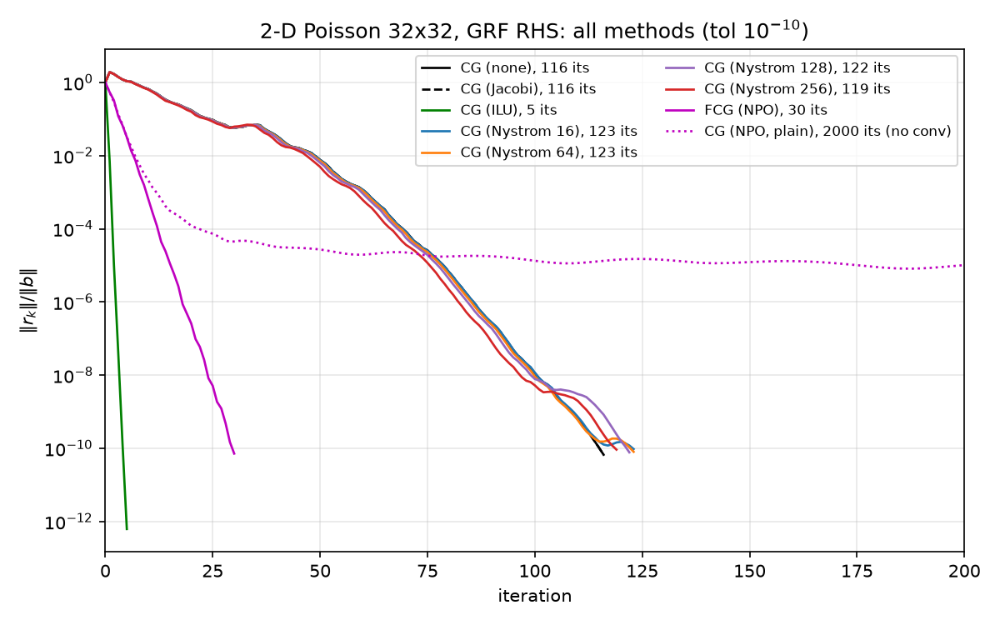
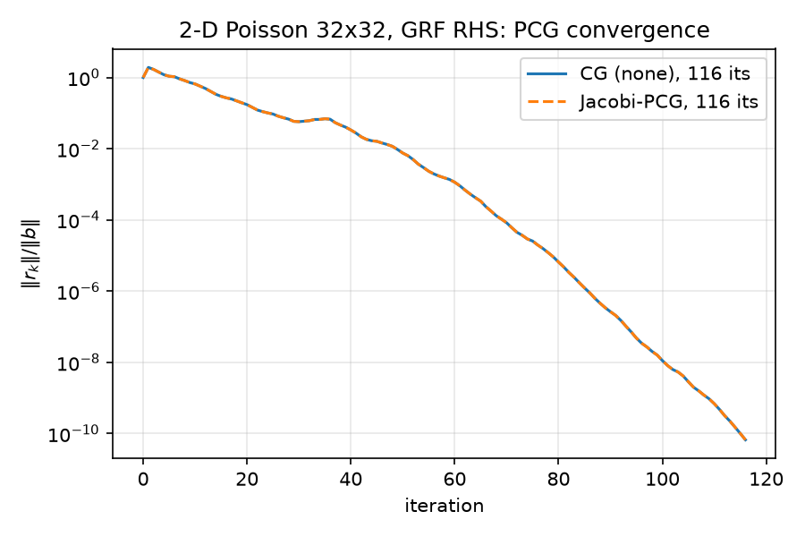
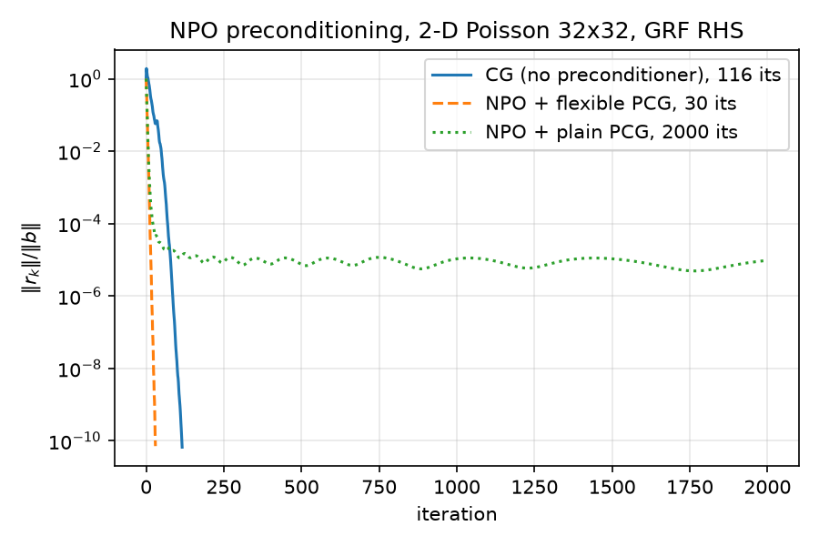
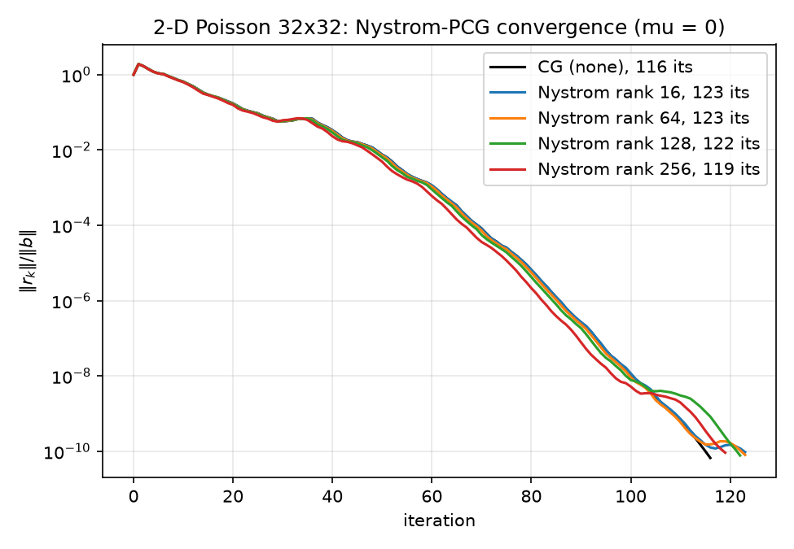
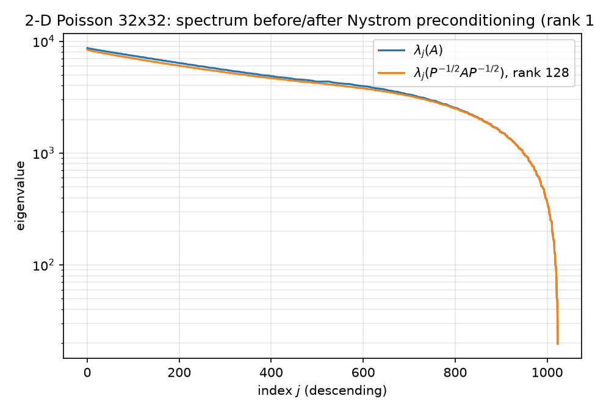
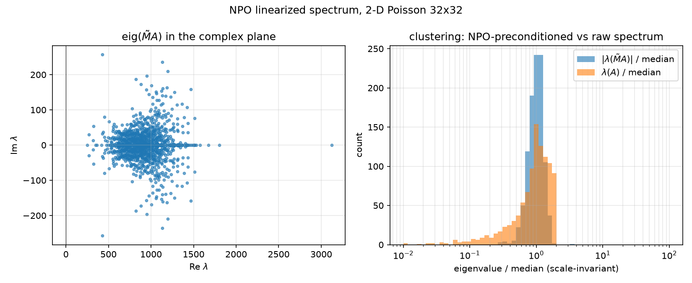
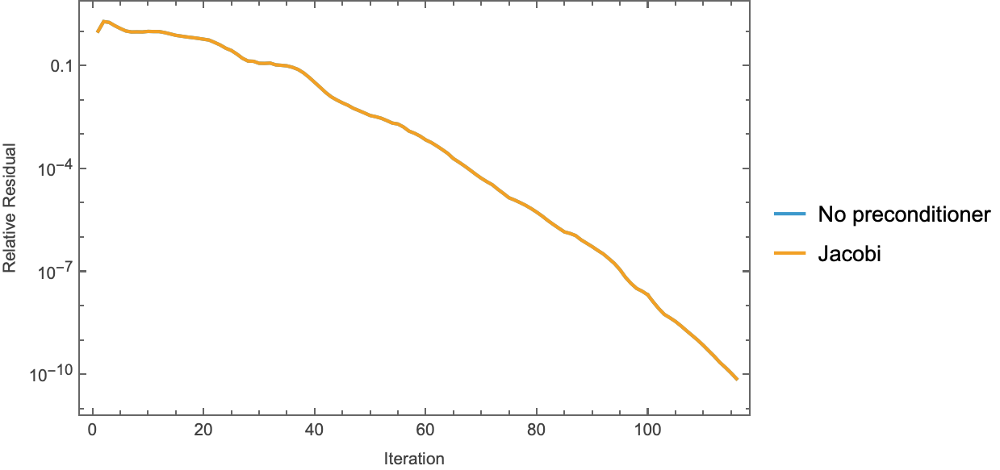
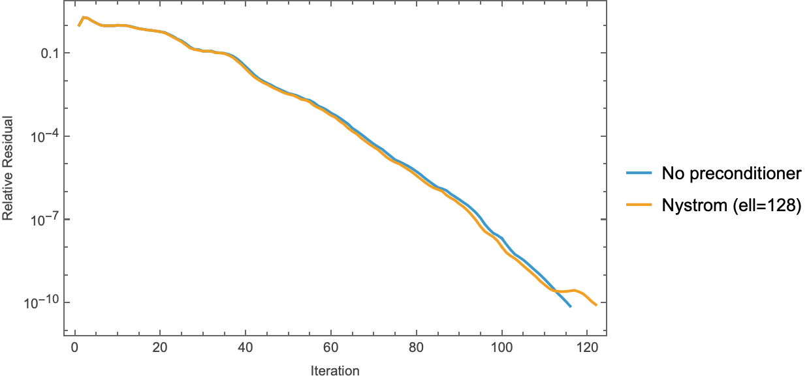
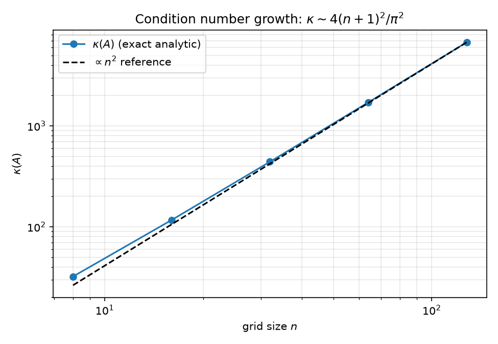

# 08 — Consolidated Results

This report consolidates every experiment in the repo into one place: the full method matrix on the canonical problem, the variable-coefficient Jacobi study, wall-time accounting, the cross-method spectral comparison, and an honest reckoning of what won, what lost, and why. Every number below is read directly from [results/results.json](../results/results.json), [results/nystrom.json](../results/nystrom.json), [results/npo_eval.json](../results/npo_eval.json), [results/npo_spectrum.json](../results/npo_spectrum.json), [results/spectra.json](../results/spectra.json), and [results/baseline.json](../results/baseline.json), all produced by the scripts described in [01-code-walkthrough.md](01-code-walkthrough.md). The single consolidated driver is [python/experiments/run_all.py](../python/experiments/run_all.py); its outputs were verified to be bit-consistent with the earlier per-experiment JSONs — every field they share (iteration counts, final residuals, relative errors vs `spsolve`, Nyström κ values) agrees exactly, as forced by the deterministic seeds; no reruns needed.

## 1. Experimental setup

All canonical-problem runs share one configuration (recorded in `results.json → config`):

| item | value |
|---|---|
| operator $A$ | `poisson_2d(32)`: 5-point Dirichlet Laplacian, $A = (\mathrm{kron}(d_1,I)+\mathrm{kron}(I,d_1))/h^2$, $h = 1/33$, $N = 1024$ ([python/poisson.py](../python/poisson.py) lines 43–68; see [02-eigenvalues.md](02-eigenvalues.md)) |
| right-hand side $b$ | `grf_rhs(32, alpha=2.0, tau=3.0, seed=42)` — standardized Gaussian random field, Matérn-like spectrum $(|k|^2+\tau^2)^{-\alpha/2}$ ([python/poisson.py](../python/poisson.py) lines 131–184; see [03-gaussian-random-fields.md](03-gaussian-random-fields.md)). Seed 42 is **held out** from the NPO training seeds 100–139. |
| tolerance | stop when $\|r_k\|/\|b\| \le 10^{-10}$ |
| max iterations | 2000 |
| Nyström sketch seed | 0 |
| solvers | `pcg` (Hestenes–Stiefel, Fletcher–Reeves $\beta$) and `flexible_pcg` (Notay 2000, Polak–Ribière $\beta$), [python/pcg.py](../python/pcg.py) lines 15–81 and 84–141; see [04-krylov-and-pcg.md](04-krylov-and-pcg.md) |
| iteration counting | `iterations = len(res_hist) - 1`; `res_hist[0] = 1.0` by convention ([python/pcg.py](../python/pcg.py) lines 48–52) |
| reference solution | `scipy.sparse.linalg.spsolve(A.tocsc(), b)`; every converged run is checked against it |
| timing protocol | `wall_time_s` is the solve loop only; `setup_time_s` is preconditioner construction, timed separately ([python/experiments/run_all.py](../python/experiments/run_all.py) lines 82–94, 120–144) |

The variable-coefficient runs use `variable_poisson_2d(32, contrast=100.0)` — a harmonic-mean finite-volume discretization of $-\nabla\!\cdot(a\nabla u)$ with $a = 1$ for $x < 0.5$ and $a = 100$ for $x \ge 0.5$ ([python/poisson.py](../python/poisson.py) lines 71–128) — with the **same** GRF right-hand side.

## 2. The full method matrix

### 2.1 Canonical problem: `poisson_2d(32)`, GRF RHS, tol $10^{-10}$

From `results.json → canonical`:

| method | iterations | final relres | solve wall [s] | setup [s] | relerr vs `spsolve` | converged |
|---|---:|---:|---:|---:|---:|---|
| CG (none) | **116** | 6.667e-11 | 0.00117 | — | 5.40e-12 | yes |
| CG (Jacobi) | 116 | 6.667e-11 | 0.00119 | ~0 | 5.40e-12 | yes |
| CG (ILU, `spilu` defaults) | **5** | 6.212e-13 | 0.000236 | 0.000996 | 8.17e-14 | yes |
| CG (Nyström, rank 16) | 123 | 9.518e-11 | 0.00184 | 0.000737 | 1.53e-11 | yes |
| CG (Nyström, rank 64) | 123 | 8.005e-11 | 0.00188 | 0.00418 | 9.76e-12 | yes |
| CG (Nyström, rank 128) | 122 | 7.727e-11 | 0.00200 | 0.0116 | 6.97e-12 | yes |
| CG (Nyström, rank 256) | 119 | 9.183e-11 | 0.00233 | 0.0238 | 2.54e-11 | yes |
| FCG (NPO, Notay flexible) | **30** | 7.162e-11 | 0.0277 | 0.00272 | 3.10e-11 | yes |
| CG (NPO, plain PCG) | 2000 | 9.653e-06 | 1.68 | 0.00272 | 6.65e-06 | **no** |

The figure (x-axis clipped at 200 iterations for readability; the plain-PCG NPO curve continues stalling to 2000) shows the four qualitative regimes at a glance:

1. **ILU** drops nearly vertically — 5 iterations. `spilu` with default parameters on this small, well-structured matrix produces a nearly exact factorization, so each preconditioned residual is close to the true error and CG converges almost immediately.
2. **CG(none), CG(Jacobi), and all four Nyström ranks** form a tight bundle around 116–123 iterations — the Nyström curves sit marginally *right* of plain CG (Section 5.2 explains why).
3. **FCG(NPO)** cuts through the bundle at a visibly steeper slope: 30 iterations, a **3.87×** iteration reduction over plain CG (`npo_eval.json → speedup_fcg_vs_cg = 3.8666…`).
4. **CG(NPO, plain)** decays for a while, then flattens near $10^{-5}$ and never recovers — the deliberate negative control (Section 6, anomaly 3).

Two smaller per-experiment figures show the same runs in isolation:

Note the baseline figure: the CG(none) and CG(Jacobi) curves are **exactly** superimposed. This is a theorem, not a coincidence — `diag(A)` is the constant $4/h^2 = 4356$ for the constant-coefficient Dirichlet Laplacian, so Jacobi preconditioning is $M = (h^2/4)I$, a positive scalar multiple of the identity, and PCG iterates are invariant to positive scaling of $M$ (the scalar cancels between $\alpha = r^\top z / p^\top A p$ and $\beta = r_{k+1}^\top z_{k+1} / r_k^\top z_k$). `baseline.json` records the max deviation between the two residual histories as **4.441e-16** — one ulp of 1.0. This is sanity check #1 below.

### 2.2 Variable-coefficient problem: `variable_poisson_2d(32, contrast=100)`

From `results.json → variable`:

| method | iterations | final relres | solve wall [s] | relerr vs `spsolve` |
|---|---:|---:|---:|---:|
| CG (none) | 771 | 8.979e-11 | 0.00742 | 4.52e-12 |
| CG (Jacobi) | **137** | 9.219e-11 | 0.00144 | 1.12e-12 |

Here Jacobi is worth **5.6×** in iterations (771 → 137) and **5.1×** in wall time. The mechanism: with $a$ jumping from 1 to 100 across $x=0.5$, `diag(A)` ranges from $(w_{i-1/2}+w_{i+1/2}+2a_i)/h^2 = 4/h^2 = 4356$ in the $a{=}1$ half to $400/h^2 = 435{,}600$ in the $a{=}100$ half — a factor-100 diagonal spread (compute directly from [python/poisson.py](../python/poisson.py) lines 110–127 with $1/h^2 = 1089$). Plain CG must resolve this two-scale spectrum by brute Krylov force; Jacobi rescales both material regions to a common diagonal and recovers near-constant-coefficient behavior (137 iterations, close to the canonical problem's 116). This is the textbook statement "Jacobi ≈ free and worthless on constant-coefficient problems, cheap and genuinely useful when the diagonal varies" — measured rather than asserted. See [05-classical-preconditioners.md](05-classical-preconditioners.md) for the operator-level discussion.

No dedicated convergence figure is produced for the variable problem (`run_all.py` plots only the canonical panel); the iteration counts and JSON records are the artifact.

## 3. Wall-time discussion

### 3.1 Per-iteration cost decomposition

Dividing solve wall time by iterations (both from `results.json`):

| method | µs / iteration | dominant per-iteration work |
|---|---:|---|
| CG (none) | 10.1 | one 5-point sparse matvec (~5 flops/row) + 3 axpys + 2 dots |
| CG (Jacobi) | 10.3 | + one elementwise multiply |
| CG (ILU) | 47.2 | + two sparse triangular solves (sequential, cache-unfriendly) |
| CG (Nyström 16) | 14.9 | + $U(d\odot U^\top r)$: two $1024\times16$ GEMVs |
| CG (Nyström 64) | 15.3 | two $1024\times64$ GEMVs |
| CG (Nyström 128) | 16.4 | two $1024\times128$ GEMVs |
| CG (Nyström 256) | 19.6 | two $1024\times256$ GEMVs |
| FCG (NPO) | 922 | one full NAMG transformer forward (50,465 params, attention over 1024 tokens) on CPU |
| CG (NPO, plain) | 838 | same forward; slightly cheaper loop (no $r_{k+1}-r_k$ vector) |

Three observations:

- **The NPO forward is ~90× a sparse matvec** at this scale. Its 3.87× iteration reduction is therefore a ~24× wall-time *loss* against plain CG (0.0277 s vs 0.00117 s). This is the expected regime for $N=1024$ on CPU: a neural preconditioner amortizes only when the per-iteration baseline cost is large (big $N$, GPU-resident matvec) or when iteration counts are the binding constraint (memory-bound distributed solves, many-RHS pipelines where the forward batches). The NPO paper (Li et al., [arXiv:2502.01337](https://arxiv.org/abs/2502.01337)) does report a wall-time win at exactly this $32\times32$ scale — Table 1: NPO 0.0751 s vs Jacobi 2.7337 s at tol $10^{-10}$ — but with the forward pass on GPU and inside GMRES, i.e. precisely the amortized regime above; its benchmarks otherwise span resolutions 128–4096.
- **Nyström's apply cost is visibly linear in rank**, exactly the $O(N\cdot\mathrm{rank})$ predicted for `NystromPreconditioner.apply` ([python/nystrom.py](../python/nystrom.py) lines 166–170): the per-iteration overhead over plain CG grows 4.8 → 5.2 → 6.3 → 9.5 µs for ranks 16 → 256.
- **ILU's per-iteration cost is 4.7× plain CG** (triangular solves don't vectorize like a stencil matvec), but with only 5 iterations it doesn't matter.

### 3.2 Total time to solution (setup + solve)

| method | total [s] | note |
|---|---:|---|
| CG (none) | 0.00117 | |
| CG (Jacobi) | 0.00119 | |
| CG (ILU) | 0.00123 | 0.000996 setup + 0.000236 solve — **ties plain CG** despite 5 vs 116 iterations |
| CG (Nyström 16) | 0.00257 | |
| CG (Nyström 64) | 0.00606 | setup grows superlinearly in rank (QR + Cholesky + SVD of $1024\times\mathrm{rank}$) |
| CG (Nyström 128) | 0.01356 | |
| CG (Nyström 256) | 0.02617 | 91% of total is setup |
| FCG (NPO) | 0.03038 | setup = checkpoint load only; **training cost (216.6 s, `npo_training_history.json → wall_time_seconds`) is amortized off-line** |
| CG (NPO, plain) | 1.679 | did not converge |

### 3.3 Caveats — read before extrapolating

1. **$N = 1024$ is far below the crossover scale for everything here.** At this size the entire problem fits in L2 cache, `spsolve` is effectively instantaneous, and the asymptotic arguments that motivate each preconditioner (ILU's $O(N^{1.5})$-ish fill on 2-D problems, Nyström's matvec-only access, NPO's resolution-agnostic amortization) are invisible. Wall-time *rankings* here should not be extrapolated; iteration counts and spectra are the transferable signal.
2. **Single measurement, no repetition.** Times are one `perf_counter` interval each ([run_all.py](../python/experiments/run_all.py) lines 82–84); sub-millisecond entries carry maybe tens-of-percent jitter. They are reported to characterize regimes (10 µs vs 1 ms per iteration), not for micro-comparisons like Jacobi's 0.00119 vs plain's 0.00117.
3. **CPU-only, float64 pipeline, PyTorch forward in float32** internally with float64 in/out ([python/neural/npo.py](../python/neural/npo.py) lines 218–227). On a GPU the NPO forward cost collapses and the matvec/forward ratio changes completely.
4. **Dense diagnostics are excluded from the timing story.** The exact preconditioned condition numbers (Section 5) come from $O(N^3)$ dense eigensolves in [run_nystrom.py](../python/experiments/run_nystrom.py) and [npo_spectrum.py](../python/experiments/npo_spectrum.py) — analysis instruments, feasible only at toy scale, and never part of a solve.

## 4. Convergence-figure gallery (per-experiment)

Nyström convergence and the before/after spectrum for the rank-128 sketch:

The spectrum figure is the whole Nyström story in one panel: the preconditioned curve matches $\lambda_j(A)$ except for a flattened top-128 plateau at $\approx \hat\lambda_{128}$ — deflation from above only, leaving $\kappa$ nearly unchanged because the Laplacian's upper spectrum is dense (eigenvalue counts grow like the area of a quarter-disk in frequency space; see [02-eigenvalues.md](02-eigenvalues.md)).

NPO linearized-spectrum figure (complex-plane scatter + median-scaled clustering histogram):

Mathematica cross-checks (reference implementation in [mathematica/poisson_pcg.wls](../mathematica/poisson_pcg.wls) and [mathematica/nystrom_pcg.wls](../mathematica/nystrom_pcg.wls), same problem and protocol; the Python `pcg` is a line-by-line port of the Mathematica `PCGSolve`):

## 5. Cross-method spectral comparison

### 5.1 The κ table

Unpreconditioned, from `spectra.json`: the computed $\kappa(A) = 440.688560$ agrees with the closed form

$$\kappa(A) = \frac{\lambda_{n,n}}{\lambda_{1,1}} = \frac{\sin^2\!\big(\tfrac{n\pi h}{2}\big)}{\sin^2\!\big(\tfrac{\pi h}{2}\big)} = 440.688560\ldots, \qquad h = \tfrac{1}{n+1},\ n = 32,$$

to all printed digits (asymptote $4(n+1)^2/\pi^2 = 441.355$), and the full 2-D spectrum matches $(\lambda_k + \lambda_l)/h^2$ with $\lambda_k = 2 - 2\cos\frac{k\pi}{n+1}$ to max deviation **2.73e-11** (1-D stencil: **2.22e-15**). Scaling: $\kappa$ vs $n$ is exactly $O(n^2)$ — analytic values 32.16, 116.46, 440.69, 1711.66, 6743.68 for $n \in \{8,16,32,64,128\}$, with $\kappa/n^2 \to 0.412$ at $n=128$, approaching $4/\pi^2 \approx 0.405$:

Preconditioned condition numbers (Nyström values are **exact**, from dense `eigvalsh` of $P^{-1/2} A P^{-1/2}$ using the closed-form square root $P^{-1/2} = I + U(\sqrt{s}-1)U^\top$, $s_i = \hat\lambda_\ell/\hat\lambda_i$ — [run_nystrom.py](../python/experiments/run_nystrom.py) lines 39–66; recorded in `nystrom.json`):

| preconditioner | $\kappa$ (exact) | optimal rank-$\ell$ bound $\lambda_{\ell+1}/\lambda_{\min}$ | iterations | $\sqrt{\kappa}$-predicted iterations$^\dagger$ |
|---|---:|---:|---:|---:|
| none | 440.69 | — | 116 | (116, by construction) |
| Nyström rank 16 | 439.62 | 428.91 | 123 | 115.9 |
| Nyström rank 64 | 434.52 | 395.67 | 123 | 115.2 |
| Nyström rank 128 | 426.58 | 359.61 | 122 | 114.1 |
| Nyström rank 256 | 407.46 | 298.41 | 119 | 111.5 |
| NPO (FCG) | n/a (non-normal); $|\lambda|$-spread **12.56** | — | 30 | ~19.6 if the spread acted like a κ |
| ILU | not computed (would require forming $M^{-1/2}$) | — | 5 | — |
| Jacobi (canonical) | 440.69 (scalar scaling, provably unchanged) | — | 116 | 116 |

$^\dagger$ scaled as $116\sqrt{\kappa_P/\kappa_A}$, using the classical CG bound $\|e_k\|_A \le 2\big(\frac{\sqrt\kappa - 1}{\sqrt\kappa + 1}\big)^k \|e_0\|_A$, i.e. iterations $\propto \sqrt{\kappa}$ at fixed tolerance. (For calibration, the bound itself is loose here: it predicts $\tfrac12\sqrt{440.69}\,\ln(2\cdot10^{10}) \approx 249$ iterations for plain CG vs 116 observed — CG exploits the discrete spectrum's structure beyond the two-point bound.)

### 5.2 Reading the table: three different stories

**Nyström: correct implementation, adversarial problem.** All four sketches *reduce* the exact κ (440.69 → 439.62…407.46), monotonically in rank, and all sit above their optimal-rank-$\ell$ lower bounds — exactly what [arXiv:2110.02820](https://arxiv.org/abs/2110.02820) (Frangella–Tropp–Udell) predicts. But the reductions are marginal *by construction of the problem*: the Nyström preconditioner deflates the **top** of the spectrum, so the best any rank-$\ell$ method can achieve is $\kappa = \lambda_{\ell+1}/\lambda_{\min}$, and the 2-D Laplacian's spectrum decays so slowly from the top that even a **perfect** rank-256 deflation (a quarter of all modes!) would leave $\kappa = 298$. The paper targets regularized/ridge-type systems with fast spectral decay and small effective dimension $d_{\mathrm{eff}}(\mu)$; the flat-topped Laplacian at $\mu = 0$ is the worst case. On top of that, the randomized sketch slightly perturbs the retained eigenvectors, which at these tiny κ-gains is enough to make the observed iteration counts (119–123) land *above* plain CG's 116 rather than at the $\sqrt\kappa$-predicted 111–116. Full derivation in [07-nystrom-preconditioning.md](07-nystrom-preconditioning.md).

**NPO: clustering, not symmetry, drives the win.** The NPO is not a matrix — it's a ReLU network — so `npo_spectrum.py` linearizes it column-by-column ($\tilde M_{:,j} = M_\theta(e_j)$, exact per column because the wrapper normalizes inputs and $\|e_j\| = 1$) and takes the dense nonsymmetric spectrum of $\tilde M A$. From `npo_spectrum.json`:

- all 1024 eigenvalues have **positive real part**: $\mathrm{Re}\,\lambda \in [248.8,\ 3125.2]$, $\max|\mathrm{Im}\,\lambda| = 257.1$, zero nonpositive-real eigenvalues;
- modulus spread $\max|\lambda|/\min|\lambda| = \textbf{12.56}$ vs $\kappa(A) = 440.69$ — **35× tighter**;
- **98.1%** of $|\lambda(\tilde M A)|$ lie within $[0.5, 2]\times$ median, vs **82.0%** for $\lambda(A)$;
- yet the linearization is severely non-symmetric ($\|\tilde M - \tilde M^\top\|_F/\|\tilde M\|_F = 0.568$) and the operator severely non-linear ($\|\tilde M b - M_\theta(b)\|/\|M_\theta(b)\| = 0.432$ on the canonical GRF $b$).

So the NPO's 116 → 30 comes from squeezing the spectrum of the preconditioned operator into one decade with a strong cluster near the median — despite being nothing like an SPD matrix. The naive $\sqrt{440.69/12.56} \approx 5.9\times$ prediction overestimates the realized $3.87\times$; the gap is exactly the price of complex eigenvalues, non-normality, and the 43% nonlinearity, which FCG's local orthogonality tolerates but cannot fully exploit. Details in [06-neural-preconditioner.md](06-neural-preconditioner.md). (Training context: 400 epochs, 50,465 parameters, 216.6 s wall; total loss 7.504 → 0.301, with the condition/residual/data terms ending at 0.0738/0.1545/0.0730 — `npo_training_history.json`.)

**ILU: the boring winner.** No spectral diagnostic was computed for ILU, and none is needed: at $N=1024$ with `spilu` defaults the incomplete factorization is nearly complete, $M^{-1}A \approx I$, and CG finishes in 5 iterations with the best final residual (6.2e-13) and the best accuracy vs `spsolve` (8.2e-14) of any method. This is the standing reminder that classical preconditioners are extremely hard to beat at small scale.

## 6. Sanity checks and anomalies

From `results.json → sanity_checks` (logic at [run_all.py](../python/experiments/run_all.py) lines 173–204; hard assertions at lines 252–261):

| check | result |
|---|---|
| Jacobi iterations == plain-CG iterations, constant-coefficient (116 == 116) | **PASS** (asserted) |
| Jacobi iterations < plain-CG iterations, variable-coefficient (137 < 771) | **PASS** (asserted) |
| Nyström iterations strictly decreasing with rank | **FAIL** (report-only) |
| Nyström iterations non-increasing AND rank-256 < rank-16 | **PASS** (asserted) |
| every converged solve matches `spsolve` to 1e-8 rel. error | **PASS** (asserted) |

Anomalies, in decreasing order of interest:

1. **Nyström strict monotonicity fails on a tie.** Iterations by rank $[16, 64, 128, 256]$ are $[123, 123, 122, 119]$ — ranks 16 and 64 tie at 123 even though rank 64's exact κ is smaller (434.52 vs 439.62). Iteration counts are integers and the κ difference is 1.2%; a tie is unremarkable. `run_all.py` deliberately computes and reports the strict check as FAIL while asserting only the non-increasing-with-overall-decrease version (docstring lines 16–24, assertion list line 254–259).
2. **All Nyström variants are *worse* than plain CG in iterations** (119–123 vs 116) despite provably smaller exact κ. Explained in Section 5.2: the achievable κ gain on a flat-top spectrum is tiny, and the sketch's slight distortion of the retained eigenspace costs more than the deflation buys at this scale. This is a *property of the problem–method pairing*, not a bug — and it is exactly the "honest expectation" written into the module docstring of [python/nystrom.py](../python/nystrom.py) (lines 13–21) before the experiment was run.
3. **Plain PCG + NPO stalls at $\sim 10^{-5}$** and burns all 2000 iterations (final relres 9.653e-06, relerr 6.65e-06). Deliberate negative control: $M_\theta$ contains ReLUs, so it is not a fixed SPD matrix, Fletcher–Reeves $\beta = r_{k+1}^\top z_{k+1}/r_k^\top z_k$ loses conjugacy, and the search directions degrade once the easily-representable error components are gone. The Notay flexible variant — one changed line, $\beta = z_{k+1}^\top(r_{k+1} - r_k)/z_k^\top r_k$ ([python/pcg.py](../python/pcg.py) line 134) — converges in 30. This pair is the strongest single argument in the repo for *why flexible PCG exists*.
4. **The NPO linearization is 57% non-symmetric and 43% non-linear yet works brilliantly under FCG** — the spectrum of $\tilde M A$ stays entirely in the right half-plane with a 12.6 modulus spread. Clustering, not SPD structure, is the operative property.
5. **Nothing is broken:** all pre-existing result JSONs reproduce exactly under `run_all.py` (deterministic seeds throughout — GRF seed 42, Nyström seed 0, torch seed 0), and the computed spectra match the analytic formulas at machine-precision levels (2.2e-15 in 1-D; 2.7e-11 in 2-D, consistent with eigenvalues of magnitude ~$10^4$ in float64).

## 7. What wins where, and why

| regime | winner | why |
|---|---|---|
| this exact benchmark, wall time | ILU (0.00123 s total) tied with plain CG (0.00117 s) | near-exact factorization at toy scale; 5 iterations |
| this exact benchmark, iterations | ILU (5), then FCG-NPO (30) | factorization quality; spectral clustering |
| variable coefficients, near-zero setup budget | Jacobi (5.6× iterations, 5.1× wall) | rescales the jumping diagonal; costs one vector divide |
| constant coefficients, near-zero setup budget | nothing — plain CG; Jacobi provably identical | $\mathrm{diag}(A) = 4/h^2$ constant ⇒ Jacobi ≡ scaled identity |
| matvec-only access to $A$, fast-decaying/regularized spectrum | Nyström (by the theory of [arXiv:2110.02820](https://arxiv.org/abs/2110.02820)) | this benchmark is its worst case; on ridge-type spectra with small $d_{\mathrm{eff}}(\mu)$ it achieves $O(1)$ κ |
| iteration count is the binding constraint; forward pass amortizable (GPU, many RHS, huge $N$) | NPO + FCG | 3.87× fewer iterations from a 35× tighter spectrum; per-apply cost is the only obstacle, and it's an artifact of CPU + $N{=}1024$ |
| a nonlinear/varying preconditioner of any kind | flexible PCG, non-negotiable | plain PCG demonstrably stalls (2000 iters, $10^{-5}$); FCG costs one extra stored vector |

## 8. Limitations

1. **Toy scale.** $N = 1024$ ($32\times32$). Every wall-time conclusion is scale-bound (Section 3.3); ILU's dominance in particular will erode as fill-in and factorization cost grow on larger 2-D/3-D grids.
2. **Single RHS family, single held-out instance.** All solves use one GRF draw (seed 42) from one spectral family ($\alpha=2, \tau=3$). The NPO was trained on the same family (seeds 100–139) — its 30 iterations are an in-distribution generalization result, not a robustness result. No out-of-family RHS (point sources, discontinuous $f$, high-frequency noise) was evaluated.
3. **Single-threaded CPU timings, one repetition,** float32 network forward inside a float64 solve. No GPU numbers anywhere.
4. **No multigrid baseline.** Geometric multigrid is the asymptotically optimal ($O(N)$, κ-independent) solver for exactly this operator; its absence flatters every method in the table. The NPO paper doesn't fill this gap either: it blends AMG principles *into* the NAMG architecture (its Sec. 3.4) and uses AMG-preconditioned solves only to generate training data (its Sec. 5.1.2), but its benchmarked baselines are Jacobi/Gauss–Seidel/SOR and neural models — a head-to-head NAMG-vs-multigrid comparison is missing both there and here.
5. **Nyström evaluated only at $\mu = 0$** on an unregularized Laplacian — the regime its theory explicitly does not target. A fair showcase would add $\mu > 0$ (or a kernel/ridge system) where $d_{\mathrm{eff}}(\mu) \ll N$.
6. **NPO trained and evaluated at a single resolution** ($n = 32$), although the architecture (learned coarse queries + coordinate channels, [python/neural/npo.py](../python/neural/npo.py) lines 81–120) is resolution-agnostic by design.
7. **ILU at `spilu` defaults only** — no `drop_tol`/`fill_factor` sweep, so the ILU column shows "essentially exact LU" behavior rather than the fill/quality tradeoff a practitioner would tune.

## 9. Next steps

1. **Scale $n$: 64 → 128 → 256.** κ grows as $\sim 0.41\,n^2$ (measured, `spectra.json`), so plain CG should scale as $\sim\sqrt\kappa \propto n$ while ILU setup cost and fill grow — find the crossover. Rerun the NPO **unretrained** at higher $n$ to test the resolution-agnosticism claim of [arXiv:2502.01337](https://arxiv.org/abs/2502.01337).
2. **Add a geometric multigrid baseline** (V-cycle, weighted-Jacobi smoother) — the reference point both the classical and neural columns need. Also usable as a preconditioner inside `pcg` for a direct MG-PCG vs NPO-FCG match.
3. **Train the NPO across resolutions and coefficient fields** (mixed $n \in \{16,32,64\}$ batches; variable-coefficient operators with random contrast) and evaluate on the variable-coefficient problem, where the classical cheap option (Jacobi) still leaves 137 iterations on the table.
4. **Give Nyström a fair fight:** the same pipeline at $\mu > 0$ (e.g. $A + \mu I$ with $\mu$ sweeping decades) or on a ridge-regression normal-equations matrix, where $d_{\mathrm{eff}}(\mu)$ is small and Theorem 5.1 of [arXiv:2110.02820](https://arxiv.org/abs/2110.02820) predicts $\mathbb{E}[\kappa] < 28$ at $\ell = 2\lceil 1.5\,d_{\mathrm{eff}}\rceil + 1$.
5. **Timing hygiene at scale:** repeat solves for confidence intervals, add GPU timings for the NPO forward, and batch multiple RHS through one forward to measure amortized per-solve cost.
6. **RHS robustness sweep:** out-of-family right-hand sides against the trained NPO to bound the in-distribution advantage measured here.

---

Every solve in this report ends within 3.1e-11 of the direct solution or is explicitly flagged as non-converged — the ledger is clean, and the most informative entries are the ones that lost on purpose: knowing precisely *why* Nyström loses on a flat-top spectrum and *why* plain PCG chokes on a ReLU preconditioner is the transferable result; the toy-scale wall-clock rankings are not.
