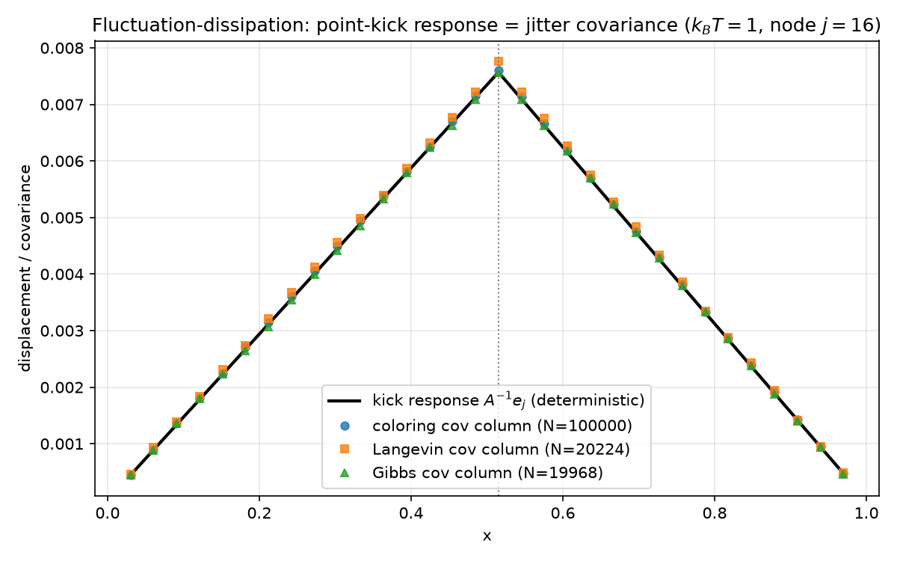
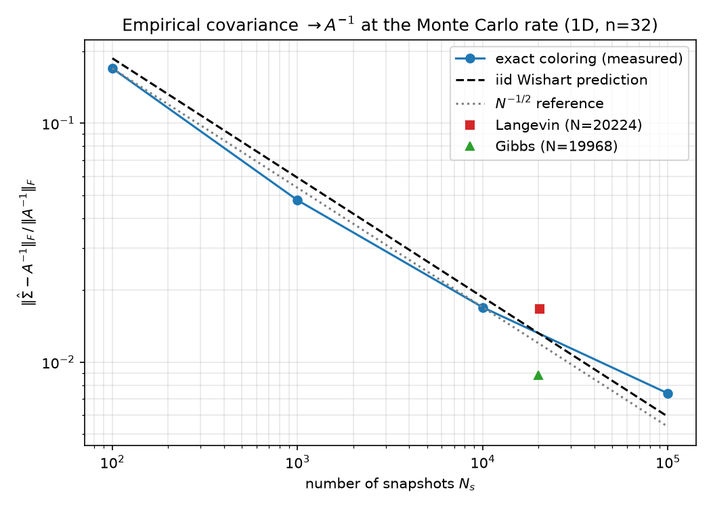
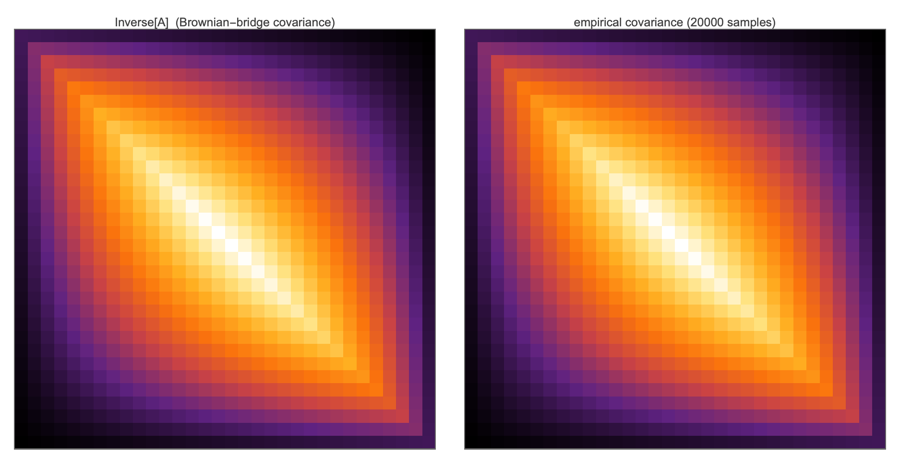
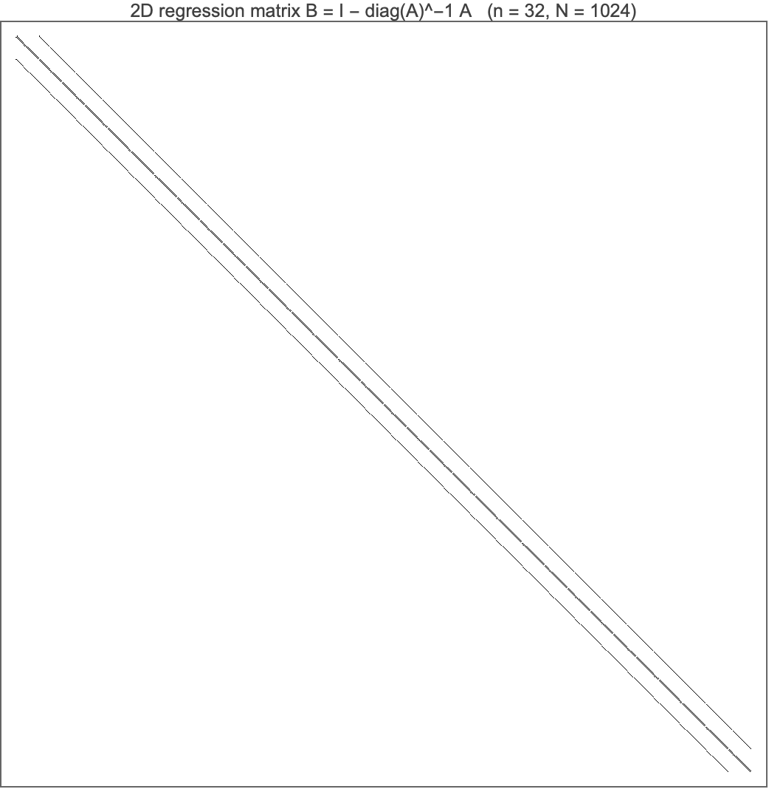
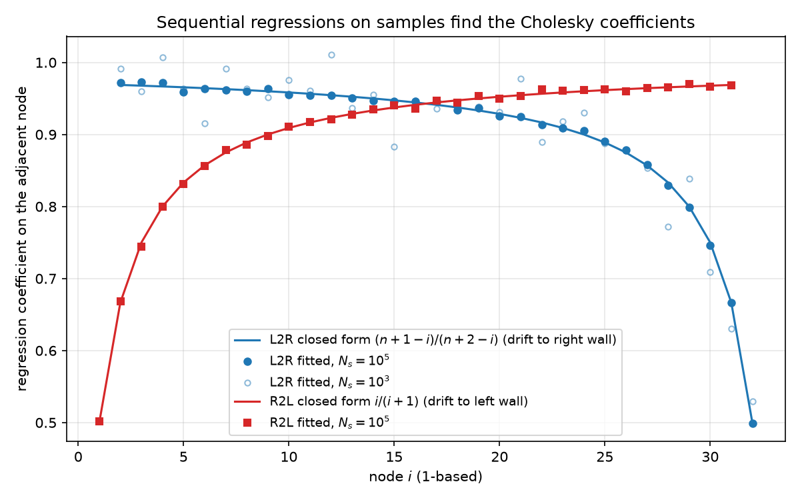
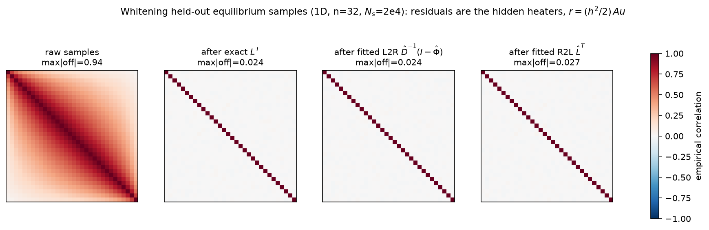
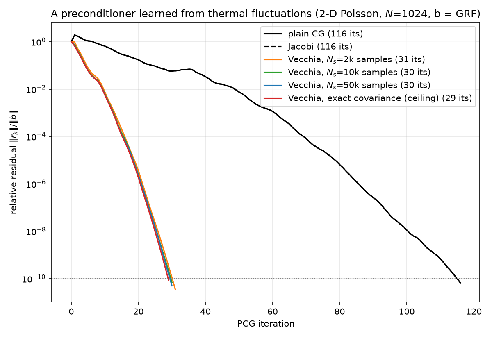
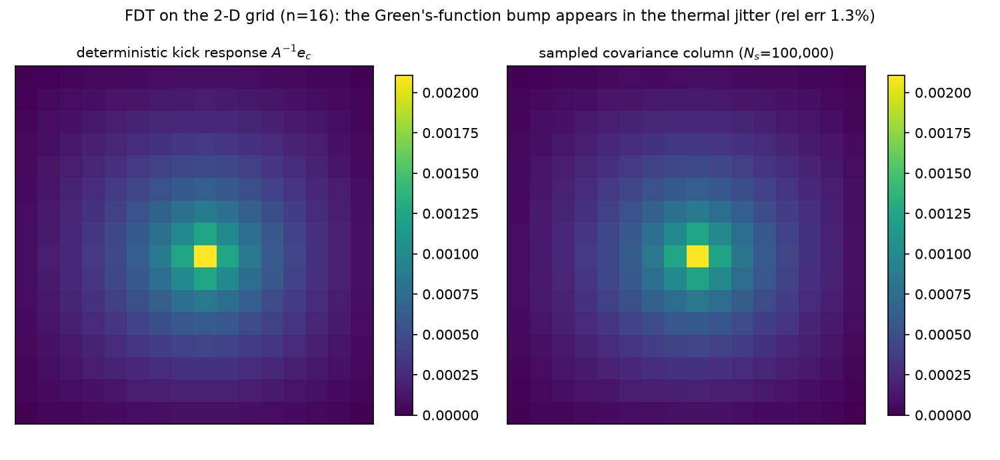

# Kick It, or Watch It Jitter

### Fluctuation–dissipation for the discrete Laplacian: the Green's function, the Cholesky factor, and a working preconditioner, all read out of thermal noise

*The physics companion to [09 — The Stiffness Matrix Is a Precision Matrix](09-stiffness-as-precision.md). Report 09 established the dictionary — stiffness = precision, $A^{-1}$ = Brownian-bridge covariance, Cholesky = sequential regression, preconditioner = surrogate Gaussian. This report runs the dictionary in the physical direction: give the rod a temperature, let it jitter, and show that **everything a solver needs is measurable from the jitter alone** — up to and including a Vecchia/IC(0)-pattern preconditioner fitted purely to fluctuation snapshots that cuts PCG on the canonical 2-D problem from 116 iterations to 30. Setting and conventions are the suite's throughout: $n$ interior nodes, $h = 1/(n+1)$, 1-D $A = \mathrm{tridiag}(-1,2,-1)/h^2$, 2-D $A$ = Kronecker sum $/h^2$ ($N = n^2$; [02](02-eigenvalues.md)). Every identity asserted below is machine-checked by [python/experiments/fdt_fluctuations.py](../python/experiments/fdt_fluctuations.py) (**52 checks, all PASS**, fixed seeds, ~6 s; outputs in [results/fdt.json](../results/fdt.json)) or by the independent Wolfram script [mathematica/fdt_fluctuations.wls](../mathematica/fdt_fluctuations.wls) (10 checks, all PASS). Statistical checks state their Monte-Carlo tolerance, derived from the exact iid-Wishart covariance-error formula; deterministic identities hold to machine precision.*

---

## 1. The theorem in one picture

Take the 1-D chain at $n = 32$ and do two completely different experiments:

1. **Kick it** (dissipation side): apply a deterministic unit point load at node $j$ and record the static displacement, $u = A^{-1}e_j$ — the $j$-th column of the discrete Green's function ([09 §2](09-stiffness-as-precision.md)).
2. **Watch it jitter** (fluctuation side): apply *nothing*, hold the rod at temperature $k_BT$, record a long sequence of equilibrium snapshots $u^{(1)}, u^{(2)}, \dots$, and compute the empirical covariance of node $j$ with every other node, $\hat\Sigma_{:,j}$.

The **fluctuation–dissipation theorem** in its static (equal-time, zero-frequency) form says the two experiments return the same curve:

$$A^{-1}e_j \;=\; \frac{1}{k_BT}\,\Sigma_{:,j}, \qquad \Sigma = \mathrm{Cov}(u).$$



The black line is the deterministic kick response at the center node $j = 16$ (0-based, $x_j = 0.515$); the markers are covariance columns estimated from three different thermalization procedures (§2). Measured relative $\ell_2$ errors of the sampled column against the deterministic response, each within its predicted sampling tolerance:

| sampler | $N_s$ | rel. $\ell_2$ error | Monte-Carlo tolerance |
|---|---:|---:|---:|
| exact coloring | 100 000 | $6.94\times10^{-3}$ | $1.64\times10^{-2}$ ($3\times$ iid pred.) |
| Langevin (Euler–Maruyama) | 20 224 | $1.92\times10^{-2}$ | $6.09\times10^{-2}$ ($5\times$) |
| Gibbs (= Gauss–Seidel + noise) | 19 968 | $4.91\times10^{-3}$ | $6.12\times10^{-2}$ ($5\times$) |

For a Gaussian the "theorem" is two lines, and — unlike the general FDT, which is a *first-order* (linear-response) statement — it is exact at any kick strength. Tilt the energy by a force $f$:

$$p_f(u) \propto \exp\!\Big(-\tfrac{1}{k_BT}\big(\tfrac12 u^\top A u - f^\top u\big)\Big) = \mathcal N\!\big(A^{-1}f,\; k_BT\,A^{-1}\big),$$

so the mean response is $\langle u\rangle_f = A^{-1}f$ *independent of temperature*, the covariance is $k_BT\,A^{-1}$ independent of $f$, and the static susceptibility matrix is

$$\chi_{ij} \;=\; \frac{\partial \langle u_i\rangle_f}{\partial f_j} \;=\; (A^{-1})_{ij} \;=\; \frac{1}{k_BT}\,\mathrm{Cov}(u_i, u_j).$$

That is the whole identity; everything else in this report is what it buys. The historical theorem is deeper than the Gaussian case — Einstein's 1905 relation $D = \mu\,k_BT$ between the diffusion of a Brownian particle (fluctuation) and its mobility against friction (dissipation); Johnson's 1928 measurement and Nyquist's 1928 derivation of thermal voltage noise $\overline{V^2} = 4k_BT R\,\Delta f$ across a resistor $R$; Callen & Welton's 1951 general quantum formulation; Kubo's 1957/1966 linear-response formalism relating the dynamic susceptibility $\chi(\omega)$ to the fluctuation spectrum. Our static Gaussian identity is the $\omega = 0$, equal-time corner of that edifice — the corner where "response equals correlation" needs no perturbation theory at all. We set $k_BT = 1$ from here on (it is a global scale on $\Sigma$ and nothing else).

The same picture holds on the 2-D grid (§7, [figure](../figures/fdt_response_vs_covariance_2d.png)): the Green's-function bump of `poisson_2d(16)` appears in the thermal jitter of 256 coupled nodes at 1.3% relative error.

---

## 2. Why the rod jitters like $A^{-1}$: Boltzmann, Langevin, Lyapunov

### 2.1 Statics: energy $\Rightarrow$ distribution

Report [09 §1](09-stiffness-as-precision.md) already made the static argument: the discrete Dirichlet energy $E(u) = \tfrac12 u^\top A u$ plus the Boltzmann weight $e^{-E/k_BT}$ gives the Gibbs measure

$$u \sim \mathcal N\big(0,\; k_BT\,A^{-1}\big),$$

the Brownian bridge on the grid, with $(A^{-1})_{ij} = h(\min(x_i,x_j) - x_ix_j)$ — re-verified here at $n=32$ to relF $7.4\times10^{-16}$, along with the conditional variance $1/A_{ii} = h^2/2 = 4.5914\times10^{-4}$.

### 2.2 Dynamics: the heat equation is the dissipation half

Statics says nothing about *how* a physical rod reaches that distribution. The canonical thermalization dynamics is the **overdamped Langevin equation**

$$du \;=\; -Au\,dt \;+\; \sqrt{2\,k_BT}\;dW.$$

Look at the drift term alone: $\dot u = -Au$ is exactly the discrete **heat equation** — pure dissipation, every mode decaying at its eigenvalue's rate, entropy of the initial condition erased toward $u = 0$. The noise term alone is pure fluctuation: variance injected isotropically at rate $2k_BT$ per unit time. Neither alone is at equilibrium; the stationary covariance is where they balance. For a linear SDE the stationary $\Sigma$ solves the **Lyapunov equation**

$$A\Sigma + \Sigma A^\top \;=\; 2\,k_BT\, I \quad\Longrightarrow\quad \Sigma = k_BT\,A^{-1} \;\;(\text{since } A = A^\top).$$

Dissipation is the operator you are trying to invert; fluctuation is white; their stationary balance *is* the inverse. This is the FDT restated as a fixed-point equation, and it is why the heat equation and the Green's function are the two halves of one pair.

### 2.3 Three legal thermalizers, measured

The experiment draws from $\mathcal N(0, A^{-1})$ three ways and confirms that all three converge to the same covariance at the Monte-Carlo rate.

**(a) Exact coloring** $u = L^{-\top}z$, $z \sim \mathcal N(0,I)$, with $A = LL^\top$ — Rue's GMRF sampler ([09 §4.2](09-stiffness-as-precision.md)). This is the "zero-autocorrelation" gold standard. Empirical-covariance error vs $N_s$ (relative Frobenius), against the exact iid-Wishart prediction $\mathbb E\|\hat\Sigma-\Sigma\|_F^2 = (\mathrm{tr}(\Sigma)^2 + \|\Sigma\|_F^2)/N_s$:

| $N_s$ | measured | Wishart prediction |
|---:|---:|---:|
| 100 | 0.1696 | 0.1868 |
| 1 000 | 0.0476 | 0.0591 |
| 10 000 | 0.0169 | 0.0187 |
| 100 000 | 0.0074 | 0.0059 |

Log–log slope $-0.453$ (checked in $[-0.65,-0.35]$); the $N_s = 10^5$ point sits at $1.25\times$ the exact prediction.



**(b) Euler–Maruyama Langevin**, $u^+ = (I - \Delta t\,A)u + \sqrt{2\Delta t\,k_BT}\,z$, with $\Delta t = 0.5/\lambda_{\max} = 1.1504\times10^{-4}$ (stability requires $\Delta t < 2/\lambda_{\max}$), 256 parallel chains, thinned to one snapshot per predicted slowest-mode autocorrelation time (881 steps), $N_s = 20\,224$: covariance error $1.67\times10^{-2}$, inside $5\times$ the iid prediction.

The discretization is *not* innocent, and the experiment measures its crime precisely. The EM chain is itself an exact linear-Gaussian recursion, so its stationary covariance solves its own discrete Lyapunov equation $S = (I-\Delta tA)S(I-\Delta tA)^\top + 2\Delta t\,k_BT\,I$, whose solution is

$$S_{\mathrm{EM}} \;=\; \big(A - \tfrac{\Delta t}{2}A^2\big)^{-1}, \qquad \text{per mode } \frac{1}{\lambda\,(1 - \Delta t\,\lambda/2)},$$

verified as the Lyapunov fixed point to relF $1.6\times10^{-16}$. That is an $O(\Delta t)$ *inflation* of every variance — EM samples a slightly-too-hot Gaussian, worst on the stiffest mode: at $\Delta t\,\lambda_{\max} = 0.5$ the predicted inflation is $1/(1-1/4) = 4/3 = +33.3\%$, and the measured stiffest-mode variance is $3.074\times10^{-4}$ vs EM prediction $3.068\times10^{-4}$ vs exact $1/\lambda_{\max} = 2.301\times10^{-4}$ — a measured $+33.6\%$. (In Frobenius norm the bias is only $3.6\times10^{-3}$, buried under sampling noise — which is exactly why one checks it on the mode where theory says it is largest.) The lesson for the dictionary: *a discretized sampler is a slightly wrong surrogate Gaussian*, the same species of object as a preconditioner.

**(c) Gibbs = Gauss–Seidel + noise**, closing report 09's loop. [09 §3](09-stiffness-as-precision.md) said: Gauss–Seidel is a Gibbs sampler with the noise deleted. Here we run the converse as code: one sweep visits the sites in order and sets

$$u_i \;\leftarrow\; \tfrac12(u_{i-1} + u_{i+1}) \;+\; \mathcal N\!\big(0,\; k_BT\,h^2/2\big),$$

i.e. literally the Gauss–Seidel update of [05](05-classical-preconditioners.md) plus the full-conditional noise $1/A_{ii}$. That *is* the systematic-scan Gibbs sampler for $\mathcal N(0, A^{-1})$, and its equilibrium covariance comes out at relative error $8.8\times10^{-3}$ ($N_s = 19\,968$, thinned at 111 sweeps $\approx$ the Goodman–Sokal/Fox–Parker autocorrelation time $-1/\ln\rho_{\mathrm{GS}}$, $\rho_{\mathrm{GS}} = \cos^2(\pi h) = 0.99096$). A solver with noise is a sampler; a sampler with the noise removed is a solver. The two communities' iteration counts are the same number (§6).

---

## 3. Reading the precision out of the noise

FDT hands you $\Sigma = k_BT A^{-1}$ for free — but a solver wants $A$, and better, wants $A$'s *factorization*. Report 09 showed that a precision matrix is a stack of regressions. So: regress on the fluctuation snapshots and see whether the solver's objects materialize. They do, in all three of 09's regression geometries.

### 3.1 Two-sided: every node against everyone else ($B$, the Jacobi iteration matrix)

Form $\hat A = \hat\Sigma^{-1}$ from the $N_s = 10^5$ coloring samples and extract the regression matrix $\hat B = I - \mathrm{diag}(\hat A)^{-1}\hat A$ ([09 §3](09-stiffness-as-precision.md)). The theory says $B$ has exactly $1/2$ on chain neighbors and $0$ elsewhere. Measured: neighbor coefficients within $0.0059$ of $1/2$; everything off the stencil below $0.0093$. Three "honest" spot checks (nodes 5, 16, 26) confirm that this shortcut equals brute force: an explicit least-squares fit of $u_i$ on all other coordinates of the raw samples matches the $\hat\Sigma$-normal-equation coefficients to $4\times10^{-13}$, and the regression residual variance equals $1/\hat A_{ii}$ ($4.60\times10^{-4} \approx h^2/2$) to the same precision. Reassembling by the notebook identity, $\hat A_{\mathrm{rec}} = (I-\hat B)\,\mathrm{diag}(1/\hat\sigma_i^2)$ recovers $A$ to relF $1.47\times10^{-2}$ — right at the first-order error-propagation prediction $\|\hat\Sigma^{-1}-A\| \approx \|\hat\Sigma - \Sigma\|$-induced $1.50\times10^{-2}$.

**The Mathematica extraction, validated.** The companion notebook's one-liner

```wolfram
B = IdentityMatrix[n] - Inverse[DiagonalMatrix[Diagonal[A]]] . A
```

is verified correct by [mathematica/fdt_fluctuations.wls](../mathematica/fdt_fluctuations.wls): in 1-D the nonzero pattern is exactly the chain-neighbor pattern with coefficients **exactly** $1/2$ (max deviation printed as `0.`), in 2-D exactly the 4-neighbor 5-point pattern with coefficients exactly $1/4$ (3968 nonzeros, matching the off-diagonal support of $A$ exactly), and the notebook identity $A = (I-B)\cdot D_2$, $D_2 = \mathrm{diag}(A)$, holds to machine precision in both dimensions. One nuance the script pins down: there are *two* conventions — the row (PDE/Jacobi) convention $B_{\mathrm{row}} = I - D^{-1}A$, where row $i$ predicts $u_i$, and the column (sample-matrix) convention $B_{\mathrm{col}} = I - AD^{-1}$, where column $j$ predicts $u_j$. For symmetric $A$ these are transposes of each other ($B_{\mathrm{col}} = B_{\mathrm{row}}^\top$, checked on a random SPD $5\times5$ where $\|B_{\mathrm{row}} - B_{\mathrm{row}}^\top\|_F = 0.112 \ne 0$), and they *coincide* here only because our diagonal is constant ($2/h^2$, $4/h^2$), which makes $B$ itself symmetric — both facts checked to machine precision. (Wolfram 15.0 implementation note: `Inverse` densifies the sparse product, so the script re-sparsifies via `SparseArray[Chop[...]]` before the pattern check; the coefficients are still bit-exactly $1/4$.) The script also reruns the FDT demo natively — 20 000 `MultinormalDistribution` samples give covariance error $0.92\%$, center-node regression coefficients $\{0.5017, 0.4983\}$ against theory $\{1/2,1/2\}$, residual variance $4.600\times10^{-4}$ vs $h^2/2 = 4.591\times10^{-4}$.





### 3.2 One-sided, left-to-right: the covariance factor, with a closed form

Run Pourahmadi's sequential regressions ([09 §4.2](09-stiffness-as-precision.md), `phiL2R`): regress $u_i$ on all predecessors $u_1,\dots,u_{i-1}$. On the exact $\Sigma$, two clean facts, both verified to $\le 5.4\times10^{-15}$:

- **Markov:** only the immediate predecessor gets a nonzero coefficient — conditioned on $u_{i-1}$, the earlier past is irrelevant.
- **Closed form:** the coefficient on $u_{i-1}$ is (1-based $i$)

$$\varphi_{i,i-1} \;=\; \frac{1 - x_i}{1 - x_{i-1}} \;=\; \frac{n+1-i}{n+2-i} \;=\; \frac{31}{32},\, \frac{30}{31},\, \dots,\, \frac{2}{3},\, \frac{1}{2} \qquad (i = 2, \dots, n).$$

The derivation is one sentence of bridge lore: a Brownian bridge conditioned on its value at $x_{i-1}$ is, to its right, a bridge from $(x_{i-1}, u_{i-1})$ to $(1, 0)$, so the conditional mean at $x_i$ is linear interpolation toward the pinned **right** wall. This is the exact mirror of 09's right-to-left coefficient $i/(i+1)$ (interpolation toward the pinned **left** wall): scan direction chooses which wall does the pinning, and the two coefficient sequences are each other's reversals.

From *samples*: the assembly identity $(I-\hat\Phi)^\top \hat D^{-2}(I-\hat\Phi) = \hat\Sigma^{-1}$ holds on the estimated quantities to relF $4.6\times10^{-15}$ (it is an algebraic identity of the fitted regressions, not a statistical statement), the fitted immediate-predecessor coefficients match the closed form to $0.0068$ at $N_s = 10^5$, and the reconstruction error of $A$ falls at the Monte-Carlo rate:

| $N_s$ | 100 | 1 000 | 10 000 | 100 000 |
|---|---:|---:|---:|---:|
| $\|\hat A_{\mathrm{rec}} - A\|_F/\|A\|_F$ | 0.882 | 0.146 | 0.0453 | 0.0143 |

### 3.3 One-sided, right-to-left: the Cholesky factor of $A$, and the reversal identity on *estimates*

Regressing on successors (`phiR2L`) assembles the estimated factor $\hat L = (I-\hat\Phi_u)^\top \hat D^{-1}$ — and this equals $\mathrm{chol}(\hat\Sigma^{-1})$ *exactly* (relF $4.1\times10^{-15}$), with immediate-successor coefficients matching 09's closed form $i/(i+1)$ to $0.0063$ ($5.6\times10^{-16}$ when read off the exact $\mathrm{chol}(A)$). Report 09's reversal identity is then re-verified one level up, on purely *estimated* quantities:

$$\mathrm{chol}\big(P\hat\Sigma P\big) \;=\; P\,\hat L^{-\top}P \qquad (\text{relF } 1.9\times10^{-15}),$$

$P$ the index-reversal permutation. The identity is not about the true model at all — it is a theorem about any SPD matrix and its inverse, so it survives estimation error verbatim. Fitting regressions to thermal noise in either scan direction gives you the two Cholesky factorizations of the *empirical* model, consistent with each other in exactly the way the exact ones are.



The figure shows both closed-form curves (L2R falling from $31/32$ to $1/2$, R2L rising from $1/2$ to $31/32$), the $N_s = 10^5$ fits sitting on them, and the visibly noisier $N_s = 10^3$ fit — coefficient estimation is already decent at a thousand snapshots because each coefficient is a *local* functional of $\Sigma$ (a $1\times1$ or $2\times 2$ block), a fact that becomes the punchline of §5.

---

## 4. Whitening physically: hidden heaters and flux shocks

Whitening — applying $L^\top$ (or a fitted stand-in) to a sample — was 09's algebra. The physics reading: an equilibrium temperature profile $u$ is the *blurred effect* of diffusion; the whitened coordinates are the *independent causes* that diffusion blurred together. Whitening runs the entropy-production movie backwards — not by reversing time (you cannot), but by inverting the smoothing map, un-diffusing the profile back into the uncorrelated disturbances that generated it.

The experiment makes both flavors of "cause" concrete on $N_H = 20\,000$ held-out samples (fresh seed, never touched by any fit):

**Two-sided residual = hidden heater.** Define $r_i = u_i - \tfrac12(u_{i-1}+u_{i+1})$, the discrepancy from the discrete mean-value property. Then, per sample and deterministically,

$$r_i \;=\; \frac{h^2}{2}\,(Au)_i,$$

verified to relF $2\times10^{-16}$. Read $f = Au$ as the **hidden heat source**: the forcing that *would have to be present* for this snapshot to be a steady state, recovered from the snapshot by applying the operator. Its statistics are exactly what independence-of-causes predicts, with one honest refinement. Site variance: $\mathrm{Var}(r_i) = k_BT\,h^2/2$ at every site (max site deviation 2.4%) — the full-conditional variance $1/A_{ii}$, as it must be, since $r_i$ is precisely the residual of the regression of $u_i$ on everyone else. Correlation: $\mathrm{Cov}(Au) = A\,\Sigma\,A = k_BT\,A$, so the hidden forcing is **stencil-local but not white** — neighboring heaters are anticorrelated at exactly $A_{i,i+1}/A_{ii} = -1/2$ (measured $-0.5003$) and uncorrelated beyond one lattice step (max $|corr| = 0.026$, at the $N_H^{-1/2}$ noise floor). The heaters are independent *choices* two steps apart; adjacent ones share a difference.

**One-sided residual = flux shock, exactly white.** The sequential innovations $z = L^\top u$ — "scan the rod from the right wall; at each node, record the surprise given what the scan has already seen" — are the coordinates where independence is exact: $\mathrm{Cov}(z) = L^\top \Sigma L = k_BT I$. That is the whitener, and it is the difference between the two residuals: the two-sided one conditions on *both* neighbors (symmetric, local, MA(1)-correlated), the one-sided one conditions on the *past only* (causal, triangular, iid). Cholesky's triangularity is causality.

Measured on the held-out set (max absolute off-diagonal empirical correlation; iid noise floor $\approx 0.025$ at this $N_H$):

| transform | max off-diag correlation |
|---|---:|
| raw samples | 0.941 |
| exact $L^\top$ | 0.0245 |
| fitted L2R factor $\hat D^{-1}(I-\hat\Phi)$ | 0.0240 |
| fitted R2L factor $\hat L^\top$ | 0.0267 |



The panels tell the whole story: the raw covariance is dense (neighboring nodes correlated at $0.94$ — diffusion entangles everything), and one triangular matrix — exact or *fitted to noise* — flattens it to the identity up to Monte-Carlo dust. The fitted factors whiten data they never saw, indistinguishably from the exact factor.

---

## 5. From whitening to preconditioning: the ladder, with the top rung learned from noise

Three rungs, in the language of §4:

1. **Exact whitener.** Unrestricted sequential regressions $=$ $\mathrm{chol}(A)$ $=$ the direct solver (Thomas/Kalman on the chain, [09 §5](09-stiffness-as-precision.md)). Perfect, but in 2-D the regressions go long-range (fill-in, §7) and the factor is no longer cheap.
2. **Sloppy whitener.** Keep only the stencil neighbors as regressors: incomplete Cholesky IC(0) $=$ the **Vecchia approximation** $=$ the KL-optimal factor for that sparsity pattern (Vecchia 1988; Schäfer–Katzfuss–Owhadi 2021; [09 §6](09-stiffness-as-precision.md)).
3. **Learned whitener.** Fit the (truncated) regressions *from data* rather than from $A$ — which, per this report, means: from thermal-fluctuation snapshots. The neural preconditioner of [06](06-neural-preconditioner.md) is the flexible-function-class version of this rung; here we run the honest linear version and race it.

The experiment (`Part B6` of the script) is the report's headline. On `poisson_2d(32)` ($N = 1024$): draw $N_s \in \{2000, 10\,000, 50\,000\}$ equilibrium snapshots; order nodes lexicographically; regress each node on its at-most-two previously-ordered stencil neighbors (W and S) — coefficients and residual variance read from a $2\times2$ normal-equation block that touches **only sampled covariance entries**; assemble $M = \hat G^\top \mathrm{diag}(1/\hat d^2)\,\hat G$ with $\hat G = I - \hat\Phi$ unit-lower-triangular and sparse, applied inside [pcg](../python/pcg.py) by two sparse triangular solves. Sanity is machine-checked at both ends: with *all* predecessors on the *exact* covariance the assembly returns $A$ itself (relF $1.6\times10^{-16}$, $4\times4$ grid), and every fit — exact-covariance or sampled — has all residual variances positive, so $M$ is SPD and legal for PCG. The sampled coefficients converge to the exact-covariance Vecchia coefficients (interior means $W = S = 0.3904$; max deviation $0.0135$ at $N_s = 50$k).

Racing them on the suite's canonical solve ($b = $ `grf_rhs(32)`, seed 42 — the same right-hand side as [05](05-classical-preconditioners.md)–[08](08-results.md); tol $10^{-10}$; every run's true residual $< 10^{-9}$):

| preconditioner | source of coefficients | $\hat\Sigma$ rel. err. | PCG iterations | $\kappa(M^{-1}A)$ |
|---|---|---:|---:|---:|
| none | — | — | 116 | 440.69 |
| Jacobi | $\mathrm{diag}(A)$ | — | 116 | 440.69 |
| Vecchia | 2 000 thermal snapshots | 0.190 | **31** | 13.99 |
| Vecchia | 10 000 thermal snapshots | 0.082 | **30** | 13.74 |
| Vecchia | 50 000 thermal snapshots | 0.036 | **30** | 13.66 |
| Vecchia | exact covariance (ceiling) | 0 | **29** | 13.63 |



Three things to read off. **First, the headline: thermal noise alone yields a working preconditioner** — a $3.7\times$ iteration cut and a $32\times$ condition-number cut ($440.69 \to 13.7$), two iterations from the sample-free ceiling, with *no access to $A$* beyond the ability to watch the field jitter. **Second, the sample-efficiency surprise**: at $N_s = 2000$ the global covariance estimate is still 19% wrong in Frobenius norm, yet the preconditioner is already within two iterations of the ceiling. The reason is §3.3's observation scaled up: Vecchia coefficients are *local* functionals of $\Sigma$ ($2\times2$ blocks of neighboring entries, the best-estimated entries there are), so the preconditioner inherits the estimation problem's easiest part. Fitting a sparse autoregression is statistically much cheaper than estimating a covariance. **Third**, the Jacobi row reprises [05](05-classical-preconditioners.md)'s theorem (116 = 116, constant diagonal $\Rightarrow$ scalar $M$): an independence surrogate learns nothing from the fluctuations' variances alone; the correlations are where the solver-relevant information lives. (Incidentally, $\kappa(A) = 440.69$ here is *the same number* as the 1-D chain's $\kappa$ in §6 — the Kronecker sum doubles both spectral endpoints, so the ratio is untouched; [02](02-eigenvalues.md).)

This is the FDT reading of "preconditioner = surrogate Gaussian" ([09 §6](09-stiffness-as-precision.md)) run in reverse: 09 fit the surrogate to $A$; here nature runs the Gibbs measure, we merely observe it, and the surrogate is fit to the observations.

---

## 6. Critical slowing down: mixing time, stall time, and $\kappa$

Why did the Langevin sampler in §2.3 need 881-step thinning? Because the slowest mode of the dynamics decorrelates at rate $\lambda_{\min}$: for the EM chain the mode-$k$ autocorrelation per step is $(1-\Delta t\,\lambda_k)$, so the slowest mode's e-folding time is

$$\tau \;=\; \frac{-1}{\ln(1-\Delta t\,\lambda_{\min})} \;\approx\; \frac{1}{\Delta t\,\lambda_{\min}} \;=\; \frac{\lambda_{\max}}{0.5\,\lambda_{\min}} \;=\; 2\kappa \;\; \text{steps}.$$

Measured on the slow-mode projection: $\tau = 926$ steps vs predicted $881 = 2\kappa$ (within the 25% tolerance; in physical time, $0.107$ vs $1/\lambda_{\min} = 0.101$). The Gibbs sampler tells the same story in sweeps: $\tau = -1/\ln\rho_{\mathrm{GS}} = 110$ sweeps with $\rho_{\mathrm{GS}} = \cos^2(\pi h)$ — the *same* $\rho$ that governs Gauss–Seidel-the-solver ([09 §3](09-stiffness-as-precision.md); Goodman–Sokal, Fox–Parker).

This is **critical slowing down**: as $h \to 0$ the field's long-wavelength mode becomes arbitrarily soft ($\lambda_{\min} \to \pi^2$ stays finite, but $\Delta t \sim 1/\lambda_{\max} \to 0$, so the *step count* $\kappa \sim 4/(\pi h)^2$ diverges), and any local dynamics takes ever longer to decorrelate it. The statistician calls it slow MCMC mixing; the numerical analyst calls it iterative-solver stall; the physicist calls it the divergence of relaxation time near criticality. They are one phenomenon, and $\kappa$ is its dimensionless face: simple local dynamics (Langevin, Jacobi, Gibbs, Gauss–Seidel) pay $O(\kappa)$ steps per independent sample / digit of accuracy. CG's Chebyshev magic ([04](04-krylov-and-pcg.md)) cuts this to $O(\sqrt\kappa)$, and a preconditioner attacks $\kappa$ itself — §5's learned Vecchia drops the *sampling* problem's difficulty and the *solving* problem's difficulty by the same factor, because they are the same number. (The multigrid/coarse-graining answer to critical slowing down — cluster and multiscale samplers on the MCMC side, coarse-grid correction on the solver side — is the same move made in both fields, per [09 §6](09-stiffness-as-precision.md).)

---

## 7. 2-D: many paths, long correlations, and fill-in as the FDT face of marginalization

Part B of the script re-runs the core identity on the grid. At $n = 16$ ($N = 256$): the conditional variance is $1/A_{ii} = h^2/4 = 8.65\times10^{-4}$ (four neighbors now share the prediction, coefficients $1/4$ each — the Mathematica script's exact-$1/4$ check), and the center-node kick response matches the sampled covariance column at relative error $1.34\times10^{-2}$ over $10^5$ snapshots:



At $n = 32$ the covariance estimate obeys the Monte-Carlo law across scales (error ratio $5.25$ from $N_s = 2$k to $50$k, against $\sqrt{25} = 5$; measured errors $0.190/0.082/0.036$ vs iid predictions $0.184/0.082/0.037$).

What changes physically from 1-D is *connectivity*. The Neumann-series/random-walk identity $A^{-1} = \frac{h^2}{4}\sum_{k\ge0}(W/4)^k$ (with $W$ the interior adjacency matrix; convergent since $\rho(W/4) < 1$ under Dirichlet killing) reads: the covariance between two nodes is a sum over *all lattice walks* connecting them, discounted per step and killed at the walls. On the chain there is essentially one path between two nodes, and correlations die geometrically in the walk count; on the grid the number of walks grows combinatorially with length, and the sum barely decays — on the infinite 2-D lattice the massless Green's function famously grows *logarithmically* with separation (the 2-D Gaussian free field has no pointwise continuum limit), and while our finite Dirichlet box screens this at the walls, the measured $n=16$ covariance column in the figure still visibly spans the whole domain. Fluctuations at every site reach every other site along too many routes to disentangle locally.

That is the FDT face of fill-in ([09 §6](09-stiffness-as-precision.md)): eliminating (marginalizing) a node reroutes all walks through it onto direct edges among its neighbors, so the exact whitener of the 2-D field is dense below the bandwidth — the exact sequential regressions need *all* previously-scanned boundary nodes, not two. Preconditioning is the decision to model this walk-sum covariance with a tractable surrogate anyway; §5's experiment shows the cheapest honest surrogate (two regressors per node, coefficients $\approx 0.39$ where the exact bidiagonal-in-1-D logic would have suggested locality was enough) already buys $32\times$ in $\kappa$, precisely because the leading error of the truncation is the long, slow, many-path modes that CG then handles in $O(\sqrt{\kappa_{\mathrm{new}}})$.

---

## 8. The dictionary, extended

FDT rows appended to [09 §8](09-stiffness-as-precision.md)'s table (all verified in [fdt_fluctuations.py](../python/experiments/fdt_fluctuations.py) unless marked as 09's):

| Numerical linear algebra / PDE | Statistical physics / inference |
|---|---|
| Green's-function column $A^{-1}e_j$ (kick response) | Equal-time fluctuation covariance column $\Sigma_{:,j}/k_BT$ — static FDT (Einstein, Nyquist, Callen–Welton, Kubo) |
| Discrete Dirichlet energy $\tfrac12 u^\top Au$ | Hamiltonian of the Gibbs measure $\mathcal N(0, k_BT A^{-1})$ |
| Heat equation $\dot u = -Au$ | Dissipation half of the Langevin pair $du = -Au\,dt + \sqrt{2k_BT}\,dW$ |
| Solving $A\Sigma + \Sigma A = 2k_BT I$ | Fluctuation–dissipation balance; stationary Lyapunov equation |
| Forward-Euler stability limit $\Delta t < 2/\lambda_{\max}$ | Euler–Maruyama sampler stability; bias $S_{\mathrm{EM}} = (A - \tfrac{\Delta t}{2}A^2)^{-1}$, stiffest mode $+33\%$ hot at $\Delta t\lambda_{\max}{=}\tfrac12$ |
| Gauss–Seidel sweep $+$ per-site noise $\mathcal N(0, 1/A_{ii})$ | Systematic-scan Gibbs sampler (09's equivalence, run forward) |
| Two-sided residual $u_i - \tfrac12(u_{i-1}{+}u_{i+1}) = \tfrac{h^2}{2}(Au)_i$ | Hidden heat source; variance $k_BT h^2/2$, neighbor correlation exactly $-\tfrac12$ ($\mathrm{Cov}(Au) = k_BT A$), zero beyond the stencil |
| One-sided residual $z = L^\top u$ | Thermal innovation / flux shock of the causal scan; exactly white |
| Whitening a snapshot | Un-diffusing: inverting the blur to recover independent causes |
| Estimated factor $\hat L = \mathrm{chol}(\hat\Sigma^{-1})$ from R2L fits | Cholesky-by-regression survives estimation; reversal identity holds on estimates verbatim |
| L2R coefficient $(n+1-i)/(n+2-i)$ | Bridge drift toward the pinned right wall (mirror of 09's $i/(i+1)$) |
| IC(0)-pattern factor fitted from snapshots | Learned Vecchia preconditioner: 116 → 30 iterations, $\kappa$ 440.69 → 13.7, from noise alone |
| Iterative-solver stall; $\kappa$ | Critical slowing down; MCMC mixing time $\tau \approx 2\kappa$ EM steps (measured 926 vs 881) |
| Fill-in under elimination | Walk-sum covariance rerouted by marginalization; many-path 2-D correlations |

---

## 9. Pointers

The fluctuation–dissipation lineage: Einstein, *Ann. Phys.* 17 (1905) — Brownian motion, $D = \mu k_BT$; Johnson, *Phys. Rev.* 32 (1928) and Nyquist, *Phys. Rev.* 32 (1928) — thermal noise in conductors, $\overline{V^2} = 4k_BT R\,\Delta f$; Callen & Welton, *Phys. Rev.* 83 (1951) — the general (quantum) theorem; Kubo, *J. Phys. Soc. Japan* 12 (1957) and the review *Rep. Prog. Phys.* 29 (1966) — linear response and the modern formulation. The Gaussian-measure and regression machinery is 09's canon: Rue & Held, *Gaussian Markov Random Fields* (2005) for the Gibbs measure, coloring sampler and precision-graph reading; Pourahmadi (Biometrika 1999; Statist. Sci. 2011) for the sequential-regression parameterization fitted here from samples; Goodman & Sokal (Phys. Rev. D 1989) and Fox & Parker (Bernoulli 2017) for the sampler–solver rate equivalence that §2.3 and §6 measure; Vecchia (JRSS-B 1988) and Schäfer, Katzfuss & Owhadi (SISC 2021) for the truncated-regression surrogate that §5 fits from noise and races in PCG. Sibling reports: the operator and spectrum, [01](01-code-walkthrough.md)/[02](02-eigenvalues.md); the GRF right-hand side (itself a colored Gaussian, one dictionary row over), [03](03-gaussian-random-fields.md); the PCG harness and $\sqrt\kappa$ bound, [04](04-krylov-and-pcg.md); the classical baselines whose numbers (116/116/ILU 5) this report's table extends, [05](05-classical-preconditioners.md); the consolidated tables, [08](08-results.md); the dictionary this report physicalizes, [09](09-stiffness-as-precision.md); the roadmap, [00](00-overview.md).

---

**Coda: the fluctuation ladder, with the suite's learners on it.** Section 5's ladder — exact whitener, truncated whitener, learned whitener — places the suite's two modern preconditioners precisely. The **NPO** of [06](06-neural-preconditioner.md) is the top rung with the linear-regression class swapped for a neural one: trained on pairs $(f, A^{-1}f)$ with GRF forcing, it sees jointly Gaussian data whose cross-covariance is the smoothing operator, so its training is covariance estimation and its converged network is a learned kriging map — and its measured success mode, spectral clustering rather than raw $\kappa$ surgery ([06 §6](06-neural-preconditioner.md)), is exactly what a good-but-inexact fitted covariance looks like to CG, one rung of expressiveness above §5's Vecchia fit (30 iterations under flexible PCG vs our 30 under plain PCG, on the identical problem). The **Nyström** preconditioner of [07](07-nystrom-preconditioning.md) is a *different* truncation of the same object — keep a few global fluctuation modes (factor analysis: low-rank + diagonal) instead of local conditional regressions — and its honest failure here (119–123 iterations, worse than plain CG) is the fluctuation story of §7 read as a spectrum: the Laplacian's thermal field has *no dominant common factors*, its fluctuation energy is spread across all wavelengths, so a surrogate that can only name a few principal modes has nothing to grab, while the local-regression surrogate, which models every node's stencil physics, captures almost everything that matters. One measure, $\mathcal N(0, k_BT A^{-1})$; every solver in the suite is a policy for compressing it.
