# Predict Thy Neighbor, Subtract the Average

### One-sided, two-sided, and multiscale regression on the 8×8 grid — and the preconditioner as an approximate whitener

*The worked-example companion to [09 — The Stiffness Matrix Is a Precision Matrix](09-stiffness-as-precision.md) and [10 — Kick It, or Watch It Jitter](10-fluctuation-dissipation.md). Report 09 built the dictionary on the 1-D chain, where every object is bidiagonal and preconditioning is theater; report 10 measured the dictionary in thermal noise. This report walks the whole dictionary through the smallest 2-D problem where preconditioning is *real*: the 8×8 interior grid ($n = 8$, $N = 64$, everything dense and inspectable), then scales the conclusions to the suite's canonical $n = 32$ ($N = 1024$) on a hot/cold-rod problem built for pictures. Notation is 09/10's throughout: $h = 1/(n+1)$, $A$ = Kronecker-sum Laplacian $/h^2$ (`poisson_2d`, [01](01-code-walkthrough.md)/[02](02-eigenvalues.md)), $\Sigma = A^{-1}$ the covariance of the Gibbs field $u \sim \mathcal N(0, A^{-1})$, $B = I - \mathrm{diag}(A)^{-1}A$ the two-sided regression matrix (= Jacobi iteration matrix), `phiL2R` = sequential regression on predecessors (modified Cholesky of $\Sigma$), `phiR2L` = regression on successors (= $\mathrm{chol}(A)$), reversal identity $\mathrm{chol}(A^{-1}) = P L^{-\top} P$ — all per the companion notebook `whitening_inverse_transposed.nb`. Every claim below is machine-checked by [python/experiments/grid_regressions_multiscale.py](../python/experiments/grid_regressions_multiscale.py) (**36 checks, all PASS**, fully deterministic — no sampling — ~1.5 s; numbers in [results/grid_multiscale.json](../results/grid_multiscale.json)) or independently by the Wolfram script [mathematica/grid8_regressions.wls](../mathematica/grid8_regressions.wls) (6 checks, all PASS), which reproduces the two `ArrayPlot`s that prompted this report.*

---

## 1. The two ArrayPlots, pixel by pixel

Take $n = 8$: 64 unknowns, lexicographic index $k = 8i + j$ for grid row $i$, column $j$ (0-based). Two 64×64 pictures contain, between them, the entire subject.

### 1.1 Reading $A^{-1}$: dense, positive, blocked, and long-ranged

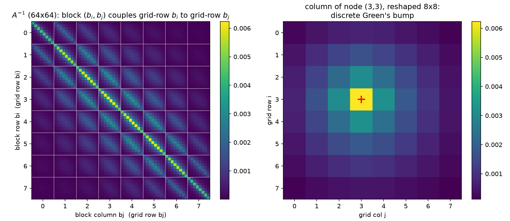

(Independent Wolfram rendering, `ArrayPlot[Inverse[A]]`: 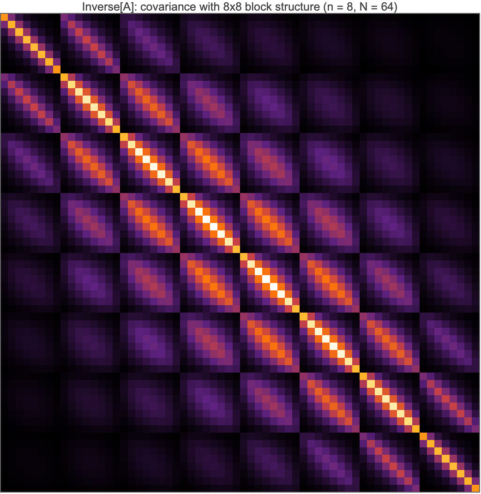.)

Four layers of structure, each machine-checked:

**Every pixel is positive.** $\min(A^{-1}) = 6.885\times10^{-6} > 0$ (verified in both Python and Mathematica). This is the M-matrix property of the 5-point Laplacian: $A$ has positive diagonal, nonpositive off-diagonals, and is nonsingular with $A^{-1} \ge 0$ — physically, heat injected anywhere raises the temperature *everywhere*; probabilistically, all 64 variables are positively correlated (an "association" every attractive Gaussian field has). The matrix is also exactly symmetric, as a covariance must be.

**The 8×8-block grid is the row structure of the lattice.** With lexicographic ordering, entry $(k, k')$ couples node $(i,j)$ to node $(i',j')$, so the matrix tiles into an $8\times8$ array of $8\times8$ blocks: **block $(b_i, b_j)$ is the covariance between grid-row $b_i$ and grid-row $b_j$** (white gridlines in the figure). The diagonal blocks are brightest, and the block Frobenius norms decay monotonically away from the diagonal — from $0.0200$ (center diagonal block, $b_i = b_j = 3$) down to $0.00039$ (corner block $(0,7)$, rows that share nothing but the far walls; all 64 block norms are in `part_a.greens.block_frobenius_norms_8x8` of the JSON). Within each block the same story repeats one level down: same-column pixels brightest, decay with column distance. The Kronecker-sum structure of [02](02-eigenvalues.md) is literally visible as self-similarity of the block pattern.

**One column is a Green's function.** The right panel reshapes column $k_c = 27$ — node $(3,3)$ — into the 8×8 grid: a single bump, maximal at the source and monotonically decaying along the source's row and column (checked coordinate by coordinate), pinned toward zero at the Dirichlet walls. This is $A^{-1}e_{k_c}$, the kick response of [10 §1](10-fluctuation-dissipation.md) — and simultaneously $\mathrm{Cov}(u_{(3,3)}, u_{\cdot})$, the covariance of node $(3,3)$ with the rest of the field. The global maximum of the whole matrix sits on the diagonal at the center ($6.229\times10^{-3}$ — the center node has the most room to fluctuate), the global minimum at the corner-to-opposite-corner entry.

**The long-range number.** Corner node $(0,0)$ covaries with its nearest neighbor $(0,1)$ at $1.290\times10^{-3}$ and with the *opposite corner* $(7,7)$ at $6.885\times10^{-6}$ — a ratio of only **187.3** across the entire domain diameter (14 lattice steps). No pixel of this matrix is zero or even negligible at rendering precision. That is the marginal, many-paths side of [10 §7](10-fluctuation-dissipation.md): sparse conditional structure, dense marginal structure ([09 §2](09-stiffness-as-precision.md)) — the picture any local solver has to reckon with.

### 1.2 Reading $B$: the two-sided regressions, four pixels per row

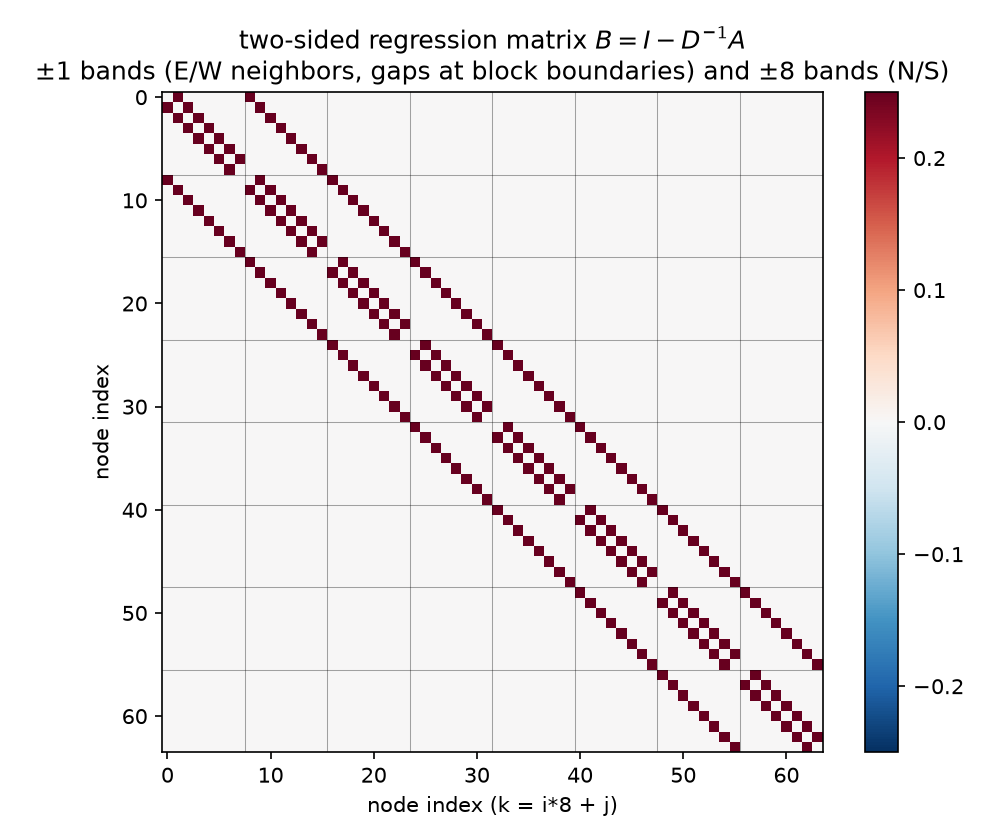

(Wolfram rendering: 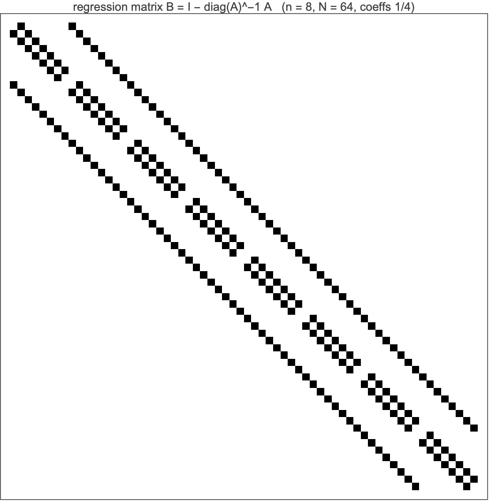.)

$B = I - \mathrm{diag}(A)^{-1}A$ is [09 §3](09-stiffness-as-precision.md)'s regression matrix, and on the grid it is verified to be *exactly* the stencil: **row $k$ has the value $1/4$ at each in-grid stencil neighbor of node $k$ (4 of them for interior nodes, 2–3 at edges and corners), zero elsewhere, zero diagonal** — the Wolfram check prints `max |coeff − 1/4| = 0.` and confirms the nonzero pattern coincides with the 5-point off-diagonal support of $A$ (224 positions), bit-exactly. The picture therefore has exactly three gray levels, and its geometry decodes as:

- **The $\pm1$ bands** are the E/W neighbors $k \pm 1$. They are *interrupted at every 8th position* — the gaps at the block boundaries are the grid-row breaks, where node $(i,7)$'s flat successor $k+1$ is $(i{+}1,0)$, a node on the other side of the domain and *not* a neighbor. The gaps are the picture telling you the 1-D index is hiding a 2-D lattice.
- **The $\pm8$ bands** are the N/S neighbors $k \pm 8$: solid bands offset by one full block. (Compass convention, used throughout and matching every figure: row $i$ increases southward from the top, column $j$ eastward from the left — so $k{-}8$ is the N neighbor, $k{+}8$ the S neighbor, and $(0,0)$ is the NW corner.)
- **Missing weight at the boundary** is not an artifact: an edge node keeps coefficient $1/4$ on each neighbor it has, and the remainder of the prediction is the Dirichlet wall, pinned at 0, which needs no regressor.

Statistically, row $k$ *is* the full conditional of the Gibbs field with the source lift:

$$\mathbb E[u_k \mid u_{-k}] \;=\; \frac{u_N + u_S + u_E + u_W}{4} \;+\; \frac{h^2}{4}\,b_k, \qquad \mathrm{Var}(u_k \mid u_{-k}) \;=\; \frac{1}{A_{kk}} \;=\; \frac{h^2}{4} \;=\; 3.086\times10^{-3},$$

the 2-D mean-value property in regression costume ([09 §3](09-stiffness-as-precision.md)). The conditional variance is verified two independent ways: as $1/A_{kk}$, and by brute-force Schur complement of $\Sigma$ at node $(3,4)$ — they agree to $10^{-15}$. And the notebook identity $A = (I - B)\,D$, $D = \mathrm{diag}(A)$, holds to machine precision in both languages: *the precision matrix is the stack of these 64 regressions, and $B$ is the Jacobi iteration matrix* — Jacobi-the-solver replaces every node by this conditional mean simultaneously, Gibbs-the-sampler does it with the $h^2/4$ noise restored ([10 §2.3](10-fluctuation-dissipation.md)).

So the two ArrayPlots are the two parameterizations of one Gaussian: $B$ (with $D$) is the sparse conditional side, $A^{-1}$ the dense marginal side. Everything that follows is about crossing between them cheaply.

---

## 2. From $B$ to $A^{-1}$: the Green's function as a sum over random walks

The bridge between the two pictures is the Neumann series. Since $A = (I-B)D$,

$$A^{-1} \;=\; \Big(\sum_{k=0}^{\infty} B^k\Big)\,D^{-1}, \qquad \rho(B) \;=\; \frac{\cos(\pi h) + \cos(\pi h)}{2} \;=\; \cos(\pi/9) \;=\; 0.939693\ (\text{verified to } 10^{-12}).$$

Because $B$'s only nonzero entries are $1/4$ on lattice neighbors, $(B^k)_{pq}$ is exactly $(1/4)^k \times$ (the number of $k$-step lattice walks from $p$ to $q$ that never leave the interior — walks touching a Dirichlet wall are killed). The identity says: **the covariance of two nodes is the discounted count of all random-walk paths connecting them**, the computable form of [10 §7](10-fluctuation-dissipation.md)'s many-paths story. Truncating at $K$ terms keeps only paths of length $\le K$:

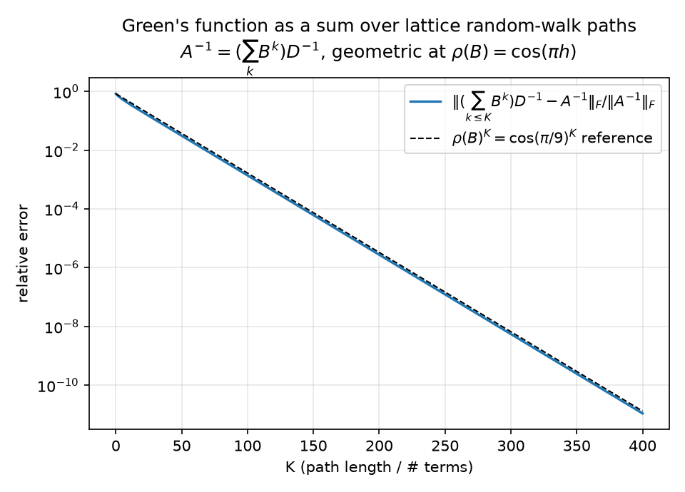

Measured: the partial sums converge to the dense inverse at relative Frobenius error $0.148$ at $K{=}25$, $1.39\times10^{-3}$ at $K{=}100$, $1.09\times10^{-11}$ at $K{=}400$, and the decay is geometric with fitted rate $0.939693$ over $K = 100\ldots300$ — matching $\rho(B) = \cos(\pi/9)$ to seven digits (checked within 0.2%). (The figure is semilog, not log–log: a geometric law $\rho^K$ is a straight line on semilogy, which is what makes the rate comparison against the dashed $\cos(\pi/9)^K$ reference legible.)

Two readings of the same number. **Solver:** $\cos(\pi/9)$ is the Jacobi convergence rate — only ~6% of the error removed per sweep even at this tiny $n$, and $\to 1 - \pi^2h^2/2$ as $h \to 0$: critical slowing down, [10 §6](10-fluctuation-dissipation.md). **Field:** the correlation between distant nodes is carried by *long* walks; any method that truncates the walk sum at short range (every method in §4) must mismodel exactly the smooth, long-wavelength content — the error mode we will see lingering in §6's pictures.

---

## 3. One-sided regressions on the grid: the wavefront, the fill, and the mirror

Now order the nodes lexicographically and run [09 §4.2](09-stiffness-as-precision.md)'s sequential regressions. On the chain, regressing $u_i$ on its successors needed one regressor and $L = \mathrm{chol}(A)$ was bidiagonal. On the grid the graph is not a tree, and the whitening rows

$$z_k \;=\; L_{kk}u_k + \sum_{j>k} L_{jk}\,u_j, \qquad \text{coefficients } -L_{jk}/L_{kk}, \quad \text{innovation sd } 1/L_{kk}$$

go long-range. Measured anatomy of $L = \mathrm{chol}(A)$ at $n=8$ (confirmed independently by the Wolfram script: 519 nonzeros, bandwidth 8, 343 fill entries):

- **Bandwidth exactly $n = 8$**: the farthest nonzero offset below the diagonal is 8, never more. Eliminating node $(i,j)$ involves only nodes up to $(i{+}1, j)$ — one grid row ahead.
- **The band fills in completely**: of the 476 strict-band slots below the diagonal, $A$'s own strict lower pattern accounts for 112 nonzeros and Cholesky creates **343 fill entries** — 455 of the 476 slots occupied, the interior of the band dense. (Adding the 64 diagonal entries gives $L$'s totals: 519 nonzeros = 176 on $A$'s lower-triangular pattern + 343 fill.) This is [09 §6](09-stiffness-as-precision.md)'s *fill-in = marginalization* made visible: eliminating node $k$ marries its not-yet-eliminated neighbors (Schur complement = integrating $u_k$ out of the Gaussian), and on a grid, unlike a chain, those neighbors were not already coupled.

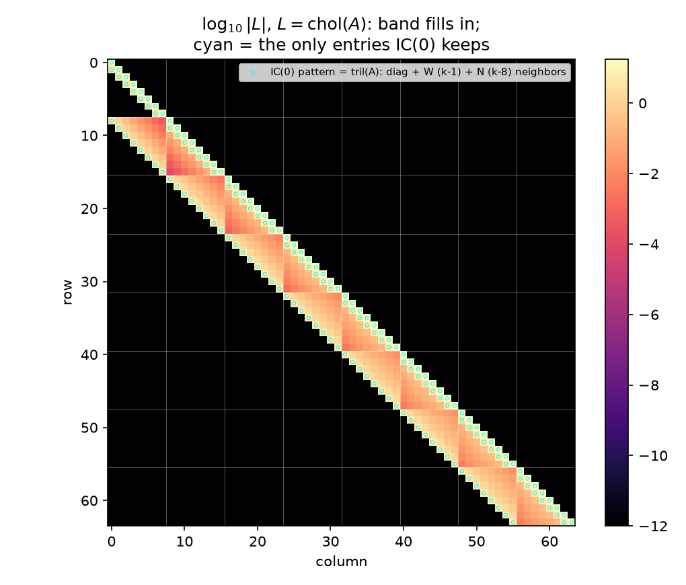

(Wolfram rendering of the same object: 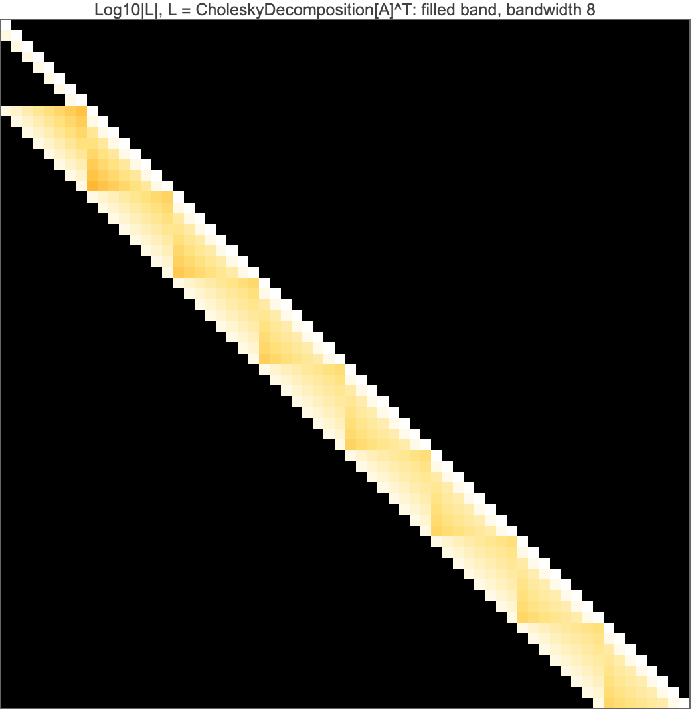.)

The heatmap of $\log_{10}|L|$ shows the filled band; the cyan circles outline the only entries $A$'s own lower pattern contains — the diagonal plus the W ($k{-}1$) and N ($k{-}8$) couplings. Everything else inside the band is marginalization-induced regression weight.

**The wavefront profile.** How big are those fill coefficients? The $\le 8$ successors of an interior node $k = (r,c)$ are the remainder of its own grid row plus the leading nodes of the next — the *elimination wavefront*. Sorting them by **lateral distance** (how far the predicting node sits, within the wavefront, from the predicted node's column; lateral 0 = the node $(r{+}1, c)$ directly in the next grid row, flat offset $+8$), the mean $|{\text{coefficient}}|$ over interior rows $r = 1..6$ decays *monotonically* (checked):

| lateral distance | 0 | 1 | 2 | 3 | 4 | 5 | 6 | 7 |
|---|---:|---:|---:|---:|---:|---:|---:|---:|
| mean \|coef\| | 0.2995 | 0.2191 | 0.0265 | 0.0112 | 0.0050 | 0.0024 | 0.0011 | 0.0005 |

Indexed by *flat* offset $d = 1..8$ instead, the same numbers form a U: $0.2941,\ 0.0107,\ 0.0049,\ 0.0050,\ 0.0109,\ 0.0296,\ 0.0894,\ 0.2995$ — large at $d=1$ (the E neighbor) and $d=8$ (the next-row neighbor), small in the middle — because the flat offset conflates lateral distance with the row wrap; lateral distance is the reading under which the decay is monotone and meaningful. The content: **the two stencil successors carry coefficients ~0.3 each; the fill coefficients are real but decay fast** (~one order of magnitude by lateral distance 2, ~600× by distance 7). The exact whitener is *quasi*-local. That is simultaneously why incomplete factorizations work at all (§4: the dropped mass is small) and why they cannot be exact (it is not zero).

**The bidirectional story survives intact — upgraded to a symmetry of the square.** All of 09's chain identities re-verify on the grid:

- $(I - \Phi_{\mathrm{L2R}})\,\Sigma\,(I - \Phi_{\mathrm{L2R}})^\top$ is diagonal — predecessor regressions are the modified Cholesky of the covariance (Pourahmadi), computed here by literally running the 64 regressions.
- The reversal identity $\mathrm{chol}(A^{-1}) = P\,L^{-\top}P$ holds, with $P$ the index-reversal permutation.
- What was "time reversal" on the chain is now geometry: index reversal is the **180° rotation of the grid**, and it is an automorphism, $PAP = A$ (checked). Consequently the two one-sided coefficient sets are mirror images, $\Phi_{\mathrm{L2R}} = P\,\Phi_{\mathrm{R2L}}\,P$ (checked): scanning the grid NW→SE and regressing on predecessors is the *same* model as scanning SE→NW and regressing on successors, rotated half a turn. One regression story, two scan directions, exchanged by a symmetry of the domain — the grid version of 09's $i/(i{+}1)$ vs $(n{+}1{-}i)/(n{+}2{-}i)$ mirror. (This automorphism returns with a vengeance in §6.)

---

## 4. IC(0): the local whitener, and exactly how local it is

Incomplete Cholesky with zero fill keeps only the cyan-circled entries of the heatmap: each node's whitening row may use its **W and N stencil predecessors only** (equivalently, by the §3 rotation, each $u_k$ is regressed on its successor stencil $\{k{+}1, k{+}8\}$ — the two comparisons are verified to coincide via $PAP = A$). Measured at $n = 8$:

| quantity | value |
|---|---:|
| $\|L_{\mathrm{IC}} - L\|_F/\|L\|_F$ on the kept pattern | **0.0391** |
| dropped mass $\|L_{\text{off-pattern}}\|_F/\|L\|_F$ | **0.0848** |
| $(L_{\mathrm{IC}}L_{\mathrm{IC}}^\top)_{ij} = A_{ij}$ on $A$'s pattern | exact (checked) |
| $\kappa(A) \to \kappa(M_{\mathrm{IC}}^{-1}A)$ | $32.16 \to 3.68$ |

The classical defining property — the incomplete factors reproduce $A$ *exactly on $A$'s own sparsity pattern* and simply have nothing to say off it — is verified entrywise. Statistically: IC(0) is a sparse autoregression that gets every retained normal equation right and drops the 8.5% of whitening mass living on the fill, and that costs a factor ~9 in condition number rather than the ~$\infty$ a naïve reading of "343 of 519 entries discarded" might suggest, because §3's wavefront profile says the discarded coefficients are the small ones.

**The Vecchia cross-check.** [09 §6](09-stiffness-as-precision.md) identified IC(0) with the Vecchia approximation — the KL-optimal sparse factor is the *truncated regression* factor, coefficients read from exact $\Sigma$ submatrices (Schäfer–Katzfuss–Owhadi). On the 1-D chain the two coincide exactly (no fill to disagree about). On the grid the experiment measures, for every node, the covariance-side regression of $u_k$ on $\{k{+}1, k{+}8\}$ against IC(0)'s column coefficients $-L_{jk}/L_{kk}$:

> same sparsity pattern, same innovation scales to $2.40\times10^{-3}$ — but **measurably different coefficients: max deviation $8.32\times10^{-2}$, mean $6.11\times10^{-2}$, on coefficients of typical size $0.34$** — i.e. ~22% relative at the worst interior nodes (e.g. $(3,5)$).

This deviation is a *feature of the report, not a bug of the code*: it is the machine-checked boundary of 09's identification. IC(0) enforces $LL^\top = A$ on the pattern (an algebraic constraint on the precision side); Vecchia solves each little $2\times2$ generalized least-squares problem exactly on the covariance side (the KL-optimal choice). On a chain the two criteria have the same solution; on a graph with fill they part ways, by about a fifth of a coefficient here. Both remain legal SPD surrogates, both whiten approximately — and [10 §5](10-fluctuation-dissipation.md) already raced the Vecchia one (fitted from noise, 30 iterations) against everything else.

**What no local predictor can model.** IC(0)'s regressions see two neighbors. The covariance they are asked to whiten has a 187:1 corner-to-corner range carried by arbitrarily long walks (§2). The residual mismatch is therefore *concentrated on the smooth end of the spectrum* — short regressions capture the stencil physics (the rough modes) and systematically miss the domain-scale modes that only long walks know about. That is not hand-waving; §6 measures it: at $n = 32$, after 15 IC(0)-PCG iterations the remaining error is, by amplitude, 91% a single smooth eigenmode. A local whitener leaves a smooth ghost. Which raises the obvious question — what would a *global but cheap* regressor buy?

---

## 5. The multiscale alternative: "what if I just subtract the average temperature?"

### 5.1 The global mean as a regressor (n = 8 anatomy)

Regress the field on one scalar: its own global mean $\bar u = \tfrac1N \mathbf 1^\top u$. The least-squares loading of node $i$ on this regressor is

$$\beta_i \;=\; \frac{\mathrm{Cov}(u_i, \bar u)}{\mathrm{Var}(\bar u)} \;=\; \frac{(\Sigma\mathbf 1)_i / N}{\mathbf 1^\top \Sigma \mathbf 1 / N^2},$$

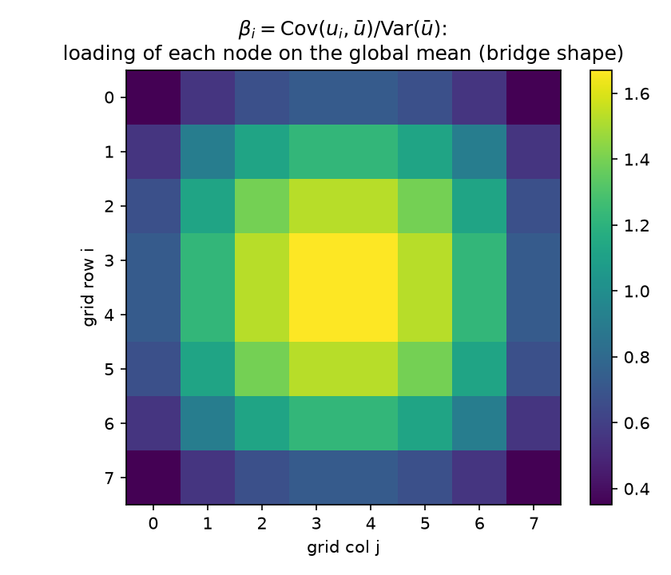

and the loading map is verified to be **bridge-shaped: maximal (1.671) at the four center nodes, minimal (0.351) at the corners**, center-to-edge-midpoint ratio 2.29 — the 2-D dome that is the grid's answer to the Brownian-bridge variance profile of [09 §2](09-stiffness-as-precision.md). Center nodes co-move with the global mean more than one-for-one ($\beta > 1$); corners, pinned by two walls, barely participate. Already a lesson: "subtract the average" should not subtract it *uniformly* — the statistically correct subtraction is $\beta_i \bar u$, a shaped correction.

How much does it explain? Conditioning $\Sigma$ on $\bar u$ (rank-one covariance update) removes **15.2%** of the total variance ($1 - \mathrm{tr}\,\Sigma_{\mathrm{res}}/\mathrm{tr}\,\Sigma$). One number cannot summarize a field — but it is the *right kind* of number: it is exactly the long-range part. Refine the regressor set to the **sixteen 2×2-block averages** and the variance explained jumps to **56.7%** (checked: $0.152 \to 0.567$). Sixteen coarse numbers carry more than half the field's energy.

The sharper diagnostic is what conditioning does to *correlation length*:

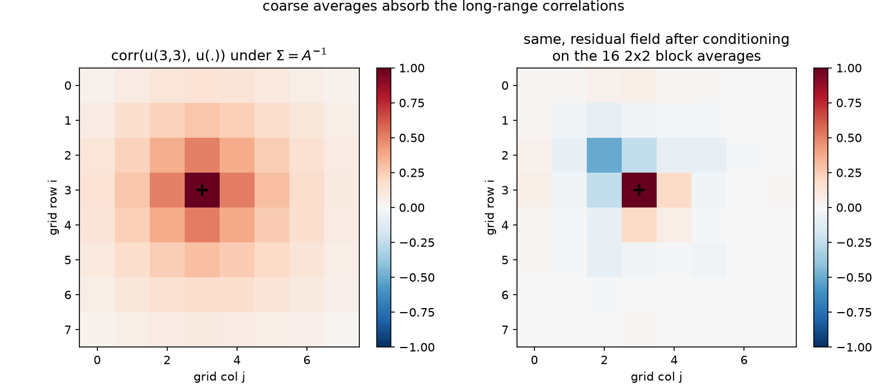

Left: $\mathrm{corr}(u_{(3,3)}, u_{\cdot})$ under $\Sigma$ — the positive halo spans the domain; mean $|{\mathrm{corr}}|$ at Chebyshev distance $\ge 3$ from the node is **0.098**. Right: the same node in the *residual* field after conditioning on the 16 block averages — the halo is gone; far-field mean $|{\mathrm{corr}}|$ collapses to **0.011**, a 8.9× drop (checked at $< 0.25\times$). **Coarse averages absorb the long-range dependence, leaving a short-range residual field** — precisely the component a local whitener (§4) is good at. The division of labor could not be cleaner, and it is the statistical case for a two-level method: let block averages model the walks that are long, let the stencil regressions model the walks that are short.

### 5.2 The preconditioner: local whitener + coarse regression (n = 32 solve)

Assemble that division of labor as an **additive two-level preconditioner** on the canonical $n = 32$ grid. Coarse space: $Z$ = the 64 columns of 4×4 block-average indicators; Galerkin coarse operator $A_c = Z^\top A Z$ (the coarse correction $Z A_c^{-1} Z^\top$ is invariant to column scaling of $Z$, so "average" vs "indicator" is immaterial); note $Z A_c^{-1} Z^\top A$ is the $A$-orthogonal projector onto the coarse space — *regression on the coarse averages in the energy inner product*. Candidates, all run to $\|r_k\|/\|b\| \le 10^{-10}$ on §6's hot/cold-rod right-hand side through the suite's [pcg](../python/pcg.py) (all five converge; all match `spsolve` to $\sim10^{-11}$; $\kappa(M^{-1}A)$ from the dense generalized eigenproblem):

| $M^{-1}$ | model it encodes | iterations | $\kappa(M^{-1}A)$ | spectrum of $M^{-1}A$ |
|---|---|---:|---:|---|
| none | — | 76 | 440.69 | $[19.7,\ 8692.3]$ |
| coarse-only: $z_1(z_1^\top A z_1)^{-1}z_1^\top + \theta I$, $z_1 \propto \mathbf 1$, $\theta = h^2/4$ | one global regressor + i.i.d. residual | 76 | 183.90 | $[0.0109,\ 1.995]$ |
| two-level: $\mathrm{diag}(A)^{-1} + Z A_c^{-1} Z^\top$ | neighborhood averages + i.i.d. residual | 48 | 19.02 | $[0.105,\ 1.996]$ |
| IC(0) | stencil regressions only (§4) | 39 | 39.81 | $[0.0303,\ 1.205]$ |
| two-level: $M_{\mathrm{IC}}^{-1} + Z A_c^{-1} Z^\top$ | stencil regressions **and** neighborhood averages | **32** | **11.05** | $[0.180,\ 1.993]$ |

The verified ordering is $\text{none} \ge \text{coarse-only} \ge \text{two-level Jacobi} \ge \text{IC(0)} \ge \text{two-level IC(0)}$, and adding the coarse level improves the $\kappa$ of both smoothers it is added to. Three morals:

**Coarse-only barely helps — and on this right-hand side, provably not at all.** A single global regressor models exactly *one direction* of a 1024-dimensional field; deflating it improves the worst case ($\kappa$: $440.7 \to 183.9$, a 2.4× cut from removing the lowest even mode) but leaves the other 1023 variance ratios untouched. And here even that one direction goes unused: the rod RHS is exactly *odd* under the 180° rotation ($Pb = -b$, checked — §3's automorphism again), and because $PAP = A$, parity propagates through the iteration: starting from odd $b$, every residual $r_k$ stays odd (inductively — $A$ preserves parity, and on an odd residual the even regressor contributes nothing, so $M^{-1}$ acts as $\theta I$), while $z_1 \propto \mathbf 1$ is *even*, and odd is orthogonal to even. Hence $z_1^\top r_k = 0$ for all $k$ ($\mathbf 1^\top b = 0$ included) and the preconditioner degenerates to $M^{-1}r = \theta r$ — a scalar, to which PCG is invariant ([04](04-krylov-and-pcg.md)). Iterations: 76 = 76, exactly (the dashed curve in §6's figure sits on the CG curve). $\kappa$ is a worst-case-RHS bound; this RHS never excites the deflated mode. A regressor orthogonal to the data teaches the solver nothing.

**Clustering beats $\kappa$.** Two-level Jacobi has *less than half* IC(0)'s condition number (19.0 vs 39.8) yet needs *more* iterations (48 vs 39): IC(0)'s spectrum is clustered near 1 with a thin lower tail, and CG eats clustered spectra ([04](04-krylov-and-pcg.md), [05 §1](05-classical-preconditioners.md), and the NPO result of [06](06-neural-preconditioner.md), which wins *entirely* by clustering). Both checks — the iteration ordering and the $\kappa$ ordering — are asserted separately in the script for exactly this reason.

**The sum does what neither part can.** Two-level IC(0) is the best on every column: 32 iterations, $\kappa = 11.05$, lowest eigenvalue lifted 6× above IC(0)'s ($0.180$ vs $0.030$ — the coarse regression props up precisely the smooth tail that the local whitener leaves sagging), while the upper edge stays at ~2 (the additive combination at most doubles a normalized mode). Read as a model, this preconditioner is one sentence:

> **Predict each temperature from its stencil neighbors *and* from its neighborhood average; whiten by subtracting both predictions.** $M^{-1} = $ local conditional regressions (IC(0)/Vecchia, §4) $+$ coarse least-squares regression ($Z A_c^{-1}Z^\top$, §5.1), applied additively to the residual inside PCG.

(Report [12](12-autoregressive-preconditioning.md) strips the CG acceleration off this whole table and re-runs each model as a bare stationary Richardson iteration, where its quality is a naked spectral radius — IC(0)'s 39 PCG iterations become 706 sweeps at $\rho = 0.9697$, and the additive Jacobi+coarse combination runs at $\rho = 0.9024$.)

### 5.3 From averages to multigrid

Recurse the idea. The coarse operator $A_c = Z^\top A Z$ is itself a (Galerkin) Laplacian-like matrix on the 8×8 grid of block averages — a 64-variable version of the *same problem*, whose own smooth modes can be handled by *its* block averages, and so on down. Iterating "local regression + regression on averages" through a hierarchy of scales, with the exact coarse solve replaced by recursion, **is multigrid** — coarse-grid correction is inference on aggregated variables ([09 §8](09-stiffness-as-precision.md)'s last dictionary row, now with measured numbers behind it), and the smoother/coarse-grid division of labor is §5.1's variance decomposition run at every level. That is [05 §5](05-classical-preconditioners.md)'s "the right answer for Poisson is multigrid" with a statistical *why*: each level's regressors explain the octave of correlation lengths that the level below cannot reach (here: 15% for the top scalar, 57% by the 16 block averages, the short-range remainder for the stencil). And it locates the learned version precisely: the NAMG architecture of [06](06-neural-preconditioner.md) hard-wires this same topology and *learns the restriction* — its attention weights $R = A\cdot E_\theta$ are **learned coarse regressors**, data-dependent block averages chosen by training rather than by geometry, one rung up the same ladder ([10 §5](10-fluctuation-dissipation.md)) from our hand-built $Z$.

---

## 6. The hot/cold-rod demonstration: watching the error fields

The narrative problem, built so every claim above is visible as a picture: on the $n = 32$ grid, a **hot rod** (+1 source on the 6 nodes $(3..8,\ 4)$, near the NW corner) and a **cold rod** (−1 on $(23..28,\ 27)$, near the SE corner).

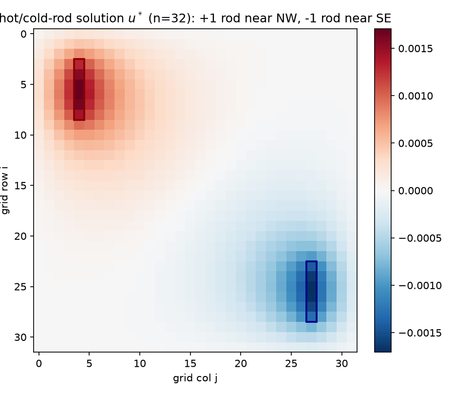

The solution (checked): global maximum $+1.706\times10^{-3}$ *on* the hot rod, global minimum $-1.706\times10^{-3}$ on the cold rod — equal magnitudes, because the configuration maps onto its own negative under the 180° rotation — positive over the hot half, negative over the cold, with the zero level set threading between. This is $A^{-1}b$: the two rods' Green's bumps (§1.1) superposed with signs.

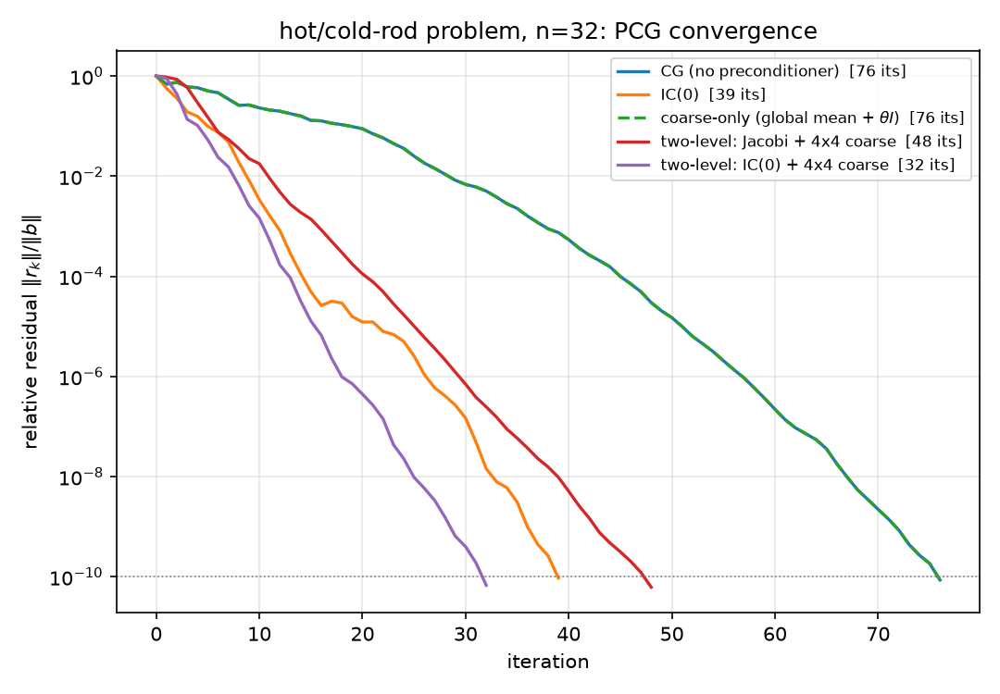

The convergence curves realize §5.2's table: coarse-only (dashed) lies *exactly* on the plain-CG curve, the two-level curves drop steepest earliest, two-level IC(0) reaches $10^{-10}$ first (32).

**The error-field panel.** Run plain CG, IC(0)-PCG, and two-level (Jacobi+coarse) for exactly $k = 0, 5, 15$ iterations and plot $e_k = u^\star - x_k$ (shared symmetric color scale per row):

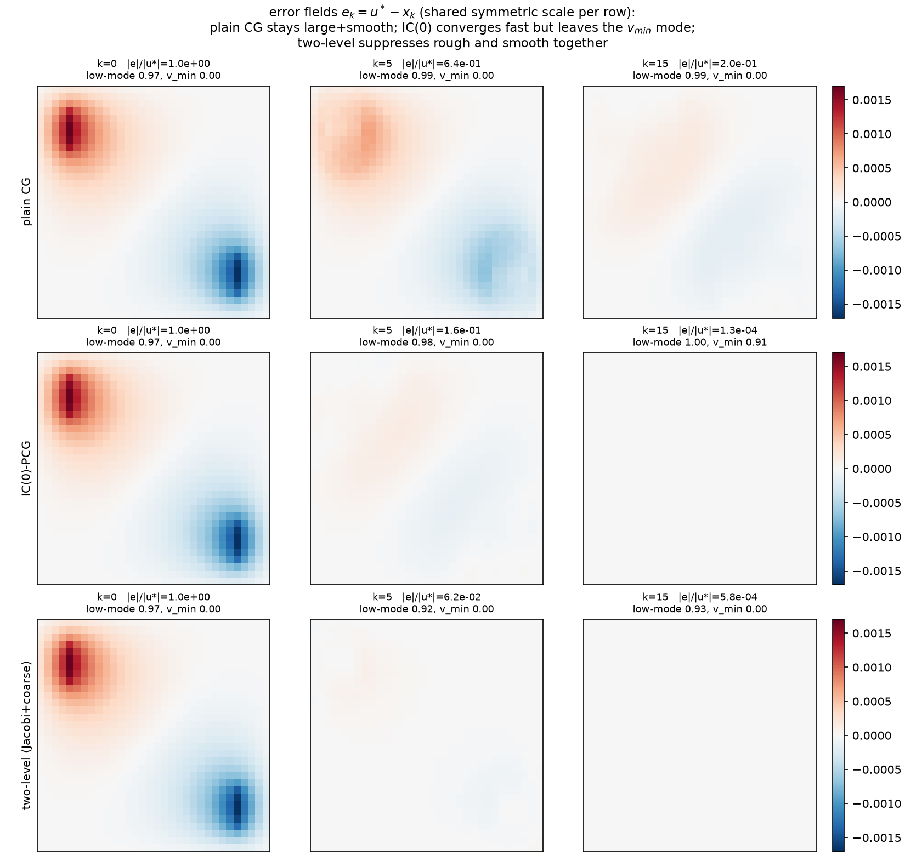

The measured numbers under each panel ($v_{\min}$ = lowest eigenvector of $A$; "low-15" = the *amplitude* fraction of $e_k$ in $A$'s lowest 15 eigenmodes, $\|V_{\mathrm{low}}^\top e_k\|/\|e_k\|$, and "$v_{\min}$ frac" $= |\langle v_{\min}, e_k\rangle|/\|e_k\|$ — norm fractions, not squared energies):

| $\|e_k\|/\|u^\star\|$ | $k=0$ | $k=5$ | $k=15$ | low-15 at $k{=}0/5/15$ | $v_{\min}$ frac at $k{=}0/5/15$ |
|---|---:|---:|---:|---|---|
| plain CG | 1.0 | 0.643 | 0.200 | 0.974 / 0.991 / 0.989 | 0 / 0 / 0 (exact) |
| IC(0)-PCG | 1.0 | 0.156 | $1.31\times10^{-4}$ | 0.974 / 0.985 / 0.996 | 0.000 / 0.001 / **0.914** |
| two-level (Jac+coarse) | 1.0 | $6.20\times10^{-2}$ | $5.80\times10^{-4}$ | 0.974 / 0.916 / 0.928 | 0 / 0 / 0 (exact) |

Read the rows against §2–§5:

- **Plain CG: large and smooth, for a long time.** At $k = 15$ the error is still 20% of the solution and ~99% of its amplitude sits in the lowest 15 (of 1024) eigenmodes. The panels show a smooth two-lobed ghost of the solution itself. Krylov polynomials kill the rough end of the spectrum first; the smooth end — the long-walk content of §2 — is exactly what a degree-15 polynomial in $A$ cannot yet resolve.
- **IC(0): rough error annihilated, one smooth mode lingers.** By $k = 15$ the error *norm* is tiny ($1.3\times10^{-4}$, checked $< 10^{-3}$, three orders below plain CG) — but **91.4% of what remains, by amplitude, is the single mode $v_{\min}$**. The local whitener of §4 delivered exactly what its dropped-fill budget predicted: everything but the smoothest content, whose ghost is visible as the domain-filling dome in the $k=15$ panel.
- **Two-level: rough and smooth die together.** Smallest error already at $k = 5$ ($6.2\times10^{-2}$, vs IC(0) $0.156$ and CG $0.643$ — the checked ordering), the low-mode *fraction* of its error actually falls (0.974 → 0.916), and its $v_{\min}$ content is zero throughout. The honest caveat is also checked and worth stating: by $k = 15$ IC(0)'s error *norm* has caught back up ($1.3\times10^{-4} < 5.8\times10^{-4}$) — additive Jacobi+coarse is a weaker smoother than IC(0); the point of the panel is *which component* survives, and the combination two-level IC(0) beats both (32 vs 39/48 iterations, §5.2).

**The symmetry footnote that the experiment forced.** Those exact zeros in the $v_{\min}$ column are not luck. $v_{\min} = \sin(\pi x)\sin(\pi y)$ (verified as $A$'s lowest eigenvector, with the dense $\lambda_{\min}$ matching the analytic $8\sin^2(\pi h/2)/h^2 = 19.72$) is *even* under the 180° rotation $P$, while the rod RHS is exactly *odd* ($Pb = -b$, checked). Every method whose preconditioner commutes with $P$ — plain CG, coarse-only, Jacobi+coarse (the 4×4 block space is $P$-invariant) — keeps every iterate in the odd subspace, so its error is *exactly* orthogonal to $v_{\min}$ at every $k$ (measured at $10^{-12}$–$10^{-16}$). Only IC(0) leaks into the even subspace, because its **lexicographic elimination ordering is not rotation-invariant** — the one method that breaks §3's automorphism is the one whose lingering error *is* $v_{\min}$. (Hence the low-15 column as the parity-blind smoothness measure; the cut at 15 is degeneracy-safe because it *completes* the degenerate $(3,4)/(4,3)$ pair at ranks 13–14 and leaves the next pair, $(1,5)/(5,1)$ at ranks 15–16, out whole: $w_{14} < w_{15} = w_{16}$, 0-based.) A regression model's *ordering* is part of the model — 09 said it abstractly; here it decides which invariant subspace your error haunts.

---

## 7. The unified statement

Assemble §§1–6 into the sentence the whole suite has been circling:

> **A preconditioner is a statistical model that predicts the value at each position from a subset of other positions, applied inside CG as an approximate whitener.** Factor the surrogate as $M = L_M L_M^\top$; PCG is CG on $L_M^{-1}AL_M^{-\top}$ — the true precision in the coordinates the surrogate believes are white ([09 §6](09-stiffness-as-precision.md)) — and $\kappa(M^{-1}A)$, tempered by clustering ([04](04-krylov-and-pcg.md)), prices the model mismatch. The choice of *conditioning set* is the whole design space:
>
> | predict each node from… | preconditioner | measured here |
> |---|---|---|
> | nothing (variances only) | Jacobi | inert on constant diagonal ([05](05-classical-preconditioners.md): 116 = 116; §5.2's $\theta I$) |
> | its stencil neighbors | IC(0) ≈ Vecchia (deviation measured: ≤ 0.083, §4) | 39 its, $\kappa$ 39.8; smooth ghost = 91% $v_{\min}$ by amplitude |
> | one global average | coarse-only | 76 its; models one direction, unexcited on odd RHS |
> | neighborhood averages | two-level Jacobi+coarse | 48 its, $\kappa$ 19.0 |
> | neighbors **and** averages | two-level IC(0)+coarse | **32 its, $\kappa$ 11.05** |
> | averages of averages, recursively | multigrid ([05 §5](05-classical-preconditioners.md)) | the $O(N)$ endpoint of §5.3 |
> | a few dominant global factors | Nyström ([07](07-nystrom-preconditioning.md)) | fails here: no dominant factors to keep |
> | a learned conditioning set | NPO/NAMG ([06](06-neural-preconditioner.md)), fitted Vecchia ([10 §5](10-fluctuation-dissipation.md)) | 30 its each, learned restriction = learned coarse regressors |
> | everything (exact regressions) | complete Cholesky = direct solve | one "iteration"; 343 fill entries at $n{=}8$ is the price |

Dictionary delta — multiscale rows appended to [09 §8](09-stiffness-as-precision.md) and [10 §8](10-fluctuation-dissipation.md) (all verified in [grid_regressions_multiscale.py](../python/experiments/grid_regressions_multiscale.py)):

| Numerical linear algebra / PDE | Statistics / probability |
|---|---|
| Neumann series $A^{-1} = (\sum_k B^k)D^{-1}$, rate $\rho(B) = \cos(\pi h)$ | Green's function as discounted sum over killed lattice random walks; fitted rate 0.939693 = theory |
| Cholesky fill inside the bandwidth-$n$ band (343 entries at $n{=}8$) | Marginalization-induced regressions on the elimination wavefront; mean \|coef\| decays 0.2995 → 0.0005 with lateral distance |
| IC(0) vs KL-optimal sparse factor | Precision-side vs covariance-side truncated regression: identical on trees, ~22% coefficient deviation on the grid (Schäfer–Katzfuss–Owhadi) |
| Coarse-space vector $\mathbf 1$; deflation of the mean | Global-mean regressor; loadings $\beta_i = \mathrm{Cov}(u_i,\bar u)/\mathrm{Var}(\bar u)$, bridge-dome shaped (1.671 center / 0.351 corner) |
| Coarse correction $Z(Z^\top AZ)^{-1}Z^\top$; Galerkin $A_c$ | Least-squares regression on block averages ($A$-orthogonal projection); $R^2$: 0.152 (1 regressor) → 0.567 (16) |
| Smoother handles high frequencies, coarse grid the low | Residual correlation-length collapse after conditioning on averages (far-field \|corr\| 0.098 → 0.011) |
| Additive two-level $M^{-1} = M_{\mathrm{loc}}^{-1} + ZA_c^{-1}Z^\top$ | Predict from neighbors *and* neighborhood average, subtract both (76→32 its, $\kappa$ 440.7→11.05) |
| Multigrid hierarchy; learned restriction (NAMG) | Recursive regression on aggregates; learned coarse regressors |
| Preconditioner ordering (lexicographic IC(0)) breaks a domain symmetry | Model's variable ordering is part of the model: error leaks into the even subspace, lingering mode = $v_{\min}$ (91.4% by amplitude) |
| $\kappa$ improvement without iteration improvement (coarse-only, odd RHS) | Worst-case vs realized: a regressor orthogonal to the data is never exercised |

---

## 8. Pointers

Everything cited here is 09/10's canon, now with grid-scale measurements: Rue & Held (2005) for the GMRF reading of §1; Pourahmadi (1999, 2011) for the sequential-regression parameterization of §3; Vecchia (1988) and Schäfer, Katzfuss & Owhadi (SISC 2021) for §4, whose IC(0)-vs-Vecchia gap this report is, to our knowledge, the suite's first explicit measurement of; Saad (*Iterative Methods*, §10.3.5) for the IC(0) recurrence as implemented; Trottenberg–Oosterlee–Schüller (2001) via [05 §5](05-classical-preconditioners.md) for the multigrid endpoint of §5.3. Sibling reports: the operator and its spectrum, [01](01-code-walkthrough.md)/[02](02-eigenvalues.md); the GRF right-hand side, [03](03-gaussian-random-fields.md); the PCG harness, the $\sqrt\kappa$ bound, and why clustering beats $\kappa$, [04](04-krylov-and-pcg.md); the classical baselines and the road to multigrid, [05](05-classical-preconditioners.md); the learned restriction this report's §5.3 grounds, [06](06-neural-preconditioner.md); the factor-analysis alternative and its instructive failure, [07](07-nystrom-preconditioning.md); consolidated tables, [08](08-results.md); the dictionary, [09](09-stiffness-as-precision.md); the physics, [10](10-fluctuation-dissipation.md); the roadmap, [00](00-overview.md).

---

**Coda.** The 8×8 grid's two ArrayPlots began as a curiosity: one dense positive matrix, one three-valued sparse one. They end as the two halves of the suite's final sentence. The dense picture is what the field *is* — every node touching every node through too many walks to count. The sparse picture is what the field *knows locally* — four neighbors, coefficient ¼ each, variance $h^2/4$. Solving $Au = b$ is crossing from the second picture to the first, and every preconditioner in reports 05–07, this one included, is a wager about which regressors — neighbors, averages, factors, or learned attention — buy the most of that crossing per flop.
