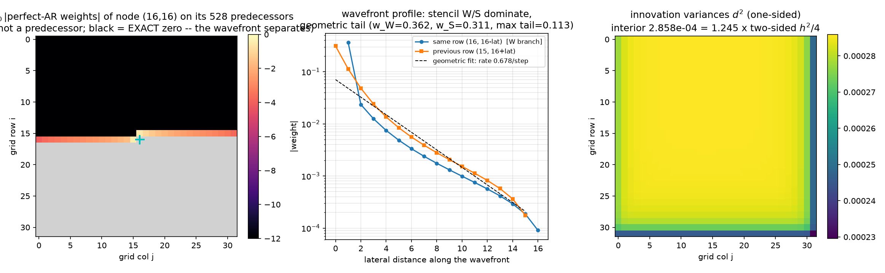
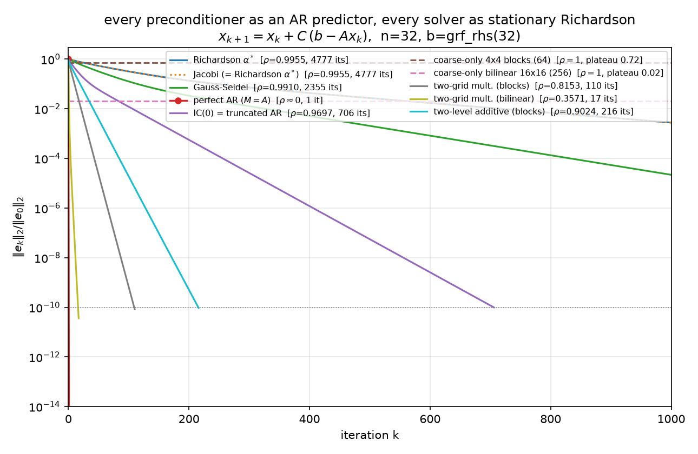

# The Preconditioner Is an Autoregressive Predictor

### Predict-and-correct: Jacobi, Gauss–Seidel, the perfect one-sided regression, and the whole truncation ladder, run as one stationary Richardson iteration

*The synthesis report the suite has been building toward: [09](09-stiffness-as-precision.md) established stiffness = precision and Cholesky = sequential regression on the 1-D chain; [10](10-fluctuation-dissipation.md) measured the same objects in thermal noise; [11](11-regressions-and-multiscale.md) walked them across the 2-D grid inside PCG. This report removes CG entirely and runs **every** preconditioner as the same stationary predict-and-correct iteration, so that each one's quality is exposed as a bare geometric rate — the spectral radius of its error-propagation matrix — with nothing clever in between. Notation is 09/10/11's throughout: $h = 1/(n+1)$, $A$ = Kronecker-sum Laplacian $/h^2$ (`poisson_2d`, $N = n^2$, lexicographic row-major $k = ni+j$; [01](01-code-walkthrough.md)/[02](02-eigenvalues.md)), $B = I - \mathrm{diag}(A)^{-1}A$ the two-sided regression matrix = Jacobi iteration matrix with $\rho(B) = \cos(\pi h)$ (2-D eigenvalues $(\cos(k\pi h)+\cos(l\pi h))/2$), conditional variance $1/A_{ii} = h^2/4$, `phiL2R`/`phiR2L` the sequential regressions, $A = (I-\Phi)^\top D_\sigma^{-2}(I-\Phi)$, reversal identity $\mathrm{chol}(A^{-1}) = PL^{-\top}P$, Vecchia = truncated regression — all per the companion notebook `whitening_inverse_transposed.nb` (`~/git0/newton/`). Canonical problem: $n = 32$, $\kappa(A) = 440.69$, $b = $ `grf_rhs(32)` (seed 42), the same right-hand side as [05](05-classical-preconditioners.md)–[08](08-results.md). Every claim below is machine-checked by [python/experiments/richardson_ar.py](../python/experiments/richardson_ar.py) (**53 checks, all PASS**, fully deterministic, ~6 s; numbers in [results/richardson_ar.json](../results/richardson_ar.json)), which reuses `poisson.poisson_2d`/`grf_rhs`, `preconditioners.ic0`, and `preconditioners.block_average_matrix` — no CG anywhere. Compass convention is [11 §1.2](11-regressions-and-multiscale.md)'s: grid row $i$ increases southward from the top, so $k{-}1$ is the W neighbor and $k{-}n$ the N (previous-row) neighbor.*

---

## 1. The frame: predict, correct, and read the rate

Every method in this report is the **stationary preconditioned Richardson iteration**

$$x_{k+1} \;=\; x_k \;+\; C\,(b - Ax_k), \qquad C \text{ a fixed linear operator},$$

started at $x_0 = 0$ and run to relative $\ell_2$ *error* $10^{-10}$ (cap 20 000 iterations). Read it as **predict-and-correct**: the residual $r_k = b - Ax_k$ is the visible symptom; $Cr_k$ is the model's *prediction of the error* from the symptom; the update applies the predicted correction. Since $r_k = Ae_k$ with $e_k = x^\star - x_k$, the error obeys

$$e_{k+1} \;=\; (I - CA)\,e_k,$$

and the asymptotic convergence factor is $\rho(I - CA)$ — literally **the per-sweep fraction of structure the predictor fails to explain**. A perfect model of $A$ ($C = A^{-1}$) predicts the error exactly and converges in one step; a vacuous model ($C = \alpha I$) leaves $1 - O(h^2)$ of the structure on the table every sweep. For each rung of the ladder the script computes $\rho$ exactly (dense eigenvalues of $I - CA$ at $N = 1024$) *and* measures the tail slope of $\Vert e_k\Vert $: they agree to six digits for the one-level methods and to 1% for the composite ones, with one honest exception — the bilinear two-grid hits $10^{-10}$ in 17 iterations, before the dominant mode separates, so its generic-start slope (0.3418) undershoots $\rho = 0.3571$ by 4.3%, and only the dominant-eigenvector-seeded slope (0.357104) recovers $\rho$ (§4).

Two deliberate methodological choices, both load-bearing:

**Richardson instead of CG.** CG's min–max optimality ([04](04-krylov-and-pcg.md)) adapts a fresh polynomial to the spectrum every iteration — it makes every $M$ look better than it is and entangles model quality with polynomial cleverness. A stationary iteration has no such adaptivity: what you see is $\rho(I - CA)$, the surrogate's honest per-sweep explanatory power. (§7 puts CG back.)

**Error curves, not residual curves.** $r = Ae$, so the residual weights each error mode by its eigenvalue — rough modes are overweighted by up to $\lambda_{\max}/\lambda_{\min} = 440.69$ in amplitude. In residual-think, a method that annihilates only the *smooth* error (§4's coarse-only projections: 98% of the $\ell_2$ error gone in one step) barely registers, and a method that leaves *only* smooth error (IC(0)'s tail) reads better than it is — measured: at iteration 20 the field is still 23% wrong in $\ell_2$ while the relative residual says 12%, and the under-report widens as the surviving error smooths (1.93× there, 2.79× by iteration 40, worst case $\lambda_{\max}/\lambda_{\min}$ in amplitude). The plateaus and phase transitions below are visible only in $\Vert e_k\Vert $ — which the experiment can afford because $x^\star$ is available from `spsolve`. Both norms are tracked ([$\ell_2$ figure](../figures/richardson_error_convergence.png), [$A$-norm figure](../figures/richardson_error_Anorm.png)); complete per-iteration histories are in the JSON.

---

## 2. The trichotomy: same regressions, three schedules

Here is the report's conceptual core, stated as a theorem and verified line by line. Reports 09–11 established that $A$'s rows *are* the exact two-sided regressions ($B$, weights $1/4$ on stencil neighbors, conditional variance $h^2/4$) and that $\mathrm{chol}(A)$'s columns *are* the exact one-sided regressions ($\Phi$, $d^2$). Both encode **perfect conditional models** of the Gibbs field. The entire difference between a $\rho = 0.9955$ solver and a one-step solver is *scheduling* — what you condition on, and whether the values you condition on are fresh.

**(i) Perfect two-sided predictor, applied synchronously = Jacobi, $\rho = \cos(\pi h)$.** $C = D^{-1} = \mathrm{diag}(A)^{-1}$ replaces every node *simultaneously* by its conditional mean given its four neighbors — but the neighbors used are the **stale** values from the previous sweep. Verified: the error-propagation matrix $I - D^{-1}A$ equals $B$ bit-exactly (`np.array_equal`), and $\rho(B) = 0.99547192$. Physics: one pass of **parallel (synchronous) heat-bath dynamics** — every site equilibrates against a frozen snapshot of its neighborhood. Statistics: one synchronous scan of conditional-mean updates ([09 §3](09-stiffness-as-precision.md)). Each regression is individually perfect; the schedule wastes it, because a smooth field almost equals the average of its neighbors and each sweep extracts an $O(h^2)$ sliver of news.

**(ii) Same weights, applied sequentially with fresh values = Gauss–Seidel, $\rho = \cos^2(\pi h)$.** $C = \mathrm{tril}(A)^{-1}$. Verified as an update schedule, not just algebra: one GS sweep coincides (to $10^{-12}$) with the explicit loop "visit nodes in lexicographic order; replace $u_k$ by its conditional mean given **fresh** W/N and **stale** E/S neighbors" — the **systematic-scan Gibbs sampler with the noise deleted** ([09 §3](09-stiffness-as-precision.md), [10 §2.3](10-fluctuation-dissipation.md), Goodman–Sokal / Fox–Parker). Measured $\rho_{\mathrm{GS}} = 0.99096435 = \cos^2(\pi h)$ (Young's theory for consistently ordered matrices; verified to $10^{-6}$), and $\log\rho_{\mathrm{GS}}/\log\rho_J = 2.0000$: merely *using what you just computed* doubles the rate exponent — 4777 iterations $\to$ 2355, exactly the sampler-community folklore that sequential scans mix twice as fast as parallel ones.

**(iii) Perfect one-sided (causal, triangular) predictor = one step.** Build the full autoregression: $\Phi$ = strictly-lower prediction weights of every node on *all* its predecessors, $d^2$ = innovation variances. The script constructs the pair **two independent ways** — (a) from $L = \mathrm{chol}(A)$ via the `phiR2L` successor weights and the reversal/automorphism machinery of [11 §3](11-regressions-and-multiscale.md) ($PAP = A$ re-verified), (b) from the modified Cholesky of $\Sigma = A^{-1}$ (Pourahmadi, `phiL2R`) — agreeing to $7.4\times10^{-15}$ ($\Phi$) and $1.1\times10^{-14}$ ($d^2$), with explicit least-squares regressions on $\Sigma$ submatrices confirming individual rows at an interior node ($(16,16)$: max weight dev $2.4\times10^{-15}$), an edge node ($(0,16)$: $2.2\times10^{-16}$), and the last node ($(31,31)$: $8.3\times10^{-16}$). Then the normal equations of the perfect predictor **are the operator**:

$$M \;=\; (I-\Phi)^\top\,\mathrm{diag}(1/d^2)\,(I-\Phi), \qquad \frac{\Vert M - A\Vert _F}{\Vert A\Vert _F} \;=\; 1.27\times10^{-16},$$

and because $I - \Phi$ is unit-triangular, $C = M^{-1}$ is **back-substitutable** — two exact triangular solves, no iteration. Richardson with this $C$ converges in **one step**: $\Vert e_1\Vert /\Vert e_0\Vert  = 3.95\times10^{-15}$ ($\ell_2$), $4.01\times10^{-15}$ ($A$-norm), $\rho(I - M^{-1}A) = 5.5\times10^{-15}$. Triangularity is causality ([10 §4](10-fluctuation-dissipation.md)): a causal model can be *unwound* — each node solved given already-solved nodes — which is exactly what the synchronous two-sided model, equally perfect regression-by-regression, cannot do.

One closure identity stitches (i) and (iii) together: the **last node** $(31,31)$ has every other node as a predecessor, so its one-sided regression *is* its two-sided full conditional — weights verified exactly $1/4$ on its 2 in-grid stencil neighbors, all other weights $< 10^{-10}$, $d^2 = h^2/4$ to $1.2\times10^{-16}$. The trichotomy is one family of regressions, indexed by how much of the conditioning set has already been resolved.

**The pretty coincidence.** For this operator, undamped Jacobi *is* optimally damped Richardson. The Kronecker-sum spectrum pairs up: $\lambda_{\min} + \lambda_{\max} = 8/h^2$ **exactly** (verified; $8\sin^2 + 8\cos^2$), so the optimal scalar step $\alpha^\star = 2/(\lambda_{\min}+\lambda_{\max}) = h^2/4 = 1/A_{ii} = 2.295684\times10^{-4}$ — the Jacobi step. The two iterations' error histories agree to rtol $10^{-10}$ (4777 = 4777 iterations), and three numbers coincide to eight digits:

$$\rho(B) \;=\; \cos(\pi h) \;=\; \frac{\kappa - 1}{\kappa + 1} \;=\; 0.99547192.$$

This is [05](05-classical-preconditioners.md)'s "Jacobi is a scalar" story with its stationary punchline: on a constant diagonal, Jacobi-the-preconditioner is inert inside CG (116 = 116, [05](05-classical-preconditioners.md)/[09 §3](09-stiffness-as-precision.md)) precisely because the scalar it degenerates to is already the *best possible* scalar — Jacobi-the-iteration is the optimal no-predictor method, and no-predictor is exactly what CG doesn't need help with.

*The whole trichotomy is replayed in exact fractions on the $n = 5$ chain — the perfect two-sided $B$, the causal $\Phi, d^2$, and the one-step solve — as Steps 2–4 of the worked tutorial, [15](15-preconditioning-as-prediction.md).*

---

## 3. The perfect weights, in detail

What did the one-step predictor actually learn? Row $k = 528$ of $\Phi$ — node $(16,16)$, 528 predecessors — dissected in the [weights-anatomy figure](../figures/richardson_ar_weights.png) (left: $\log_{10}\vert $weights$\vert $ on the grid; middle: wavefront profile with geometric fit; right: innovation-variance map):

**Exact wavefront support (global Markov property).** The weights are supported *exactly* on the last $n = 32$ predecessors — indices 496–527: the trailing (eastern) segment of the previous row, $(15, 16..31)$, plus the leading (western) segment of the node's own row, $(16, 0..15)$ — i.e. [11 §3](11-regressions-and-multiscale.md)'s elimination wavefront. Max $\vert $weight$\vert $ on the 496 pre-wavefront predecessors: **$0.0$, exactly** — not small, zero. The wavefront is a separating set between node $k$ and everything scanned earlier, so the GMRF global Markov property zeroes the regression on the far side; algebraically this *is* the bandwidth-$n$ of $\mathrm{chol}(A)$. The perfect predictor is not global — it is **wavefront-wide**, which in 2-D is $n$ regressors, which is exactly why exact factorization stops being cheap as $n$ grows.

**Stencil dominance and the screening effect.** Within the wavefront, the two stencil predecessors dominate: $w_W = 0.3624$ ($3.2\times$ the largest non-stencil weight) on the same-row neighbor $(16,15)$, and $0.3112$ ($2.8\times$) on the previous-row neighbor $(15,16)$ (N under 11's compass; stored as `w_S_prev_row` in the JSON). The tail decays **geometrically along the previous row**: fitted rate $0.6785$/step over lateral distances 2–12. Measured profile (|weight| by lateral distance from column 16):

| lateral | 0 | 1 | 2 | 3 | 4 | 5 |
|---|---:|---:|---:|---:|---:|---:|
| same row (W branch) | — | 0.3624 | 0.0235 | 0.0125 | 0.0075 | 0.0048 |
| previous row | 0.3112 | 0.1128 | 0.0482 | 0.0240 | 0.0135 | 0.0084 |

Statistics calls this the kriging **screening effect**: once the nearest observations are in the conditioning set, they screen the far ones, whose weights decay fast (note the same-row branch collapses faster — the just-observed W neighbor screens its own row hard). Physics calls the same numbers **effective couplings from decimation**: integrating out degrees of freedom renormalizes the couplings among the survivors, short-ranged but not strictly local. Two asymmetries worth reading off: $w_W > w_{\text{prev-row}}$ — lexicographic scanning breaks the stencil tie in favor of the most recently observed neighbor — and the weights sum to $0.9597 < 1$, unlike the two-sided interior rows, which sum to exactly 1.

**The decimation claim, made literal (Schur / Dirichlet-to-Neumann).** "Effective coupling" is verified as an identity, both ways:
- *Eliminate the successors* $k{+}1..N{-}1$ of node $k$: row $k$ of the Schur complement $S$, rescaled to prediction form $-S_{k,j}/S_{k,k}$, reproduces the $\Phi$ row to $6.9\times10^{-17}$, and $1/S_{kk} = d^2_k$ to $1.9\times10^{-16}$.
- *Eliminate the predecessors* $0..k{-}1$ (the literal decimation of everything already scanned): the leading row of the trailing Schur complement equals the $\mathrm{chol}(A)$ successor weights of node $k$ ($1.7\times10^{-16}$), which by the reversal identity are the reversed prediction weights of the **mirror node** $(15,15)$ ($1.7\times10^{-16}$; $1/S_{00} = d^2$ of the mirror). The Schur complement on the wavefront is the discrete **Dirichlet-to-Neumann / transfer operator**: the perfect AR row is one row of the renormalized Hamiltonian on the not-yet-eliminated boundary.

**Innovation variances: one-sided conditions on less, so innovations are larger.** $d^2(16,16) = 2.857837\times10^{-4}$ vs the two-sided conditional variance $h^2/4 = 2.295684\times10^{-4}$ — ratio **1.2449**. Conditioning on the past only (a half-plane of the lattice) leaves 24.5% more variance than conditioning on all four neighbors. Across the grid $d^2 \in [2.2957, 2.8593]\times10^{-4}$: largest in the first row (few predecessors), essentially constant in the deep interior, and touching the two-sided floor $h^2/4$ exactly once — at the last node, per §2's closure identity.

**Honest note: no closed form.** On the 1-D chain the one-sided coefficient was a single number with bridge lore behind it — $(n+1-i)/(n+2-i)$ for `phiL2R`, mirror $i/(i+1)$ for `phiR2L` (reports [09 §4.2](09-stiffness-as-precision.md), [10 §3.2](10-fluctuation-dissipation.md): linear interpolation toward the pinned wall). In 2-D there is no such closed form: the wavefront row is a row of a Schur complement of a 2-D Dirichlet Laplacian, dense within the wavefront, and the numbers above (0.3624, 0.3112, decay 0.6785) are *measured*, not derived. The 1-D chain is the special case where the wavefront has width one.

---

## 4. The ladder of truncations

Now truncate the perfect predictor progressively and watch the rate degrade — the headline figure, all ten methods as the *same* iteration:

([$A$-norm version](../figures/richardson_error_Anorm.png).) The measured table ($n = 32$; every convergent slope matches its dense $\rho$, per-method PASS lines in the JSON):

| method | predictor it encodes | $\rho$ exact | slope measured | iters to $10^{-10}$ |
|---|---|---:|---:|---:|
| Richardson $\alpha^\star$ | none (optimal scalar) | 0.995472 | 0.995472 | 4777 |
| Jacobi | two-sided, synchronous, stale | 0.995472 | 0.995472 | 4777 (= Richardson, identical histories) |
| Gauss–Seidel | two-sided weights, sequential, fresh | 0.990964 | 0.990964 | 2355 |
| perfect AR | all predecessors (exact $\Phi, d^2$) | $5.5\times10^{-15}$ | — | **1** |
| IC(0) | stencil-only wavefront (truncated AR) | 0.969736 | 0.969736 | 706 |
| coarse-only, 4×4 blocks (64 dofs) | block averages only | 1.0 | stall | plateau $\ell_2$ 0.7230 / $A$ 0.8467 at $k{=}1$ |
| coarse-only, bilinear 16×16 (256 dofs) | coarse field only | 1.0 | stall | plateau $\ell_2$ 0.0203 / $A$ 0.1279 at $k{=}1$ |
| two-grid mult., blocks | smoother + block-spin coarse | 0.8153 | 0.8119 (seeded 0.815303) | 110 |
| two-grid mult., bilinear | smoother + geometric coarse | **0.3571** | 0.3418 (seeded 0.357104) | **17** |
| two-level additive, blocks | neighbors + averages, one shot | 0.9024 | 0.9002 | 216 |

**IC(0) = truncated AR, and its two-phase signature.** Keep only the stencil entries of the wavefront — each node predicted from $\{k{-}1, k{-}n\}$ — i.e. `preconditioners.ic0` reused verbatim ([05](05-classical-preconditioners.md)/[09 §6](09-stiffness-as-precision.md)/[11 §4](11-regressions-and-multiscale.md); recall 11's measured boundary: IC(0) and covariance-side Vecchia share the pattern but differ by up to $8.32\times10^{-2}$ per coefficient). $\mathrm{spec}(M^{-1}A) = [0.0303, 1.2048]$, $\rho = 1 - \lambda_{\min} = 0.969736$, 706 iterations. The error history is visibly **two-phase**: over the first 10 iterations the slope is 0.9233 ($\ell_2$) / 0.9083 ($A$-norm) — $2.6\times$ faster in rate exponent than the terminal 0.9697 — then the iteration settles onto its geometric tail (within 99% of terminal by iteration 40). The truncated regressions capture the stencil physics, so rough error dies at the fast early rate; what survives is the smooth content the dropped fill was responsible for, and the terminal rate is exactly the smoothest mode's $1 - \lambda_{\min}(M^{-1}A)$ — [11 §6](11-regressions-and-multiscale.md)'s smooth ghost, here as a measured slope transition rather than a picture.

**Coarse-only Galerkin: one shot, then a wall.** $C = Z A_c^{-1} Z^\top$ with Galerkin $A_c = Z^\top A Z$, two coarse spaces: $Z$ = 4×4 block-average indicators (64 dofs, `block_average_matrix`, reused from [11 §5](11-regressions-and-multiscale.md)) and $Z$ = bilinear interpolation from the vertex-centered 16×16 coarse grid (256 dofs). Verified in full: $E = I - ZA_c^{-1}Z^\top A$ is an **$A$-orthogonal projector** (idempotency $2.3\times10^{-15}$, $Z^\top A e_1 = 0$ to $2.2\times10^{-15}$, $A$-Pythagoras to $6.2\times10^{-16}$), $\rho(E) = 1$, and the iteration is *exactly stationary* after one step (drift $4.6\times10^{-16}$ over 14 further sweeps). The plateau level **is** the fraction of the initial error outside the coarse space — by $A$-Pythagoras, plateau${}_A = \Vert (I-\Pi_A)e_0\Vert _A/\Vert e_0\Vert _A$: blocks retain 0.8467 of the initial $A$-norm error (the coarse space captures only $1 - 0.8467^2 = 28\%$ of the energy), bilinear retains 0.1279 (captures 98.4%). Statistically: regression on coarse covariates explains the smooth component in one shot and *can never explain the residual* — $\rho = 1$ is a model with no fine-scale term. And per §1, this drama is invisible in residual-think: the bilinear step kills 98% of the $\ell_2$ error while barely denting $\Vert r\Vert $, because what it kills is precisely the low-$\lambda$ content the residual discounts.

**Two-level: the composite model.** Multiplicative (a genuine two-grid cycle: one $\omega = 4/5$ damped-Jacobi pre-smooth, Galerkin coarse correction, one post-smooth; $\omega = 4/5$ is the classical high-frequency-optimal damping for the **2-D** 5-point Laplacian, smoothing factor $3/5$ — Trottenberg et al., *Multigrid*, §2.1; the 1-D model-problem analysis of Briggs–Henson–McCormick ch. 2 gives the analogous $\omega = 2/3$): the implemented cycle's error propagation is verified to *be* $S(I - ZA_c^{-1}Z^\top A)S$ on a random vector ($3.9\times10^{-16}$ blocks, $1.3\times10^{-15}$ bilinear). Rates: blocks $\rho = 0.8153$ (110 its), bilinear $\rho = 0.3571$ (**17 its** — the best stationary method on the board, verified $< $ every other non-perfect $\rho$). The generic-start tail slopes (0.8119, 0.3418) sit slightly below $\rho$ because at $\rho \approx 0.36$ the iteration hits $10^{-10}$ in 17 steps, before the dominant mode separates from the cluster; seeding the iteration with the dominant eigenvector of $E$ recovers $\rho$ to six digits (0.815303, 0.357104) — the transient, not the theory, limits the measurement. Additive (Jacobi + coarse applied to the *same* residual, [11 §5.2](11-regressions-and-multiscale.md)'s combination, here optimally damped: $\theta = 2/(\mu_{\min}+\mu_{\max}) = 1.0919$ on $\mathrm{spec}(C_0A) = [0.0894, 1.7423]$): $\rho = 0.9024$, 216 its — convergent but far behind multiplicative, which lets the smoother clean up exactly what the coarse correction just exposed instead of having the two terms talk past each other.

**Block spins vs geometric interpolation.** The gap between the two coarse spaces is the report's renormalization lesson. Block averaging is the **Kadanoff block-spin** map: crude piecewise-constant coarse fields whose jumps carry spurious energy, so the renormalized coarse Hamiltonian $A_c = Z^\top A Z$ misrepresents the smooth physics — plateau 0.8467, two-grid $\rho = 0.8153$. Bilinear interpolation is the proper geometric multiscale map — coarse fields that are themselves smooth — and everything improves at once: plateau 0.1279, $\rho = 0.3571$. Same Galerkin construction, same smoother; the choice of *what a coarse variable means* is worth a factor of 6.6 in plateau ($0.8467/0.1279$) and cuts the two-grid rate from 0.8153 to 0.3571 — 110 sweeps to 17.

**Mesh (in)dependence and critical slowing down.** The same four methods at $n \in \{16, 32, 64\}$ ($n = 64$ via sparse `eigsh`/`eigs`; measured slopes agree with $\rho$ to six digits for the one-level methods) — [figure](../figures/richardson_mesh_dependence.png):

| $\rho$ | $n=16$ | $n=32$ | $n=64$ | $1-\rho$ ratios vs $h^2$ ratios (3.77, 3.88) |
|---|---:|---:|---:|---|
| Jacobi | 0.98297 | 0.99547 | 0.99883 | 3.76, 3.88 (within 5%) |
| Gauss–Seidel | 0.96624 | 0.99096 | 0.99767 | 3.74, 3.87 (within 5%) |
| IC(0) | 0.89245 | 0.96974 | 0.99207 | 3.55, 3.82 (within 30%, tightening) |
| two-grid bilinear | 0.34913 | 0.35710 | 0.35925 | spread 0.0101 — flat |

Iteration counts tell the same story brutally: Jacobi 1312 → 4777 → 19153; two-grid 18 → 17 → 15. Every *local* predictor — and IC(0) is still local, just cleverer — has $1 - \rho = O(h^2)$: as the lattice refines, the field's smooth modes become arbitrarily well predicted by neighbors, each sweep extracts less news, $\rho \to 1$. This is **critical slowing down**, the same divergence [10 §6](10-fluctuation-dissipation.md) measured as MCMC autocorrelation time ($\tau = -1/\ln\rho$: the solver's iteration count and the sampler's mixing time are one number). The two-level method is its **multiscale cure**: the coarse regression handles the correlation lengths the local predictor cannot reach, at every $h$ — the stationary-iteration face of the multigrid endpoint [05 §5](05-classical-preconditioners.md) promised and [11 §5.3](11-regressions-and-multiscale.md) recursed.

---

## 5. Implementation index: every AR predictor in the suite

| predictor variant | implementation | what it computes |
|---|---|---|
| 1-D closed-form `phiL2R`/`phiR2L`, reversal identity, $A = (I-\Phi)^\top D^{-2}_\sigma(I-\Phi)$ | [python/experiments/verify_statistical_identities.py](../python/experiments/verify_statistical_identities.py) | chain regressions with closed forms $i/(i{+}1)$, $(n{+}1{-}i)/(n{+}2{-}i)$; QR/Cholesky/Gram–Schmidt duality; 19 checks ([09](09-stiffness-as-precision.md)) |
| fitted from fluctuations (thermal snapshots → $\hat B$, $\hat\Phi$, learned Vecchia) | [python/experiments/fdt_fluctuations.py](../python/experiments/fdt_fluctuations.py) | FDT; regression coefficients estimated from noise; snapshot-fitted IC(0)-pattern preconditioner, PCG 116 → 30 ([10](10-fluctuation-dissipation.md)) |
| 2-D truncated AR: IC(0) vs Vecchia, wavefront/fill anatomy, coarse + two-level PCG | [python/experiments/grid_regressions_multiscale.py](../python/experiments/grid_regressions_multiscale.py) | the 8×8 dissection, IC(0)-vs-Vecchia dev $8.32\times10^{-2}$, block-average regressions, hot/cold-rod error fields ([11](11-regressions-and-multiscale.md)) |
| perfect AR ($\Phi$, $d^2$, $M = A$) + the full Richardson ladder of this report | [python/experiments/richardson_ar.py](../python/experiments/richardson_ar.py) | §§2–4: trichotomy, weight anatomy, Schur/DtN identities, truncation ladder, mesh study; 53 checks |
| Wolfram, independent: FDT + $B$-extraction; 8×8 ArrayPlots and exact-$1/4$ checks | [mathematica/fdt_fluctuations.wls](../mathematica/fdt_fluctuations.wls), [mathematica/grid8_regressions.wls](../mathematica/grid8_regressions.wls) | cross-language verification of the regression matrices and factors |
| notation source (Pourahmadi parameterization, `mchol`, `phiL2R`/`phiR2L`, reversal identity) | `whitening_inverse_transposed.nb` (`~/git0/newton/`, external companion) | the notebook whose identities reports 09–12 machine-check |

Shared machinery, reused not re-derived: [python/poisson.py](../python/poisson.py) (`poisson_2d`, `grf_rhs`), [python/preconditioners.py](../python/preconditioners.py) (`ic0`, `block_average_matrix`), [python/pcg.py](../python/pcg.py) (the CG harness this report deliberately does not use).

---

## 6. Terminology bridge

One table, three communities. Every row is machine-checked in the suite except the one marked †, which is a structural analogy:

| statistics | physics | numerics |
|---|---|---|
| innovations / Wold decomposition | thermal kicks | residuals (whitened: $z = L^\top u$) |
| synchronous scan of conditional means | parallel heat-bath dynamics | Jacobi, $\rho = \cos(\pi h)$ |
| systematic-scan Gibbs, noise deleted | sequential relaxation | Gauss–Seidel, $\rho = \cos^2(\pi h)$ |
| Vecchia (truncated conditioning sets) | short-range effective model | IC(0), $\rho = 0.9697$ |
| kriging screening effect | decimation RG / Dirichlet-to-Neumann | Schur-complement fill; wavefront weights, decay 0.6785/step |
| regression on block averages | Kadanoff block spins | Galerkin coarse operator $A_c = Z^\top AZ$ |
| kriging the fine field from coarse† | RG effective field† | prolongation $Z$† |
| perfect ordered AR (all predecessors) | exact decimation, node by node | Cholesky; back-substitution; one-step solve |
| critical slowing down of local samplers | diverging correlation/relaxation time | $\rho \to 1$ like $1 - O(h^2)$; two-level stays flat |

† analogy, not a machine-checked identity: bilinear $Z$ interpolates geometrically — it is not literally the kriging map $\Sigma_{fc}\Sigma_{cc}^{-1}$.

---

## 7. Where CG comes back, and where the learned rung sits

Richardson was this report's instrument, not its recommendation. A stationary iteration pays $\rho^k$ forever; CG wrapped around the *same fixed* $M$ replaces the geometric factor with the min–max polynomial rate on $\mathrm{spec}(M^{-1}A)$ — roughly $(\sqrt{\kappa'}-1)/(\sqrt{\kappa'}+1)$ per step, with clustering bonuses on top ([04](04-krylov-and-pcg.md)). The comparison is now clean because both numbers are on the table: IC(0) costs 706 Richardson sweeps here and 39 PCG iterations in [11 §5.2](11-regressions-and-multiscale.md) — CG's acceleration of the *same* statistical model, quantified. The division of labor of the whole suite, in one line: **the predictor explains what it can; Richardson exposes how much that is; CG accelerates whatever is left.** And the ladder keeps going up: the NPO of [06](06-neural-preconditioner.md) is a *learned, nonlinear* predictor — the fitted rung of [10 §5](10-fluctuation-dissipation.md) with the linear regression class swapped for a network — which no longer defines a fixed SPD $M$ at all, and therefore needs the flexible (iteration-tolerant) CG variant that [06](06-neural-preconditioner.md) runs. Same frame, one more rung.

---

**Coda.** Reports [09](09-stiffness-as-precision.md)–[11](11-regressions-and-multiscale.md) kept saying "a preconditioner is a statistical model." This report removed the last hedge by removing CG: run the model bare, as predict-and-correct, and its quality is a single number, $\rho(I - CA)$ — the fraction of the field the model cannot explain per look. The perfect two-sided model, scheduled synchronously, explains 0.45% per sweep; scheduled sequentially, 0.90%; the perfect causal model, scheduled in elimination order, explains everything at once, because triangularity lets prediction become substitution. Everything between those poles — IC(0) at 3%, block coarse spaces that explain 28% once and nothing thereafter, a two-grid cycle at 64% per sweep at every mesh size — is a truncation policy for one object: the regression of each node on what the solver has already understood. [13](13-preconditioning-as-decoupling.md) names the frame all these rungs are instances of: preconditioning is decoupling.
