# Preconditioning Is Decoupling

### Coupling = cross-partials = off-diagonal precision = conditional dependence — and every preconditioner is a scheme for splitting one entangled minimization into subproblems you can optimize (nearly) separately

*The capstone reading of the suite. [09](09-stiffness-as-precision.md) said the stiffness matrix is a precision matrix; [11](11-regressions-and-multiscale.md) said a preconditioner is a statistical model of the field; [12](12-autoregressive-preconditioning.md) ran every model bare and priced it as $\rho(I - CA)$, the per-sweep unexplained fraction. This report states what all of those were instances of: the difficulty of minimizing $J(u) = \tfrac12 u^\top A u - b^\top u$ is exactly the **coupling** $A_{ij} = \partial^2 J/\partial u_i \partial u_j$ — the cross-partials of the energy, the off-diagonal precision entries, the conditional dependencies of the Gibbs field $u \sim \mathcal N(A^{-1}b, A^{-1})$ — and a preconditioner is a change of coordinates or a splitting that turns the one heavily-coupled minimization into subproblems that can be optimized (nearly) separately, with "nearly" priced by $\rho(I - M^{-1}A)$ or $\kappa(M^{-1}A)$. Notation is 09/11/12's throughout: $h = 1/(n+1)$, $A = (I \otimes d_1 + d_1 \otimes I)/h^2$ (`poisson_2d`, $n = 32$, $N = 1024$, $\kappa(A) = 440.69$; [01](01-code-walkthrough.md)/[02](02-eigenvalues.md)), $B = I - \mathrm{diag}(A)^{-1}A$, $\Sigma = A^{-1}$, hot/cold-rod right-hand side of [11 §6](11-regressions-and-multiscale.md). Every claim below is machine-checked by [python/experiments/decoupling.py](../python/experiments/decoupling.py) (**44 checks, all PASS**, fully deterministic — ten fixed seeds listed in the JSON meta — ~2.4 s; numbers in [results/decoupling.json](../results/decoupling.json)) or independently by the Wolfram script [mathematica/decoupling_adi.wls](../mathematica/decoupling_adi.wls) (**7 checks, all PASS**: the structural identities in exact integer arithmetic, the spectra by dense $1024\times1024$ eigensolve). Deviations from the idealized story are logged in `results/decoupling.json → deviations` and flagged inline. The schematic figures and animations below are generated by [make_report13_diagrams.py](../python/experiments/make_report13_diagrams.py) and [make_report13_anims.py](../python/experiments/make_report13_anims.py), each with its own machine-checked assertions.*

---

## 1. What coupling is, and the two exact decouplers

### 1.1 The decoupled limit: a diagonal precision is $N$ independent parabolas

If $A$ is diagonal, the energy splits completely: $J(u) = \sum_i \big(\tfrac12 a_i u_i^2 - b_i u_i\big)$, $N$ scalar parabolas with no cross-terms, each minimized by $u_i = b_i/a_i$ independently of all the others. Statistically ([09 §1–2](09-stiffness-as-precision.md)): a diagonal precision is a Gaussian with fully independent coordinates. The solver consequence is verified on a random diagonal system ($N = 400$, diagonal $\sim\mathcal U[0.5, 10]$): **Jacobi-preconditioned gradient descent converges in one step from a random start** — relative error after one iteration $7.7\times10^{-17}$ (PASS line 2). The mechanism is exact, not approximate: $z = \mathrm{diag}(A)^{-1}r = x^\star - x$ is the concatenation of the per-parabola Newton steps, and the line search accepts it whole ($\alpha = 1$).

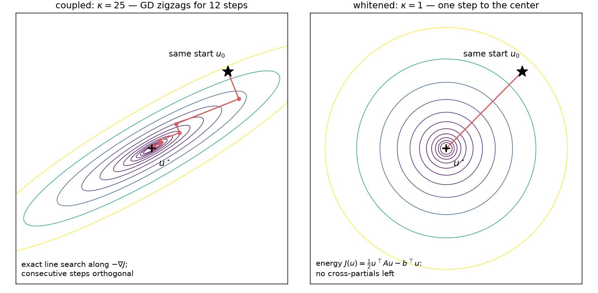

*Coupling as landscape: on a coupled quadratic (tilted ellipses, cross-partials nonzero) exact-line-search gradient descent zigzags — 12 steps still leave a $1.04\times10^{-3}$ fraction of the initial error — while in whitened coordinates the contours are circles and the same method lands on the minimizer in exactly one step, the mechanism behind the one-step $7.7\times10^{-17}$ check above.*

On the real $A$ the obstruction to this one-liner *is* the coupling, and "coupling" is not a metaphor for anything — it is the second cross-partial of the energy, measured directly: for five index pairs (grid-E/W neighbors, N/S neighbors, and far pairs), the second-order finite difference $J(u + e_i + e_j) - J(u + e_i) - J(u + e_j) + J(u)$ equals $A_{ij}$ to $4.7\times10^{-10}$ **on entries of size $4/h^2 = 4356$** (PASS line 3; the difference is exact for a quadratic — the residue is pure floating-point cancellation). Zero cross-partial $=$ zero precision entry $=$ conditional independence ([09 §2](09-stiffness-as-precision.md)): the three vocabularies name one number.

### 1.2 Why Jacobi does nothing here (the one-paragraph recap of 05/09/12)

Poisson's diagonal is the constant $4/h^2$, so $\mathrm{diag}(A)^{-1}$ is a scalar — and a scalar decouples nothing, it only rescales the same entangled landscape. Verified as trajectories, not just algebra: Jacobi-GD and plain GD on the rod problem are **the same iteration** (1998 = 1998 iterations to $10^{-10}$; max relative trajectory deviation over the first 200 iterations $4.7\times10^{-15}$, PASS line 4), the stationary face of [05](05-classical-preconditioners.md)'s CG no-op (116 = 116) explained statistically in [09 §3](09-stiffness-as-precision.md) (an independence surrogate with homogeneous conditional variances carries zero correlation information) and priced in [12 §2](12-autoregressive-preconditioning.md) ($\rho(B) = \cos(\pi h) = 0.9955$: the perfect two-sided regressions, wasted by a synchronous schedule). Two rate refinements, both verified: on the rod right-hand side GD's asymptotic $A$-norm rate is $0.988687$, matching $(\kappa_{\mathrm{eff}}-1)/(\kappa_{\mathrm{eff}}+1) = 0.988700$ at the **parity-effective** $\kappa_{\mathrm{eff}} = 176.00$ — the rod RHS is odd under the 180° rotation ([11 §5.2](11-regressions-and-multiscale.md)), so the even eigenmodes are exactly unexcited and the lowest live mode is $(1,2)$ at $\lambda = \lambda_1 + \lambda_2 = 49.221$ (PASS lines 5–6); on a generic GRF right-hand side the full-$\kappa$ rate appears: measured $0.995464$ vs $(\kappa-1)/(\kappa+1) = 0.995472 = \cos(\pi h)$, 4753 iterations (PASS lines 7–8). $\kappa$ is a worst-case-RHS bound, and the parity subtlety is logged as a deviation.

### 1.3 The exact decoupler: rotate to the eigenbasis (= KL/PCA whitening)

There is a basis in which Poisson *is* §1.1: the 2-D DST-I basis $V_2 = V_1 \otimes V_1$. Verified: $V_2$ is orthonormal ($\max\vert V_2^\top V_2 - I\vert  = 1.0\times10^{-14}$), diagonalizes $A$ (max off-diagonal of $V_2^\top A V_2$: $3.3\times10^{-15}$ relative; diagonal $= \lambda_i + \lambda_j$ to $5.3\times10^{-15}$), and the **one-pass solve** $x = V_2\big((V_2^\top b)/\lambda\big)$ matches `spsolve` to $1.3\times10^{-15}$ (PASS lines 9–10). In the eigenbasis the problem is 1024 independent scalar parabolas; solving is dividing by the per-mode variance. This is exactly [09 §4.3](09-stiffness-as-precision.md)'s PCA/KL whitening — the eigenbasis is the Karhunen–Loève basis of the field, the frequency-axis representative of the whitener orbit — run as a solver ([09 §5](09-stiffness-as-precision.md)'s "spectral solve = KL rotation", here with the measured receipt). Everything below is about what to do when you cannot afford the exact rotation: pick an **axis of decoupling** — coordinates, frequency, direction, space, scale — split along it cheaply, and let the iteration absorb what the split misses.

---

## 2. Separable: heat diffusion is row-coupling plus column-coupling

### 2.1 The Kronecker sum, exactly

The requested worked example. The 2-D Laplacian is a **Kronecker sum** of two 1-D operators,

$$A \;=\; H + V, \qquad H = (I \otimes d_1)/h^2, \qquad V = (d_1 \otimes I)/h^2,$$

and on this grid the split is verified *exactly*, not to machine precision: $\max\vert H + V - A\vert  = 0.0$ and — the load-bearing structural fact — $H$ and $V$ **commute exactly**, $\max\vert HV - VH\vert  = 0.0$ (PASS lines 11–12; Kronecker algebra: $HV = VH = (d_1 \otimes d_1)/h^4$). The Wolfram script re-proves both in exact integer arithmetic: `max|A - (H+V)| (exact) = 0`, `max|H.V - V.H| (exact) = 0`. Commuting means simultaneously diagonalizable — one shared eigenbasis, the separable $\sin\otimes\sin$ modes — which is why the spectrum is the sum set $\{\lambda_i + \lambda_j\}$ (verified against the dense eigensolve to $3.1\times10^{-15}$, PASS line 13).

Physically: **heat diffusion on the grid is row-coupling plus column-coupling and nothing else.** Verified block-anatomy (PASS lines 14–15): reshaped to grid indices, $H$ has *exactly zero* coupling mass between different grid rows, and all 32 of its diagonal blocks equal $d_1/h^2$ exactly — $H$ alone is **32 independent 1-D heated rods**, one per grid row, each of them the chain of [09](09-stiffness-as-precision.md) — while $V$ couples only within grid columns (cross-column mass exactly 0). Each half, taken by itself, is embarrassingly decoupled: $(H + \sigma I)x = y$ splits into 32 *independent* tridiagonal solves, one per row (verified against `spsolve` to $2.9\times10^{-16}$; same for $V$ by columns, PASS line 16), each of them the $O(n)$ Thomas/Kalman pass of [09 §5](09-stiffness-as-precision.md). The whole difficulty of the 2-D problem is that the two trivially-solvable halves must hold simultaneously.

### 2.2 The cheap decoupler: one ADI double-sweep as a preconditioner

So build the preconditioner that solves the two halves in sequence — one rows pass, one columns pass:

$$M^{-1} \;=\; 2\sigma\,(V + \sigma I)^{-1}(H + \sigma I)^{-1}, \qquad \sigma = \sqrt{\lambda_1 \lambda_n} = 207.032,$$

with $\lambda_1 = 9.8622$, $\lambda_n = 4346.14$ the extreme 1-D eigenvalues. This is one double-sweep of the **alternating-direction implicit** iteration of Peaceman & Rachford (1955) with a single geometric-mean shift, frozen into an SPD $M$. Cost: one apply = 32 row tridiagonal solves + 32 column tridiagonal solves = **64 tridiagonal solves, $O(N)$** — the same order as one sparse matvec with $A$. Verified: commuting SPD factors make $M^{-1}$ symmetric (asymmetry $4.9\times10^{-16}$) and positive (eigenvalues in $[2.0\times10^{-5}, 8.8\times10^{-3}]$), and the banded-solve apply agrees with the dense $M^{-1}r$ to $5.4\times10^{-16}$ (PASS line 17).

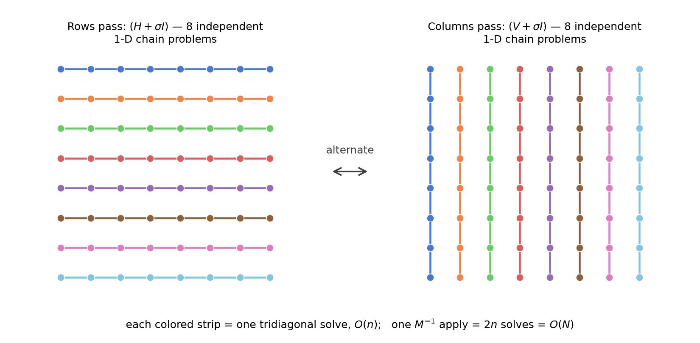

*The two problems we are solving: the rows pass $(H + \sigma I)$ is a stack of independent 1-D chains, one per grid row, and the columns pass $(V + \sigma I)$ the same per column (schematic drawn on an $8\times8$ grid for legibility) — which is why one apply of $M^{-1}$ costs 64 tridiagonal solves, $O(N)$, on the real $32\times32$ problem.*

Because everything commutes, the preconditioned spectrum has a **closed form**, verified eigenvalue-by-eigenvalue (max dev $3.4\times10^{-15}$, PASS line 18; Wolfram independently: $8.0\times10^{-15}$ relative on the dense eigensolve):

$$\mathrm{spec}(M^{-1}A) \;=\; \left\{ f(\lambda_i, \lambda_j) = \frac{2\sigma(\lambda_i + \lambda_j)}{(\lambda_i + \sigma)(\lambda_j + \sigma)} \right\}_{i,j=1}^{n}.$$

The geometric-mean shift **balances the corners** (PASS line 19): $f(\lambda_1, \lambda_1) = f(\lambda_n, \lambda_n) = 0.173609$ exactly (rel dev $1.6\times10^{-16}$) — the all-smooth and all-rough modes, treated identically — with the minimum at those pure corners and the maximum $f(\lambda_1, \lambda_n) = 1.826391$ at the **mixed corner** $(1, 32)$: the surviving difficulty is exactly the modes that are smooth along one axis and rough along the other, the modes on which the rows-expert and the columns-expert disagree most. Two tidy consequences, both pure algebra confirmed by the measured numbers: $f_{\min} + f_{\max} = 0.173609 + 1.826391 = 2$ exactly (the 13-report echo of [12 §2](12-autoregressive-preconditioning.md)'s $\lambda_{\min} + \lambda_{\max} = 8/h^2$ coincidence — so the *undamped* Richardson sweep with this $M$ is already optimally damped, $\rho(I - M^{-1}A) = 1 - f_{\min} = 0.826$), and

$$\kappa(M^{-1}A) \;=\; \frac{f_{\max}}{f_{\min}} \;=\; \frac{1 + \kappa}{2\sqrt{\kappa}} \;=\; \frac{\sqrt{\kappa}}{2}\Big(1 + \frac{1}{\kappa}\Big).$$

**The square-root effect, measured**: $\kappa(M^{-1}A) = 10.5201 = 0.501\sqrt{\kappa(A)}$ (PASS line 20), against $\sqrt{440.6886}/2 = 10.4963$ — the Wolfram script checks the same two numbers independently and confirms the ratio to within its 2% tolerance (`kappa(Minv.A) = 10.520109666`, `Sqrt[kappa(A)]/2 = 10.496291730`); the residual factor is exactly the $1 + 1/\kappa$ above. One ADI double-sweep converts an $O(h^{-2})$ conditioning problem into an $O(h^{-1})$ one:

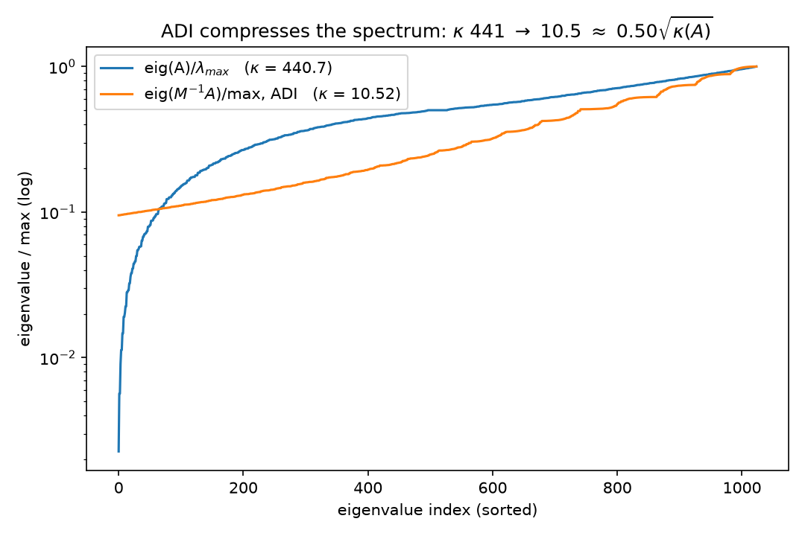

(Independent Wolfram rendering: 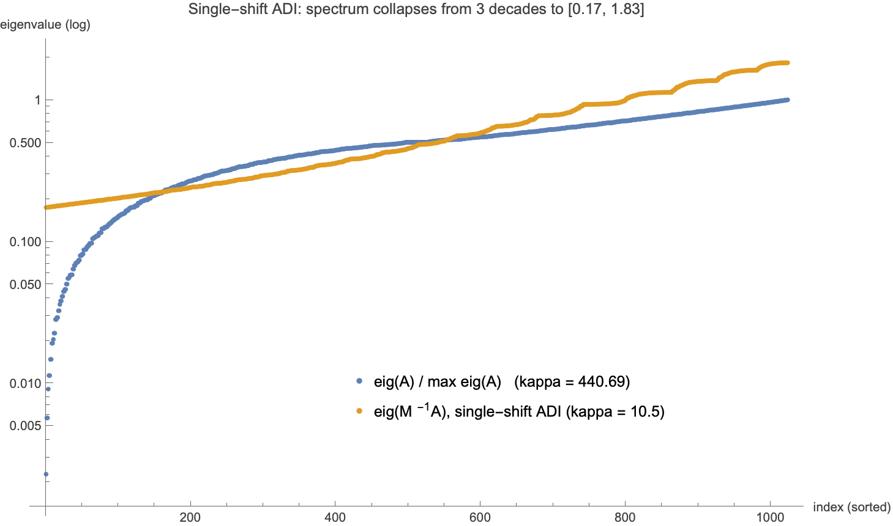.) Solver receipts (error criterion $\Vert x_k - x^\star\Vert /\Vert x^\star\Vert  \le 10^{-10}$, rod problem): **ADI-CG 32 iterations, ADI-GD 88** — against 73 and 1998 unpreconditioned (§4's ladder). Read it as the thesis instructs: the rows pass optimizes the 32 row-subproblems *exactly and separately*, the columns pass the 32 column-subproblems; the coupling **between the passes** — the mixed modes — is what remains, and its price is $\kappa' \approx \tfrac12\sqrt{\kappa}$. (The literature completes the ladder rung: each *doubling* of a well-chosen cycled-shift ladder square-roots the effective condition number again — $2^{J-1}$ shifts give $\kappa' = O(\kappa^{1/2^J})$ — so $O(\log\kappa)$ sweeps reach $\kappa' = O(1)$ on commuting model problems: Wachspress's ADI model problem; our single-shift $M$ is the $J = 1$ rung, and the only one machine-checked here.)

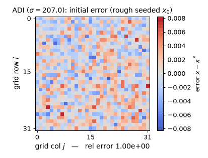

*Watch each half-sweep wipe the error along one direction on the real $32\times32$ rod problem ($\sigma = 207.032$): the rows half-sweep leaves bold horizontal stripes, the columns half-sweep erases them (the rel-error readout momentarily **rises** after a rows half-sweep — $\times 4.10$ on the first one, worst case $5.05\times$ — a genuine Peaceman–Rachford transient: half-steps are not contractions, only the full double sweep is), and the measured per-double-sweep tail rate 0.7885 approaches $(\sigma-\lambda_1)^2/(\sigma+\lambda_1)^2 = 0.8264 = 1 - f_{\min}$, exactly the $\rho(I - M^{-1}A) = 0.826$ quoted above. (Static key frames: [anim13_adi_sweep_frames.png](../figures/anim13_adi_sweep_frames.png); the schematic above is $8\times8$ for legibility, the experiments are $32\times32$.)*

**Interactive:** [drag through the sweeps yourself](../interactive/adi-sweep.html) — a slider over ADI half-sweeps on the hot-rod/cold-rod plate.

---

## 3. Semiseparable: the solution operator has reduced interactions built in

The previous section decoupled the *operator*. This one is about a structural fact of the *inverse* — the object every preconditioner is trying to imitate.

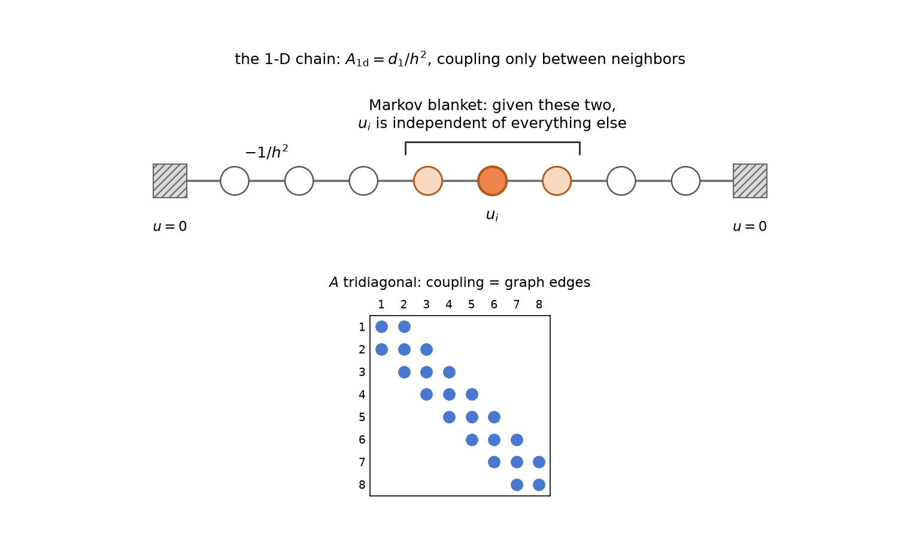

*The chain whose inverse this section dissects: each interior node's energy has cross-partials only with its two spring-coupled neighbors (entries $-1/h^2$ of the tridiagonal $d_1/h^2$), so those two neighbors are the node's Markov blanket — the 1-D miniature of §4's two-column separator.*

**1-D: the inverse of the tridiagonal chain is semiseparable — a rank-1 triangle.** Verified (PASS line 21): for $A_{1\mathrm d} = d_1/h^2$,

$$\big(A_{1\mathrm d}^{-1}\big)_{ij} \;=\; h\,x_i\,(1 - x_j) \quad \text{for } i \le j,$$

max relative dev $1.4\times10^{-15}$ — and the Wolfram script proves it **exactly** in rationals (`max|Inverse(d1/h^2)_ij - h x_i (1 - x_j)|, i<=j (exact) = 0`). This is [09 §2](09-stiffness-as-precision.md)'s Brownian-bridge covariance $h(\min(s,t) - st)$ re-read structurally: the entire upper triangle of the dense inverse is the outer product of two vectors, $u_i = h x_i$ and $v_j = 1 - x_j$ (rank 1!), while the full matrix still has full rank 32. Dense does not mean unstructured: $n^2$ correlations are carried by $O(n)$ numbers. That is Gantmacher–Krein's classical "one-pair" (Green's) matrix theorem — the inverse of an irreducible tridiagonal is semiseparable — and it is *why* the $O(n)$ Thomas/Kalman solve of [09 §5](09-stiffness-as-precision.md) exists at all.

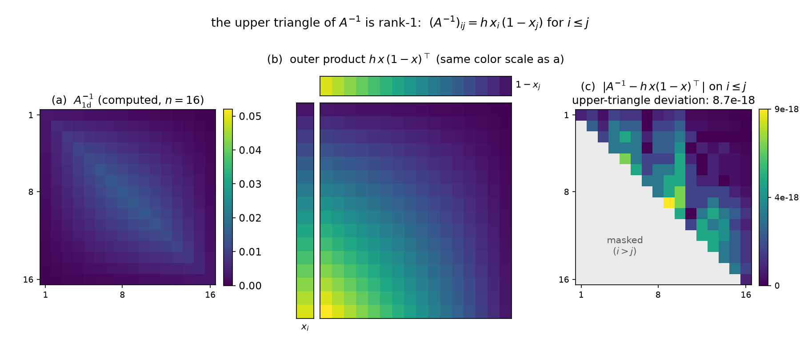

*The identity in pixels: the upper triangle of the dense $(d_1/h^2)^{-1}$ (left) coincides with the rank-1 outer product $h\,x_i(1-x_j)$ (middle, same color scale); the figure's own machine check crashes unless the upper-triangle deviation stays below $10^{-12}$ and measures $8.7\times10^{-18}$ absolute at $n=16$ (right) — the same identity verified above at $n=32$ to $1.4\times10^{-15}$ relative, and exactly in rationals by Wolfram.*

**2-D: far-field blocks of $\Sigma = A^{-1}$ are numerically low-rank.** The exact rank-1 triangle does not survive the grid, but its shadow does (PASS line 22): the off-diagonal block of $A^{-1}$ coupling grid rows 0–7 to grid rows 24–31 (a $256\times256$ block, well-separated groups) has **numerical rank 11 at the $10^{-8}$ threshold** (leading singular value $1.76\times10^{-3}$; the decay curve is the right panel below) — even though $A^{-1}$ is entrywise dense and strictly positive (min entry $2.9\times10^{-9} > 0$, the M-matrix positivity of [11 §1.1](11-regressions-and-multiscale.md)) and full-rank ($\lambda_{\min} = 1.15\times10^{-4} > 0$).

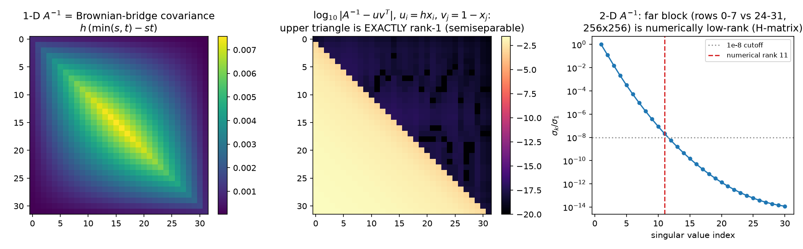

The statistical reading: between two well-separated regions, the $256^2$ pairwise covariances are routed through $\approx 11$ effective degrees of freedom — long-range dependence is **low-dimensional**, the far field interacts through a few smooth "factors" (the screening effect of [12 §3](12-autoregressive-preconditioning.md), seen from the covariance side). The numerical-analysis reading: this is the defining compression of **hierarchical ($\mathcal H$-) matrices** (Hackbusch): partition $A^{-1}$ by an admissibility condition and store far blocks as low-rank factors, giving $O(N\log N)$ approximate inverses — with the guarantee that elliptic inverses admit exactly this structure (Bebendorf–Hackbusch). The moral for the thesis: *reduced interactions are not only something you impose on the problem; the solution operator already has them.* Decoupling schemes work because the object they approximate is itself nearly decoupled at long range. ([14](14-hierarchical-inverse.md) follows this section to its algorithmic conclusion: the separator theorem behind these ranks, the full HODLR anatomy of $A^{-1}$, and the compressed inverse run as a preconditioner.)

---

## 4. Space: two subdomains, one interface, and the decoupling ladder

### 4.1 Conditional independence across a separator is exact (the statistics name for decoupling)

Split the grid by the two middle columns: $L$ = columns 0–14, $I$ = columns 15–16, $R$ = columns 17–31. The 5-point stencil puts **no precision edge across the separator**: $\mathrm{nnz}(A_{LR}) = 0$ (PASS line 23). The GMRF global Markov property (Rue & Held) then promises exact conditional decoupling, and the experiment collects it from the dense covariance (PASS line 24):

$$\mathrm{Cov}(u_L, u_R \mid u_I) \;=\; \Sigma_{LR} - \Sigma_{LI}\Sigma_{II}^{-1}\Sigma_{IR} \;=\; 0 \quad\text{exactly: } \max\vert \cdot\vert  = 1.9\times10^{-19},$$

against a *marginal* $\max\vert \Sigma_{LR}\vert  = 2.6\times10^{-4}$ — a ratio of $7.2\times10^{-16}$, i.e. fifteen orders of magnitude of dependence annihilated by conditioning on 64 interface values. Marginally the halves are thoroughly coupled (§3's dense positive $\Sigma$); given the interface they are **independent**. This is the same statement as §2's, on a different axis: there the two sub-physics shared an eigenbasis; here they share only a 2-column Markov blanket.

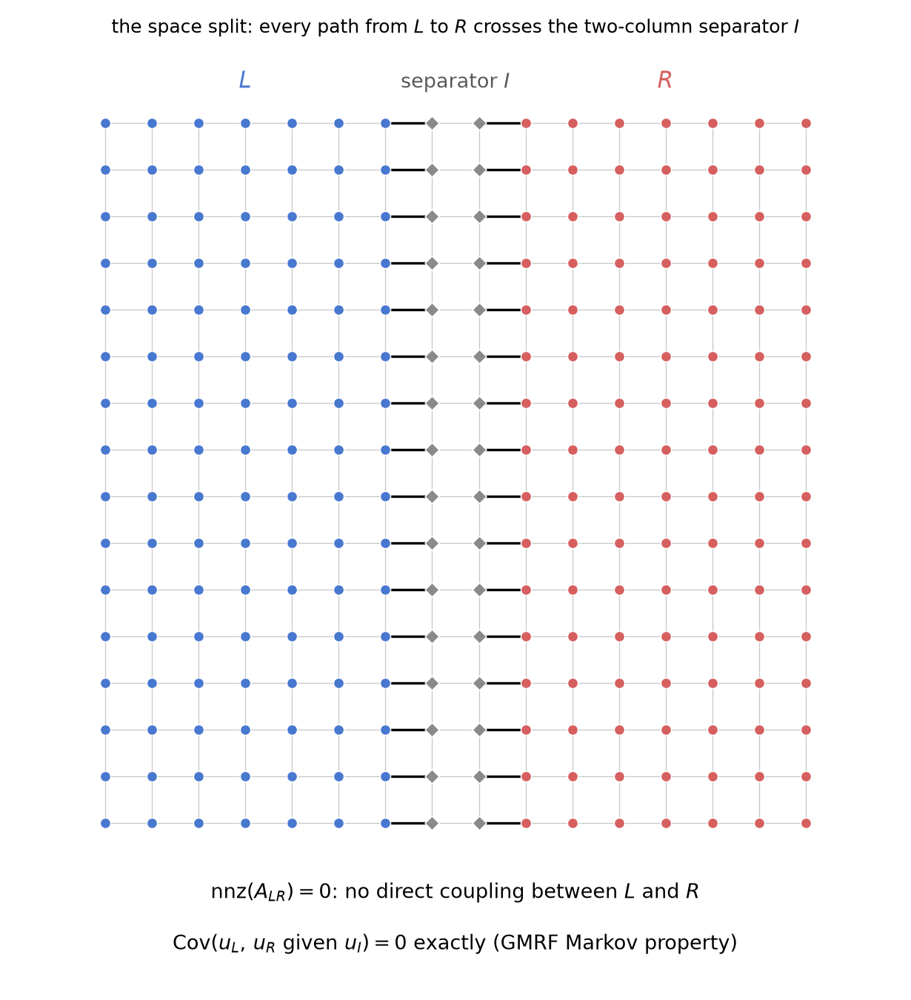

*The split drawn on the stencil graph (a $16\times16$ grid for legibility): every 5-point edge from $L$ to $R$ passes through the shaded separator columns, and the figure machine-checks $\mathrm{nnz}(A_{LR}) = 0$ on `poisson_2d(16)` before drawing — the same exact zero verified above at $n = 32$ (PASS line 23).*

### 4.2 Block-Jacobi(2): optimize each half with the other frozen

The preconditioner this licenses: split into halves $L'$ = columns 0–15, $R'$ = columns 16–31 and take $M = \mathrm{blockdiag}(A_{L'L'}, A_{R'R'})$ — one exact $32\times16$ Poisson solve per subdomain, "optimize each half pretending the other is frozen" (the additive-Schwarz / nonoverlapping domain-decomposition move; Schwarz 1870, Smith–Bjørstad–Gropp, Toselli–Widlund). What remains is *provably only the interface*, and it is **low-dimensional and localized** (PASS lines 25–26):

- $A_{L'R'}$ has exactly **32 nonzeros — one column of edges — and rank 32**. Since $A - M$ is this rank-64 (two-sided) perturbation, $M^{-1}A$ has eigenvalue **1 with multiplicity $960 = N - 2\cdot32$**: on a 960-dimensional subspace the frozen-half model is already *exact*. The remaining 64 eigenvalues split symmetrically in pairs $1 \pm \mu$ (pairing deviation $4.4\times10^{-15}$), 32 distinct $\mu$'s running up to $\mu_{\max} = 0.9014$: $\mathrm{spec}(M^{-1}A) \subset [0.0986, 1.9014]$ with $\lambda_{\min} = 1 - \mu_{\max} = 0.0986$, $\kappa(M^{-1}A) = 19.29$. (Again $\lambda_{\min} + \lambda_{\max} = 2$: the undamped Richardson sweep is optimally damped, $\rho(I - M^{-1}A) = 0.9014$ — one frozen-halves sweep leaves 90% of the worst mode, [12 §1](12-autoregressive-preconditioning.md)'s currency.)
- The extreme eigenvectors of the preconditioned operator **localize at the interface**: the $\lambda_{\min} = 0.0986$ eigenvector's column-energy profile peaks at column 16 and the $\lambda_{\max} = 1.9014$ one at column 15, with columns 14–17 carrying 39% of the $\lambda_{\min}$ mode's energy:

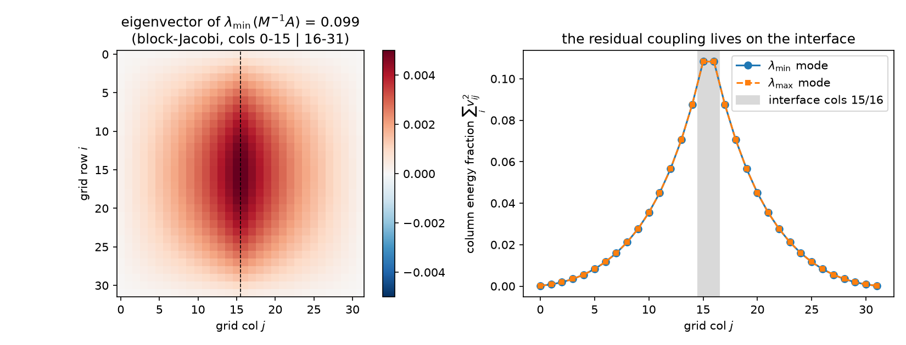

Solver receipts: **blockJacobi2-CG 12 iterations** (GD: 98). Twelve is far below the $\sqrt{\kappa'}$ heuristic and even below ADI's 32 at *smaller* $\kappa'$ — because the spectrum is 960 exact 1's plus 64 stragglers, at most 65 distinct eigenvalues, and CG's currency is clusters (§5.3). The eliminated-interior view is the Schur complement: solving the halves exactly reduces the global problem to an effective equation on the interface (the Dirichlet-to-Neumann operator, [12 §3](12-autoregressive-preconditioning.md)'s decimation row) — a rank-32 problem, which is what those 64 non-unit eigenvalues are the spectrum of. Domain decomposition is the industrialization of exactly this move; and the reason practical DD adds a *coarse space* is [11 §5](11-regressions-and-multiscale.md)'s reason: the interface modes that survive are smooth along the interface, i.e. the residual coupling is not only low-rank but low-*frequency* — the space axis hands off to the scale axis.

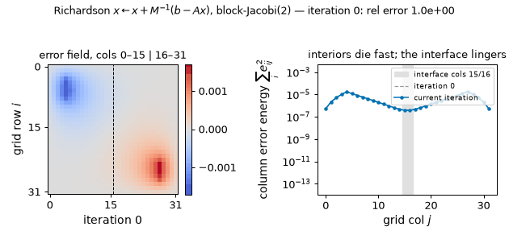

*The frozen-halves iteration in motion (rod problem): the subdomain interiors die within a few sweeps while the interface mode lingers — columns 14–17 still carry 42% of the error energy at iteration 30 — and continuing the same iteration to 200 sweeps measures a tail rate of 0.901444, matching the $\rho(I - M^{-1}A) = 0.9014$ above to six digits. (Static key frames: [anim13_interface_frames.png](../figures/anim13_interface_frames.png).)*

### 4.3 The decoupling ladder

One move — *pick an axis, split exactly along it, approximate the rest* — five axes. All numbers measured on the canonical problem (rod RHS, error criterion $10^{-10}$; $\rho$ = spectral radius of the optimally-damped Richardson sweep, computed from the measured spectral extremes; Jacobi's from [12 §2](12-autoregressive-preconditioning.md)):

| axis | exact decoupling condition | verified here as | cheap approximation | $\kappa(M^{-1}A)$ | $\rho(I - M^{-1}A)$ | CG its |
|---|---|---|---|---:|---:|---:|
| **coordinates** | $A$ diagonal (all coordinates conditionally independent) | diagonal system one-steps ($7.7\times10^{-17}$) | Jacobi $\mathrm{diag}(A)^{-1}$ | 440.69 (unchanged) | 0.9955 | 73 (inert) |
| **frequency** | known eigenbasis: DST-I diagonalizes $A$ ($3.3\times10^{-15}$) | one-pass KL solve ($1.3\times10^{-15}$) | — (exact; FFT-able) | 1 | 0 | **1 pass** |
| **direction** | $A = H + V$, $[H, V] = 0$ (both exact) | closed-form ADI spectrum ($3.4\times10^{-15}$) | ADI double-sweep, 64 tridiag solves | 10.52 $= 0.50\sqrt{\kappa}$ | 0.826 | 32 |
| **space** | $\mathrm{Cov}(L, R \mid I) = 0$ (ratio $7.2\times10^{-16}$) | rank-32 interface, 960 unit eigenvalues | block-Jacobi(2), frozen halves | 19.29 | 0.901 | **12** |
| **scale** | coarse field ⊥ fine residual (approx.; [11 §5.1](11-regressions-and-multiscale.md)) | [11](11-regressions-and-multiscale.md)/[12](12-autoregressive-preconditioning.md)'s two-level | IC(0) + 4×4 coarse (additive) | 11.05 | 0.834 | 31 |

(PASS line 28 records all the ladder counts and asserts the chains GD > CG > ADI-CG $\ge$ twolevel-CG > 1 and CG > blockJacobi2-CG — the five axes do not order linearly, blockJacobi2's 12 undercutting twolevel's 31; the two-level row is [11 §5.2](11-regressions-and-multiscale.md)'s best fixed-$M$ method rebuilt verbatim, 31 error-based / 32 residual-based iterations, consistent with 11's table. Scale's "exact condition" is the one axis with no finite exact version — hence multigrid recurses it, [05 §5](05-classical-preconditioners.md).) The whole ladder on one plot, GD and CG variants together, with the DST one-pass star at the bottom left:

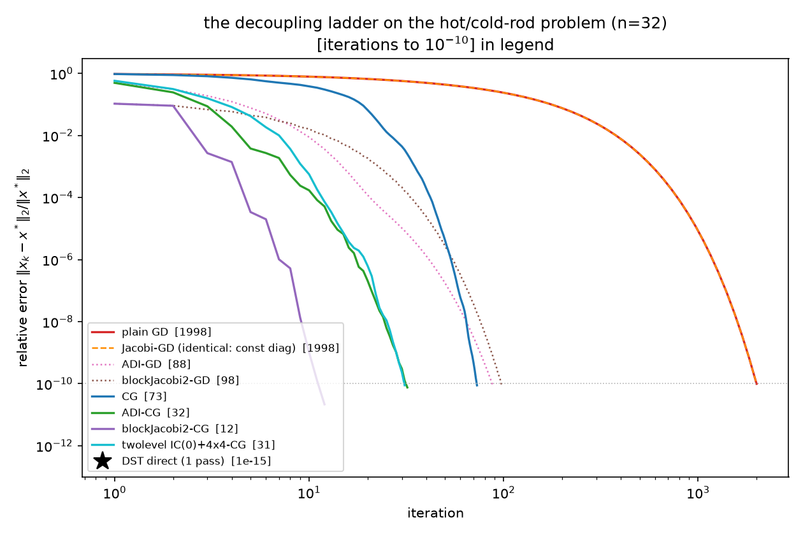

---

## 5. GD vs CG: pre-decoupling vs decoupling on the fly

The suite's remaining question ([04](04-krylov-and-pcg.md) proved the polynomial bounds; here is the decoupling reading, fully measured).

### 5.1 GD is memoryless: it pays the full eigenvalue range, forever

Steepest descent keeps no state but $x_k$: each step re-solves a 1-D problem along the current gradient and forgets the direction it just optimized. Its asymptotic contraction is set by the **range** of the spectrum, $(\kappa-1)/(\kappa+1)$ — verified three independent ways in this report: on Poisson ($0.995464$ measured vs $0.995472$, §1.2), and on the rank-1 family below, where the worst-case-RHS rates match $(\kappa-1)/(\kappa+1)$ to seven digits at $\kappa = 101$ ($0.98039214$ measured vs $0.98039216$, rel. dev $1.4\times10^{-8}$) and to all eight printed digits at $10^4{+}1$ and $10^6{+}1$ ($0.99980004$, $0.99999800$; PASS lines 30/33/36). The one thing diagonal preconditioning buys GD — one-stepping — it buys only on the *already decoupled* problem (§1.1 vs §1.2: $7.7\times10^{-17}$ in one step there, 1998 identical iterations here). A refinement the experiment forced (deviations log): for a *generic* RHS on a two-eigenvalue problem the textbook rate is provably not attained — the per-step $A$-norm contraction is the exact closed form $\sqrt{f(m_0)}$, $f(m) = (\kappa-1)^2 m /((1+\kappa^2 m)(1+m))$ with $m$ the $\kappa$-weighted mixing ratio of the error components ($m \mapsto 1/(\kappa^2 m)$ is an involution of the GD map and $f$ is invariant under it), verified to the printed digits at all three $\kappa$'s (PASS lines 31/34/37: e.g. measured $0.19548504$ vs predicted $0.19548494$ at $\rho = 10^2$). The worst case is realized exactly by $b = v + w_\perp$ ($m_0 = 1/\kappa$), and that RHS is what the headline numbers below use.

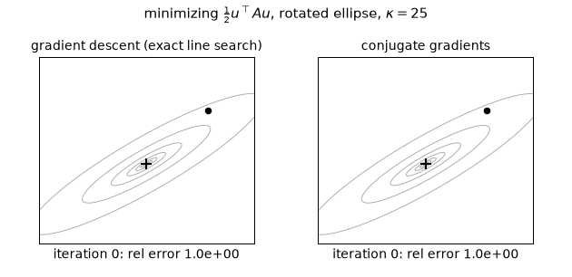

*The contrast in one cross-section ($\kappa = 25$, axes rotated 30°, equal-energy error mix $m_0 = 1$): GD zigzags at the constant measured per-step rate 0.6783 — exactly $\sqrt{f(m_0)}$ from the closed form above — reaching only $8.76\times10^{-6}$ after 30 steps, while CG finishes in exactly 2 steps ($7.4\times10^{-16}$), one per distinct eigenvalue. (Static key frames: [anim13_gd_vs_cg_frames.png](../figures/anim13_gd_vs_cg_frames.png).)*

### 5.2 One global factor is fatal for GD and free for CG

Couple 400 coordinates through a single common factor — the rank-1 perturbation $A = I + \rho\,vv^\top$, a 1-factor covariance model ([07](07-nystrom-preconditioning.md)'s favorable case, [09 §6](09-stiffness-as-precision.md)'s factor analysis), with coupling strength $\rho = 10^2, 10^4, 10^6$. The spectrum is two points, $\{1, 1+\rho\}$; $\kappa = 1 + \rho$ is *arbitrarily bad while the problem is only one direction away from the identity*. Measured (PASS lines 29/32/35/38, [figure](../figures/decoupling_gd_vs_cg.png) left panel):

| $\rho$ | $\kappa$ | CG its (rel err after 2, worst-case RHS) | GD its to $10^{-10}$ (worst-case RHS) | $\tfrac{\kappa}{2}\ln 10^{10}$ |
|---:|---:|---:|---:|---:|
| $10^2$ | $101$ | **2** ($1.3\times10^{-15}$) | 1163 | 1162.8 |
| $10^4$ | $10^4{+}1$ | **2** ($3.7\times10^{-14}$) | 115 141 | 115 140.8 |
| $10^6$ | $10^6{+}1$ | **2** ($3.6\times10^{-12}$) | 11 512 937\* | 11 512 937.0 |

**CG converges in exactly 2 iterations at every strength, for both random and worst-case RHS** (two distinct eigenvalues ⟹ a degree-2 polynomial annihilates the error: the finite-termination clause of CG's minimax optimality, [04](04-krylov-and-pcg.md), Hestenes–Stiefel). GD's count grows *linearly in $\kappa$* — the measured counts match $\tfrac{\kappa}{2}\ln(10^{10})$ to $\le 0.02\%$ (last column — the asymptotic of the exact $\ln(10^{10})/{-\ln\tfrac{\kappa-1}{\kappa+1}}$, which itself rounds to precisely the measured counts). \*The $\rho = 10^6$ run hit the 120 000-iteration cap at relative error 0.79 and is extrapolated from the measured (provably constant) per-step rate — deviations log, entry 1.

### 5.3 Clusters, not range: the 3-cluster spectrum

Now three clusters — eigenvalue centers $\{1, 10^3, 10^6\}$ with multiplicities $\{300, 80, 20\}$ and relative widths $w$, so $\kappa \approx 10^6$ throughout (PASS lines 39–40, figure right panel):

| cluster width $w$ | $\kappa$ | CG its to $10^{-10}$ | GD |
|---:|---:|---:|---|
| $10^{-3}$ | $1.001\times10^6$ | **18** | rel err **0.72** after 30 000 its; projected $2.1\times10^6$ its |
| $10^{-2}$ | $1.009\times10^6$ | 31 | — |
| $10^{-1}$ | $1.096\times10^6$ | 72 | — |

At zero width this would be 3 iterations (three distinct eigenvalues); at width $10^{-3}$ it is 18, degrading only gently as the clusters smear ($18 \to 31 \to 72$) while $\kappa$ sits at $10^6$ the whole time (honesty note: the "$\approx 3$" idealization vs measured 18 is deviations-log entry 5 — CG's first three sweeps barely move the $\ell_2$ error, 0.996 after 3 iterations, then the largest single sweep drops it **2935×** once the Ritz values have found all three clusters). GD, whose only input is the range, is hopeless at *any* width: measured tail rate 0.9999890 against the worst-case 0.9999980. **CG's currency is the number of (clusters of) distinct eigenvalues; GD's is the range.**

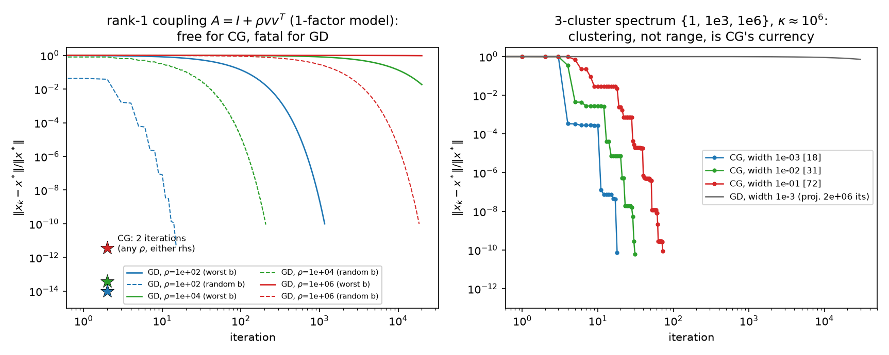

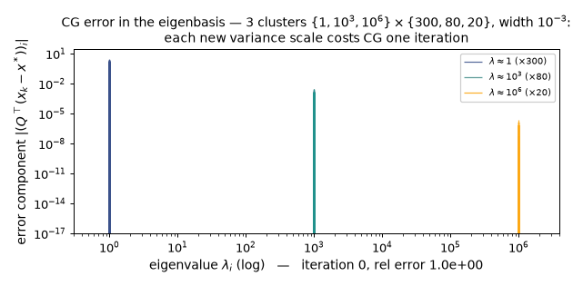

*One new variance scale = one CG iteration ($w = 10^{-3}$): the per-cluster eigencomponent bars die cluster by cluster, and the largest single sweep is the 2935× plunge at iteration 4 ($0.99557 \to 3.39\times10^{-4}$) quoted above, once the Ritz values have found all three clusters. (Static key frames: [anim13_cg_clusters_frames.png](../figures/anim13_cg_clusters_frames.png).)*

### 5.4 Why: CG is an on-the-fly sequential decoupler

The mechanism is [09 §5](09-stiffness-as-precision.md)'s row of the dictionary, now with the receipt. CG's directions satisfy $p_i^\top A p_j = 0$ — measured: max $\vert p_i^\top A p_j\vert /(\Vert p_i\Vert _A\Vert p_j\Vert _A) = 7.3\times10^{-16}$ over the first 10 directions, $1.8\times10^{-15}$ over the first 30 (finite-precision loss growing with depth; PASS line 44). $A$-orthogonality is exactly what "decoupled" means in this report: in the coordinates $\{p_i\}$, the energy has **no cross-partials** — $J(x_0 + \sum_i \alpha_i p_i)$ separates into independent scalar parabolas in the $\alpha_i$, so each 1-D minimization is final and never needs revisiting. CG is Gram–Schmidt in the $A$-inner product, run incrementally on the Krylov vectors: statistically, sequential regression on directions that are *uncorrelated under the field's own precision* ([09 §5](09-stiffness-as-precision.md): $\mathrm{Cov}(p_i^\top Au, p_j^\top Au) = p_i^\top A p_j$), i.e. the same sequential-whitening move as Cholesky ([09 §4.2](09-stiffness-as-precision.md)) but built adaptively from the residuals it encounters. GD, memoryless, keeps re-optimizing directions it has already visited (the classical zigzag); CG never does. That is why the *number* of distinct variance scales — not their spread — is what CG pays for: each new cluster is one new scalar problem to whiten.

### 5.5 Pre-decoupling and on-the-fly decoupling compose

Both mechanisms at once, on the ladder (PASS lines 42–43; Chebyshev bound $k \ge \sqrt{\kappa'}\,\ln(2/\varepsilon)/2$ at $\varepsilon = 10^{-10}$, $A$-norm iteration counts; residual-based counts kept comparable to [08](08-results.md)'s 116-iteration GRF anchor, re-verified here, PASS line 41):

| $M$ | $\kappa(M^{-1}A)$ | $\sqrt{\kappa'}$ | its ($A$-norm) | Chebyshev bound | bound used | eigenvalues at 1 |
|---|---:|---:|---:|---:|---:|---:|
| none | 440.69 | 20.99 | 75 | 249 | 30% | 0 |
| ADI | 10.52 | 3.24 | 34 | 38 | **88%** | 0 |
| blockJacobi(2) | 19.29 | 4.39 | **12** | 52 | 23% | **960** |
| two-level IC(0)+coarse | 11.05 | 3.32 | 32 | 39 | 81% | 9 |

$\sqrt{\kappa'}$ **bounds** every method (all four counts under their Chebyshev ceilings) — but it does not *rank* them: the fitted $c = \mathrm{its}/\sqrt{\kappa'}$ spans $[2.96, 11.10]$ and the orderings disagree (`ordering_match = False` in the JSON). The instructive pair: ADI's spectrum is a smooth arch with *zero* eigenvalues at 1 — it burns 88% of its Chebyshev budget, the near-worst-case shape — while blockJacobi(2), with 1.8× *larger* $\kappa'$, needs a third of ADI's iterations because 960 of its 1024 eigenvalues sit exactly at 1 and CG only has to learn the 64 stragglers. Spectral *shape* decides within the bound (deviations-log entry 7 records that this section was reframed after measurement — the data rejected "iterations $= c\sqrt{\kappa'}$" as a fine-grained law). This is the suite's oldest scar, finally explained end-to-end: [06](06-neural-preconditioner.md)'s NPO wins 3.87× *entirely* by clustering, and [07](07-nystrom-preconditioning.md)'s Nyström fails *despite* attacking $\kappa$, because Krylov methods buy convergence with clusters, and $\kappa$ is merely the crudest summary of clustering. **Punchline: a preconditioner decouples ahead of time; CG decouples as it goes; and they compose** — the preconditioner collapses the spectrum toward few effective scales, CG whitens whatever scales are left, one per (cluster of) eigenvalue.

---

## 6. Dictionary delta

Rows appended to [09 §8](09-stiffness-as-precision.md), [11 §7](11-regressions-and-multiscale.md), [12 §6](12-autoregressive-preconditioning.md) — all machine-checked in [decoupling.py](../python/experiments/decoupling.py) / [decoupling_adi.wls](../mathematica/decoupling_adi.wls) except the row marked †, which is the standard structural analogy:

| Numerical linear algebra / PDE | Statistics / probability |
|---|---|
| Cross-partial $\partial^2 J/\partial u_i\partial u_j = A_{ij}$ (FD-verified, $4.7\times10^{-10}$ on entries of size 4356) | Conditional dependence of $u_i, u_j$ given the rest; off-diagonal precision |
| Diagonal $A$: $N$ independent parabolas, GD one-steps ($7.7\times10^{-17}$) | Fully independent coordinates; inference = $N$ scalar problems |
| Separable (Kronecker-sum) operator $A = H + V$, $[H,V] = 0$ exactly | Two commuting sub-physics = two independent Gaussian information sources about one field; precision adds, one shared KL basis diagonalizes both |
| ADI double-sweep $2\sigma(V{+}\sigma I)^{-1}(H{+}\sigma I)^{-1}$ | Alternating conditional optimization — coordinate descent by *direction* (rows pass, then columns pass), backfitting the two sub-models |
| Geometric-mean shift $\sigma = \sqrt{\lambda_1\lambda_n}$; $f_{\min}{+}f_{\max} = 2$ | Equalizing the two experts' worst mismatch; hardest surviving modes = where the experts disagree (mixed corner $(1, 32)$) |
| Semiseparable inverse: $h\,x_i(1-x_j)$ rank-1 triangle (exact); far blocks of $\Sigma$ rank-11/256 | Long-range dependence carried by few effective factors; screening from the covariance side; $\mathcal H$-matrix admissibility† |
| Separator (columns 15–16); $\mathrm{nnz}(A_{LR}) = 0$ | Markov blanket: $\mathrm{Cov}(L, R \mid I) = 0$ exactly ($7.2\times10^{-16}$) |
| Block-Jacobi(2): frozen-halves solves; eigenvalue 1, multiplicity $960 = N - 2\,\mathrm{rank}(A_{LR})$ | Optimize each half with the other clamped; directions the surrogate already whitens exactly |
| Schur complement / interface problem; extreme modes localized at columns 15/16 | Effective interface physics after marginalizing the interiors; residual coupling is low-dimensional (rank 32) and lives on the blanket |
| CG conjugacy $p_i^\top A p_j = 0$ ($1.8\times10^{-15}$ over 30 directions) | Sequential decorrelation: on-the-fly Gram–Schmidt in the precision metric = adaptive sequential regression ([09 §5](09-stiffness-as-precision.md)) |
| Two distinct eigenvalues ⟹ CG = 2 its (measured at $\kappa$ up to $10^6$) | One common factor + noise: two variance scales = two regressions, however strong the factor |
| GD rate $(\kappa-1)/(\kappa+1)$ (measured to 7–8 digits); its $\approx \tfrac{\kappa}{2}\ln\tfrac1\varepsilon$ | Memoryless learner: pays the full variance *range* every step, relearns old directions; refinement $\sqrt{f(m_0)}$ for generic data |
| $\kappa$ bound vs clustering (88% vs 23% Chebyshev utilization) | Worst-case spread vs number of distinct variance scales actually present |

---

## 7. Pointers

ADI is Peaceman & Rachford (*J. SIAM* 3, 1955) and Douglas & Rachford (1956); the shift theory and the $O(\log\kappa)$ multi-shift result are Wachspress (*The ADI Model Problem*, 1995; also Varga, *Matrix Iterative Analysis*, ch. 7). Semiseparability of tridiagonal inverses is Gantmacher & Krein (*Oscillation Matrices and Kernels*, 1941/2002); the modern treatment is Vandebril, Van Barel & Mastronardi (*Matrix Computations and Semiseparable Matrices*, 2008); hierarchical matrices are Hackbusch (*Computing* 62, 1999; *Hierarchical Matrices*, 2015), with the elliptic-inverse approximability theorem in Bebendorf & Hackbusch (*Numer. Math.* 95, 2003). The GMRF Markov property and separator calculus are Rue & Held (*Gaussian Markov Random Fields*, 2005) — the same source as [09](09-stiffness-as-precision.md)'s half of the dictionary. Domain decomposition: Schwarz (1870), the modern theory in Smith, Bjørstad & Gropp (1996) and Toselli & Widlund (*Domain Decomposition Methods*, 2005) — including why two-level (coarse-space) corrections are mandatory, which is [11 §5](11-regressions-and-multiscale.md)'s measurement wearing DD clothes. CG's minimax optimality and finite termination are Hestenes & Stiefel (1952) via [04](04-krylov-and-pcg.md); the clustering refinements are Axelsson & Lindskog (1986) and van der Sluis & van der Vorst (1986); Greenbaum (*Iterative Methods for Solving Linear Systems*, 1997) for both. The GD zigzag asymptotics go back to Akaike (1959). Siblings: the operator and spectrum, [01](01-code-walkthrough.md)/[02](02-eigenvalues.md); the GRF RHS, [03](03-gaussian-random-fields.md); the baselines, [05](05-classical-preconditioners.md); the clustering win and the $\kappa$-reduction failure, [06](06-neural-preconditioner.md)/[07](07-nystrom-preconditioning.md); consolidated tables, [08](08-results.md); the dictionary, physics, grid, and Richardson readings, [09](09-stiffness-as-precision.md)/[10](10-fluctuation-dissipation.md)/[11](11-regressions-and-multiscale.md)/[12](12-autoregressive-preconditioning.md); the roadmap, [00](00-overview.md).

---

**Coda.** Reports [05](05-classical-preconditioners.md)–[13](13-preconditioning-as-decoupling.md) are one statement. The energy $J$ has cross-partials; the cross-partials are the precision's off-diagonal; the off-diagonal is conditional dependence — and every solver move in the suite is a decision about **which of those interactions to model exactly, which to approximate, and which to leave for the iteration to discover**. Model none of them: Jacobi, and the iteration discovers everything at $\cos(\pi h)$ per sweep. Model them all: the DST rotation or the perfect autoregression, one pass, nothing left to discover. In between, choose an axis and split: rows from columns (ADI, exactly separable, $\kappa \to \tfrac12\sqrt\kappa$), left from right (block-Jacobi, halves exactly conditionally independent given the 64 interface values of §4.1's two-column separator, all residual coupling localized there), coarse from fine ([11](11-regressions-and-multiscale.md)/[12](12-autoregressive-preconditioning.md)'s two-level, the one axis that must be recursed). What the split leaves unmodeled is a number — $\rho(I - M^{-1}A)$ per sweep, or $\kappa(M^{-1}A)$ with its clusters for CG — and CG itself is the same move made adaptive: a sequential decoupler that whitens one surviving scale per iteration and therefore counts clusters where gradient descent counts the whole range. Solving a coupled system *is* uncoupling it; the only choices are the axis, the price, and whether you pay before the iteration or during it.
