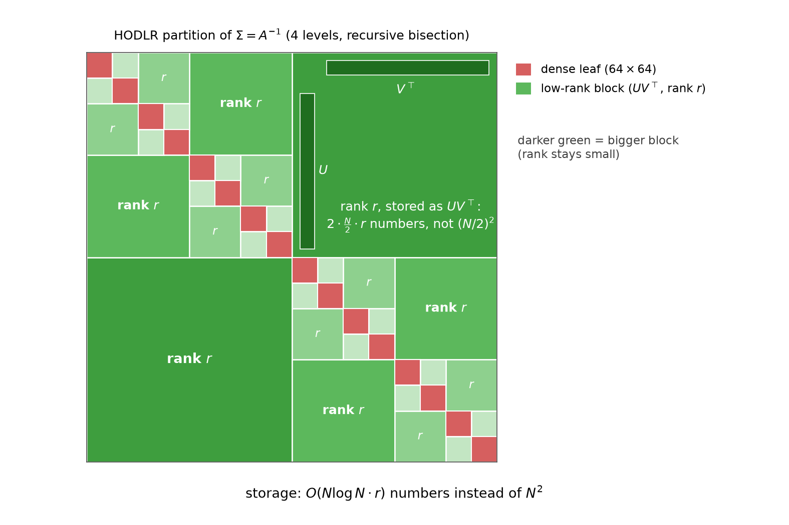
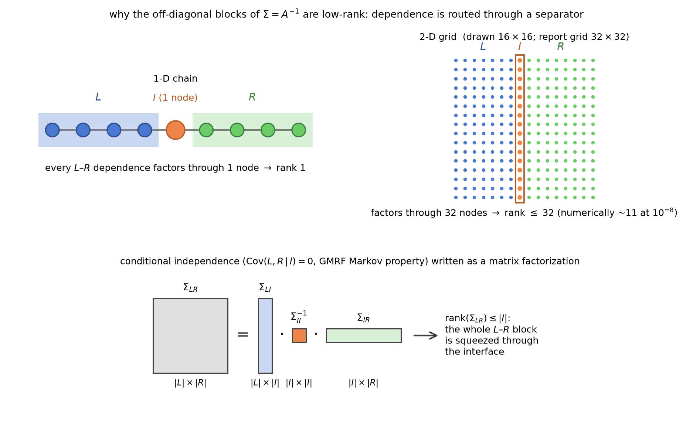
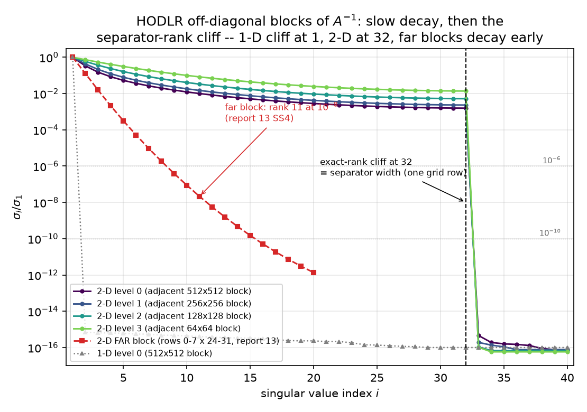
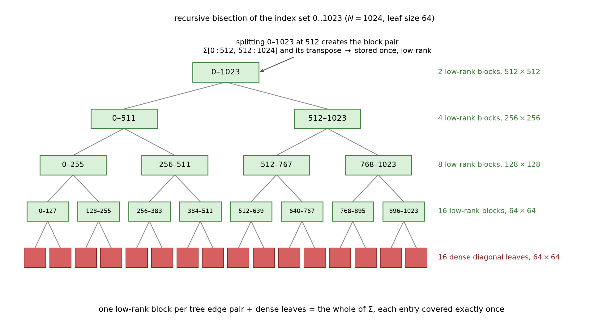
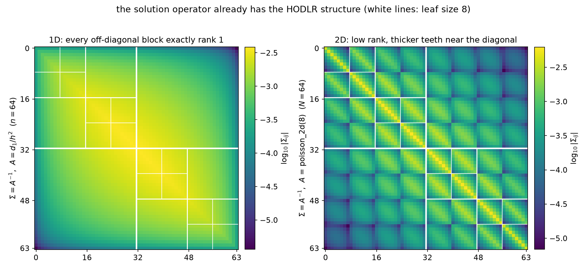
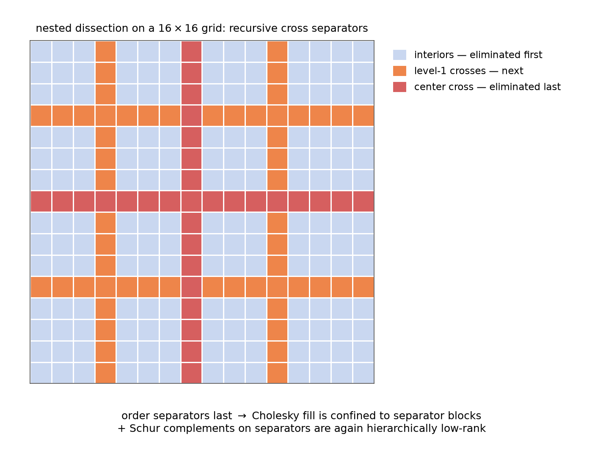
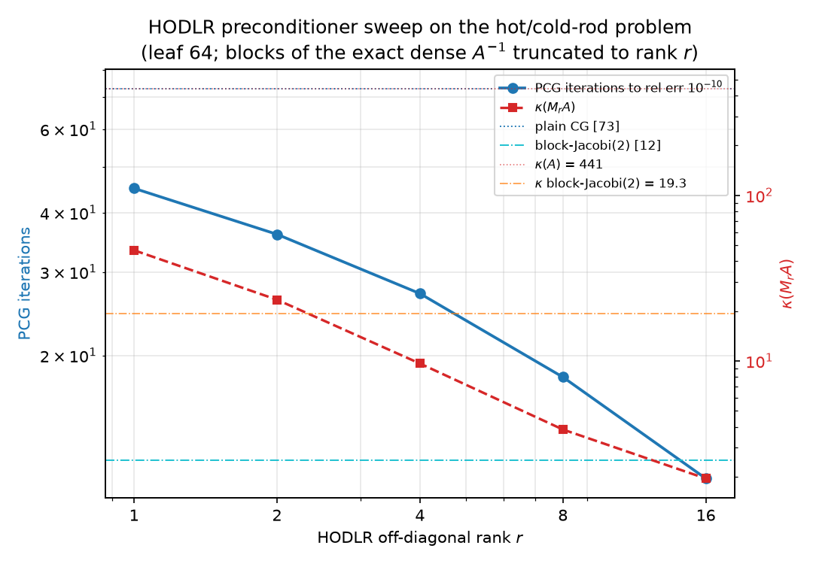
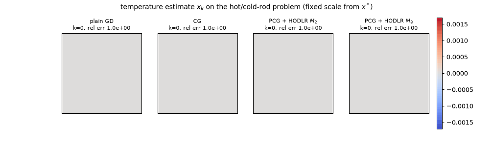

# The Hierarchical Structure of the Inverse

### $A$ is $O(N)$ numbers and $A^{-1}$ is dense — yet the inverse compresses to $O(N r \log N)$, because every long-range dependence in the field is squeezed through a separator

*The structural sequel to [13 §3–4](13-preconditioning-as-decoupling.md). [09](09-stiffness-as-precision.md) said $A^{-1}$ is the covariance of the Gibbs field $u \sim \mathcal N(A^{-1}b, A^{-1})$ and that zeros of the precision are conditional independences; [13 §3](13-preconditioning-as-decoupling.md) found the 1-D inverse is exactly a rank-1 triangle and that far 2-D blocks of $A^{-1}$ have numerical rank 11 out of 256; [13 §4.1](13-preconditioning-as-decoupling.md) measured $\mathrm{Cov}(u_L, u_R \mid u_I) = 0$ across a two-column separator. This report shows those three facts are one fact — **conditional independence across a separator is a rank bound on covariance blocks**, $\Sigma_{LR} = \Sigma_{LI}\Sigma_{II}^{-1}\Sigma_{IR}$, hence $\mathrm{rank}(\Sigma_{LR}) \le \vert I\vert$ — and follows it to its algorithmic conclusion: the **hierarchical (HODLR / $\mathcal H$-) matrix** representation of $A^{-1}$ (Hackbusch 1999), built, measured, and run as a preconditioner. Notation is the suite's: $h = 1/(n+1)$, 1-D $A_1 = d_1/h^2$ (`laplacian_1d(n)/h**2`), 2-D $A = $ `poisson_2d(32)`, $N = 1024$, $\kappa(A) = 440.69$, hot/cold-rod right-hand side of [11 §6](11-regressions-and-multiscale.md). Every claim is machine-checked by [python/experiments/hierarchical.py](../python/experiments/hierarchical.py) (**29 checks, all PASS**, ~11 s; every quoted number in [results/hierarchical.json](../results/hierarchical.json)); the schematic figures carry their own assertions in [make_report14_diagrams.py](../python/experiments/make_report14_diagrams.py); deviations from the planned story are logged in `results/hierarchical.json → deviations` and flagged inline. A companion [interactive solver race](../interactive/hierarchical-solvers.html) (§5) runs the whole of §4 live in your browser.*

---

## 1. The tension: sparse precision, dense covariance, compressible covariance

The suite has lived with an asymmetry since [09 §2](09-stiffness-as-precision.md): the precision matrix $A$ of the temperature field is **4992 nonzeros** — five-point stencil, $O(N)$ numbers — while its inverse, the covariance $\Sigma = A^{-1}$, is a full dense matrix of $N^2 = 1{,}048{,}576$ entries, every one strictly positive (a point source warms the whole plate). Conditional structure is local; marginal structure is global. Storing the solution operator looks hopeless at scale.

But [13 §3](13-preconditioning-as-decoupling.md) already saw the loophole twice without naming it: the 1-D inverse's entire upper triangle is a *single outer product* ($n^2$ correlations from $O(n)$ numbers), and a far-field $256\times256$ block of the 2-D inverse carries numerical rank 11. Dense does not mean incompressible. The resolution is **hierarchy**: tile $\Sigma$ by a recursive bisection, keep the small diagonal blocks dense, and store every off-diagonal block as a low-rank factorization $UV^\top$. That is the HODLR format (hierarchically off-diagonal low-rank — the weak-admissibility special case of Hackbusch's $\mathcal H$-matrices):

*The whole report in one picture: the $1024\times1024$ covariance $\Sigma = A^{-1}$ tiled by 4-level recursive bisection — 16 dense $64\times64$ leaves (red) on the diagonal, 30 low-rank blocks (green) off it. The largest block is $512\times512$ but stored as $U V^\top$ with $2\cdot\tfrac N2\cdot r$ numbers instead of $(N/2)^2$; darker green = bigger block, and the point of the whole construction is that **the rank does not grow with the block** ($r$ vs the separator bound 32, §2–3). Total storage $O(Nr\log N)$ instead of $N^2$.*

The two questions the picture begs — *why* are those blocks low-rank, and *what does the compressed inverse buy as a solver* — are §2 and §4. §3 does the anatomy and the arithmetic.

---

## 2. Where the low rank comes from: the separator theorem

This is the conceptual heart of the report, and it is nothing but [09](09-stiffness-as-precision.md)'s Markov property promoted from a statement about *conditional* dependence to a statement about *marginal rank*.

### 2.1 Conditional independence is a matrix factorization

Split the grid as in [13 §4.1](13-preconditioning-as-decoupling.md): $L$ = grid columns 0–14, $I$ = columns 15–16, $R$ = columns 17–31. The five-point stencil has no edge from $L$ to $R$: $\mathrm{nnz}(A_{LR}) = 0$, re-verified here (PASS 3). The GMRF global Markov property (Rue & Held) then says the halves are independent given the interface, and 13 measured exactly that: $\mathrm{Cov}(u_L, u_R \mid u_I) = \Sigma_{LR} - \Sigma_{LI}\Sigma_{II}^{-1}\Sigma_{IR} = 0$. Now read that equation *the other way around*:

$$\Sigma_{LR} \;=\; \Sigma_{LI}\,\Sigma_{II}^{-1}\,\Sigma_{IR}.$$

The left side is the full $480\times480$ marginal cross-covariance of the two halves — the dense, strictly-positive, thoroughly-coupled object of §1. The right side is a product of three matrices whose **inner dimension is $\vert I\vert = 64$**. A product cannot have rank exceeding its inner dimension, so

$$\mathrm{rank}(\Sigma_{LR}) \;\le\; \vert I\vert.$$

Machine-checked (PASS 4–5): the identity holds to relative deviation $1.0\times10^{-15}$, and the bound bites hard — the singular values of $\Sigma_{LR}$ fall off a machine-precision cliff, $s_{65}/s_1 = 3.0\times10^{-17}$. In fact the measured numerical rank at $10^{-10}$ is **32, not 64**: the *minimal* separator is a single grid column (32 nodes — the stencil has no diagonal edges, so one column already blocks every $L$–$R$ path), and the true rank obeys the tighter bound. The two-column bound is loose by exactly the factor 2 the graph predicts.

Three vocabularies for one theorem:

- **Physics.** Every unit of heat exchanged between the left and right halves of the plate flows *through the interface*. The $480^2$ pairwise thermal responses between $L$ and $R$ are therefore compositions (response of $L$ to the interface) $\circ$ (interface physics) $\circ$ (response of the interface to $R$) — a linear map factoring through a 32-dimensional channel.
- **Statistics.** $I$ is a **Markov blanket** separating $L$ from $R$: all dependence between the halves is *mediated* — $u_L \leftarrow u_I \rightarrow u_R$ — so the cross-covariance is the covariance of two regressions on a shared 32-dimensional predictor. Low rank is what "dependence factors through a bottleneck" looks like in a covariance matrix; it is a factor model ([09 §6](09-stiffness-as-precision.md)) that the field imposes on itself.
- **Linear algebra.** Block-eliminate: with $A_{LR} = 0$, the $(L,R)$ block of $A^{-1}$ computed from the block $LDL^\top$/Schur factorization is $A_{LL}^{-1}A_{LI}\,S^{-1}\,A_{IR}A_{RR}^{-1}$-shaped — every term threads the $\vert I\vert$-dimensional index. Zero pattern in $A$ $\Rightarrow$ rank pattern in $A^{-1}$.

*The theorem as shapes: the $\vert L\vert\times\vert R\vert$ cross-covariance equals a (tall $\vert L\vert\times\vert I\vert$) $\cdot$ (small $\vert I\vert\times\vert I\vert$) $\cdot$ (wide $\vert I\vert\times\vert R\vert$) product — the whole block is squeezed through the interface. In 1-D the interface is one node (rank 1); on the $32\times32$ grid it is one column of 32 nodes (rank $\le 32$, numerically ~11 for far blocks).*

### 2.2 The 1-D base case: rank 1, and it is 13's semiseparable identity

On the chain the separator between any contiguous left piece and the rest is a **single node**, so every off-diagonal block of $A_1^{-1}$ must have rank exactly 1. Measured at $n = 64$ (PASS 6): the $32\times32$ block $A_1^{-1}[0{:}32, 32{:}64]$ has $s_2/s_1 = 9.5\times10^{-17}$ — rank 1 to the last bit. And the block is not just *some* rank-1 matrix: it equals $h\,x_i(1-x_j)$ entrywise to $4.1\times10^{-15}$ (PASS 7) — **[13 §3](13-preconditioning-as-decoupling.md)'s Gantmacher–Krein semiseparable identity is the one-node-separator theorem**, re-derived from conditional independence. The Brownian-bridge reading ([09 §2](09-stiffness-as-precision.md)): given $u$ at one point, past and future of the bridge are independent — a Markov chain's blanket is a single node — so $\mathrm{Cov}(u_i, u_j) = \mathrm{Cov}(u_i, u_m)\mathrm{Var}(u_m)^{-1}\mathrm{Cov}(u_m, u_j)$ for any $m$ between $i$ and $j$: the outer-product structure is mediation, written out.

### 2.3 The 2-D case, measured at every scale — and an honest surprise

Apply the theorem to every off-diagonal block of the HODLR partition (lexicographic bisection, leaf 64). A contiguous index block is a band of grid rows; adjacent bands are separated by **one grid row = 32 nodes** (peel the first row of the right band off as $I$: the whole HODLR block is $[\Sigma_{LI}\;\; \Sigma_{LI}\Sigma_{II}^{-1}\Sigma_{IR'}]$, every column in the span of the 32 columns of $\Sigma_{LI}$). So the a-priori bound is **32 at every level**, from the $512\times512$ block down to the $64\times64$ ones. Measured (PASS 8–9):

| level | block size | blocks (upper) | bound | num. rank @ $10^{-6}$ | num. rank @ $10^{-10}$ | $s_{33}/s_1$ (max) | $s_{32}/s_1$ |
|---:|---:|---:|---:|---:|---:|---:|---:|
| 0 | $512$ | 1 | 32 | 32 | 32 | $4.6\times10^{-16}$ | $1.6\times10^{-3}$ |
| 1 | $256$ | 2 | 32 | 32 | 32 | $1.9\times10^{-16}$ | $2.3\times10^{-3}$ |
| 2 | $128$ | 4 | 32 | 32 | 32 | $1.1\times10^{-16}$ | $5.2\times10^{-3}$ |
| 3 | $64$ | 8 | 32 | 32 | 32 | $1.2\times10^{-16}$ | $1.4\times10^{-2}$ |

The bound holds *exactly* — at every level the spectrum falls off a machine-precision cliff at the separator width 32: $s_{32}$ is the last surviving singular value, and $s_{33}/s_1 \le 4.6\times10^{-16}$. But note the surprise (deviations log, entry 2, and the honest headline of Part A): the numerical rank at both $10^{-6}$ and $10^{-10}$ **equals** the bound. The singular values above the cliff decay *slowly* — at level 0 they crawl from $1$ down only to $s_{32}/s_1 = 1.6\times10^{-3}$ before plunging sixteen orders of magnitude; at level 3 they barely reach $1.4\times10^{-2}$. For these **adjacent** blocks the compression comes entirely from the separator bound, not from spectral decay. Decay-before-the-cliff belongs to *far* blocks: the report-13 far block (grid rows 0–7 × 24–31) is re-measured here with numerical rank **11** at $10^{-8}$ ($s_1 = 1.76\times10^{-3}$, successive singular values falling by factors that ease from ≈ 8 down to ≈ 4 over the first ten indices, mean ratio ≈ 6; PASS 10). Distance from the separator is what buys decay; adjacency only buys the hard ceiling.

*The whole of Part A in one plot. Adjacent 2-D blocks (viridis curves, levels 0–3): slow decay, then the exact-rank cliff at $i = 32$ — the separator width of one grid row — with $s_{33}/s_1 \le 4.6\times10^{-16}$. The far block (red): genuine geometric decay, rank 11 at $10^{-8}$ — [13 §3](13-preconditioning-as-decoupling.md)'s number reproduced. The 1-D block (grey dotted): cliff at $i = 2$ — a one-node separator. Rank = separator width, at machine precision.*

---

## 3. HODLR anatomy: the tree, the arithmetic, and 1-D vs 2-D

### 3.1 The bisection tree

The partition of §1's figure is generated by a binary tree on the index set:

*Recursive bisection of $0..1023$, leaf size 64. Each internal node's split spawns one off-diagonal block pair — $\Sigma[0{:}512, 512{:}1024]$ and its mirror at the root, and so on down — giving $1 + 2 + 4 + 8 = 15$ upper blocks of sizes $512, 256, 128, 64$; the 16 leaves keep their $64\times64$ diagonal blocks dense. One block per tree-edge pair plus the leaves tiles all of $\Sigma$, each entry covered exactly once (machine-verified in the experiment's partition check).*

**Weak admissibility** is the design decision hiding in the picture: HODLR compresses *every* off-diagonal block, including the ones touching the diagonal — the two index sets are adjacent in the grid, their separator sits right at the boundary, and §2.3 showed the price: rank exactly 32, no decay to exploit below the ceiling. The classical **strong admissibility** condition of $\mathcal H$-matrices (compress a block only when the clusters' distance is comparable to their diameter — Hackbusch 1999, Grasedyck–Hackbusch 2003) keeps near-diagonal blocks dense precisely to avoid this, compressing only blocks like our far one, where rank ~11 is available at $10^{-8}$ and, in the theory, grows only like $\log(1/\varepsilon)$ — this is the fast-multipole far-field idea (smooth far-field kernels admit short expansions) recast as linear algebra.

### 3.2 Storage and apply cost, worked out ($N = 1024$, leaf 64, rank $r = 8$)

Every number below is in `results/hierarchical.json → part_b.sweep`:

- **Dense leaves**: $16 \times 64^2 = 65{,}536$ floats.
- **Low-rank blocks**: an $m\times m$ block at rank $r$ costs $2mr$ floats ($U$ and $V$). Summing $m + m$ over the 15 upper blocks gives $1024 + 1024 + 1024 + 1024 = 4096$ per unit of rank (each level's blocks sum to $N$ — that is the $\log$ in $O(Nr\log N)$); storing the mirrored lower factors too (as the apply rule of §5 does) gives $8192\,r$ floats — $65{,}536$ at $r = 8$.
- **Total**: $131{,}072$ floats $= 12.5\%$ of $N^2$, an **8.0× compression**; the matrix–vector apply is 2 flops per stored float: $262{,}144$ flops vs the dense $2N^2 = 2{,}097{,}152$ — the same 8×.

(Deviations log, entry 4: counting both triangles is the honest match to the browser apply; symmetric storage would halve the off-diagonal part.) The asymptotic scaling is the point: storage and apply are $O(Nr\log N)$, so on a $256\times256$ grid ($N = 65{,}536$) the same $r = 8$ format would be ~$0.3\%$ of the dense inverse instead of $12.5\%$. At our toy $N$, hierarchy is a nicety; at PDE scale it is the difference between storable and not.

### 3.3 1-D vs 2-D: separator width 1 vs 32

Run the identical partition on the 1-D chain at $N = 1024$: **all 15 upper blocks have rank exactly 1 at $10^{-14}$** (max $s_2/s_1 = 1.1\times10^{-15}$, PASS 12), and the dense inverse matches the closed form $h\min(x_i,x_j)(1-\max(x_i,x_j))$ to $3.3\times10^{-13}$ (PASS 11). Same format, same tree — but in 1-D the "approximation" is exact at rank 1, because the separator is one node at every scale. The structural contrast, side by side:

*Same partition, different separator: $\log_{10}\vert\Sigma_{ij}\vert$ for the chain (left, $n = 64$) and the grid (right, $N = 64$, i.e. `poisson_2d(8)`). The 1-D blocks are smooth outer products — rank 1, exactly. The 2-D off-diagonal blocks carry bright diagonal "teeth" — the strong row-$k$-to-row-$k$ correlations that a lexicographic split cannot mediate away — which is exactly the slowly-decaying, ceiling-hitting spectrum of §2.3. The figure's own assertions verify the rank-1 identity ($2.1\times10^{-17}$) and the rank of the 2-D level-0 *adjacent* block $\Sigma[0{:}32, 32{:}64]$ (8/32 at $10^{-8}$ — exactly this grid's one-row separator bound of 8 nodes, §2.3's hard ceiling rather than far-field decay) before drawing.*

So a fair summary of the dimension gap: **1-D inverses are semiseparable (rank 1, exact); 2-D inverses are hierarchically low-rank with teeth** — the rank ceiling is the separator width $n = \sqrt N$, reached at any practical tolerance for adjacent blocks. What the literature does about the teeth:

- **Strong admissibility** ($\mathcal H$, Hackbusch 1999; Grasedyck–Hackbusch 2003): keep adjacent blocks dense or recurse into them; compress only well-separated blocks, where §2.3's far-block decay makes rank $O(\log 1/\varepsilon)$ real. More blocks, smaller ranks.
- **Nested bases** (HSS / $\mathcal H^2$; Martinsson–Rokhlin 2005): make the $U, V$ factors of a parent expressible through its children's, removing the $\log$ from storage — the linear-algebra form of the fast multipole method's translation operators.
- **Nested dissection** (George 1973; and the modern hierarchical solvers built on it — Ho–Ying 2016's hierarchical interpolative factorization factors exactly our $A$ in near-$O(N)$): don't fight the teeth in the inverse, reorder the *elimination* so that all fill is confined to separators, then compress the separators' Schur complements, which are again hierarchically low-rank.

*Nested dissection: eliminate subdomain interiors first (they are conditionally independent given the crosses — §2's theorem again, used as an ordering), separators last. Cholesky fill is confined to separator blocks, and the Schur complements that appear on the separators are themselves hierarchically low-rank — the recursion that powers $O(N\log N)$ direct solvers. This is [09 §6](09-stiffness-as-precision.md)'s "fill-in is marginalization-induced dependence", managed by keeping every Markov blanket small.*

---

## 4. From structure to solver: the HODLR preconditioner sweep

If $A^{-1}$ is (approximately) a HODLR matrix, then a truncated HODLR copy of it, $M_r \approx A^{-1}$, is an *apply-ready approximate inverse*: no solve needed, one $O(Nr\log N)$ matvec per application. The experiment builds $M_r$ for $r \in \{1, 2, 4, 8, 16\}$ by truncated SVD of the off-diagonal blocks of the exact dense inverse (dense $64\times64$ leaves kept; upper truncation mirrored to the lower triangle, so $M_r$ is symmetric to the bit — max asymmetry $0.0$, PASS 15) and runs it three ways on the hot/cold-rod problem. All five $M_r$ are SPD (min eigenvalue $1.33\times10^{-4} > 0$ at every rank, PASS 16), so PCG is legitimate throughout. The full sweep (PASS 17–24; error criterion $\Vert x_k - x^\star\Vert/\Vert x^\star\Vert \le 10^{-10}$):

| $r$ | $\dfrac{\Vert M_r - A^{-1}\Vert_2}{\Vert A^{-1}\Vert_2}$ | storage (floats) | compression | apply flops | $\kappa(M_r A)$ | $\rho$ undamped | $\rho$ damped | PCG its |
|---:|---:|---:|---:|---:|---:|---:|---:|---:|
| 1 | $3.2\times10^{-1}$ | 73,728 | 14.2× | 147,456 | 46.58 | 8.486 | 0.958 | 45 |
| 2 | $1.5\times10^{-1}$ | 81,920 | 12.8× | 163,840 | 23.42 | 5.260 | 0.918 | 36 |
| 4 | $4.8\times10^{-2}$ | 98,304 | 10.7× | 196,608 | 9.64 | 2.703 | 0.812 | 27 |
| 8 | $1.1\times10^{-2}$ | 131,072 | 8.0× | 262,144 | 3.85 | 1.153 | 0.588 | 18 |
| 16 | $2.2\times10^{-3}$ | 196,608 | 5.3× | 393,216 | 1.95 | 0.443 | 0.322 | 11 |

Baselines re-verified in the same run: plain CG **73** iterations ([13 §4.3](13-preconditioning-as-decoupling.md)'s ladder number, PASS 13), block-Jacobi(2) $\kappa = 19.29$, **12** iterations (PASS 14). Everything in the table is monotone in $r$ — error, $\kappa$, iterations — and every PCG run converged to a solution matching `spsolve` (max final relative error $8.3\times10^{-11}$, PASS 20). Note the error column *is* §2.3's singular-value curve doing its work: truncating at rank $r$ discards singular values of relative size $\approx s_{r+1}/s_1$ of the level-0 block ($1.5\times10^{-2}$ at $r = 8$ — and $\Vert M_8 - A^{-1}\Vert$ lands at $1.1\times10^{-2}$).

Three honest findings, all logged as deviations and worth more than the monotone columns:

1. **Block-Jacobi(2) wins the raw iteration race until $r = 16$** (PASS 21–22). The task's naive hypothesis was that $M_8$ ($\kappa = 3.85$) would beat block-Jacobi(2) ($\kappa = 19.29$); it does not — 18 vs 12. The reason is [13 §5.3](13-preconditioning-as-decoupling.md)'s lesson verbatim: block-Jacobi's spectrum has **960 of 1024 eigenvalues exactly at 1** ($N - 2\cdot32$ interface pairs), and CG pays per cluster, not per $\kappa$. The HODLR $M_r$ smear their spectra across $[\lambda_{\min}, \lambda_{\max}]$ — for them $\kappa$ is the honest predictor, and indeed its $\approx c\sqrt{\kappa'}$ with $c \in [6.6, 9.2]$ across all five ranks. $\kappa$-wise, HODLR passes block-Jacobi from $r = 4$ (9.64 < 19.29); iteration-wise only at $r = 16$ (11 < 12). Cost caveat in the other direction: one block-Jacobi apply is two *exact* $512$-dof Poisson solves, while $M_8$ is a 262k-flop matvec — the ladder compares iterations, not seconds.
2. **Undamped Richardson diverges for $r \le 8$** (PASS 23–24). $x \mapsto x + M_r(b - Ax)$ needs $\lambda_{\max}(M_r A) < 2$; the truncation inflates the top of the spectrum ($\lambda_{\max} = 9.49$ at $r = 1$, $2.15$ at $r = 8$), so $\rho(I - M_rA) > 1$ for $r \in \{1,2,4,8\}$ even though $\kappa$ is small — only $r = 16$ converges undamped ($\rho = 0.443$). Optimal damping $\omega = 2/(\lambda_{\min}+\lambda_{\max})$ fixes every rank at the textbook $\rho = (\kappa-1)/(\kappa+1)$: $0.958, 0.918, 0.812, 0.588, 0.322$. A good preconditioner for CG is not automatically a convergent stationary iteration — SPD-ness guarantees PCG, not Richardson.
3. **The construction is pedagogical, not production** (`part_b.cost_note`). Every $M_r$ here is assembled from the exact dense $A^{-1}$ — $O(N^3)$ offline work, which begs the question at scale. The honest claim is only about *structure*: the inverse admits this format. Building it without ever forming $A^{-1}$ is exactly what $\mathcal H$-arithmetic ($\mathcal H$-LU: Hackbusch 1999, Grasedyck–Hackbusch 2003), recursive skeletonization (Martinsson–Rokhlin 2005), and the hierarchical interpolative factorization (Ho–Ying 2016 — near-$O(N)$, for exactly our operator) do for a living.

**The 1-D punchline** (PASS 25–26): at $n = 1024$, the *rank-1* HODLR inverse equals the exact inverse to $7.9\times10^{-16}$ (storage 73,728 floats, 14.2× compression) — §2.2 said it must — and damped Richardson with it converges in **one iteration** (relative error $1.8\times10^{-15}$ after one step; $\rho(I - MA_1) = 4.6\times10^{-11}$). In 1-D the hierarchical format is not an approximation, so the "preconditioner" is the inverse and the iteration is a direct solve. The 2-D sweep above is what remains of that miracle when the separator grows from 1 node to 32.

*The sweep as temperature movies (28 frames to $k = 24$; static key frames: [anim14_hodlr_pcg_frames.png](../figures/anim14_hodlr_pcg_frames.png)). At $k = 24$: plain GD still carries 62% of the error and barely shows the sink; CG is at $1.7\times10^{-2}$; PCG + $M_2$ at $5.2\times10^{-7}$; PCG + $M_8$ at $1.2\times10^{-14}$ — converged to the eye by $k = 6$ ($9.1\times10^{-5}$), because its preconditioned spectrum spans only $[0.56, 2.15]$.*

Where does HODLR land on [13 §4.3](13-preconditioning-as-decoupling.md)'s decoupling ladder? By $\kappa$: $M_8$'s 3.85 and $M_{16}$'s 1.95 undercut everything on the ladder (ADI 10.52, block-Jacobi 19.29, two-level 11.05). By iterations: $M_{16}$'s 11 edges out block-Jacobi's 12, the previous champion. By apply cost: a $2Nr\log_2(N/\mathrm{leaf})$-flop matvec, no solves, embarrassingly parallel. The ladder's five axes were all *operator* splits; this rung is different in kind — it approximates the *solution operator directly*, in the format §2 proved the solution operator natively has.

---

## 5. The interactive visualization

**[Open the interactive solver race](../interactive/hierarchical-solvers.html)** (serve the repo over HTTP so the page can fetch its data, e.g. `python3 -m http.server` from the repo root). The page runs §4 live: five solvers on the same hot/cold-rod problem, entirely in your browser — the matrix is applied as a five-point stencil and never stored, and the two HODLR preconditioners are the *actual* rank-2 and rank-8 blocks exported by the experiment ([results/hodlr_viz_data.json](../results/hodlr_viz_data.json), 2.61 MB: 46 blocks per rank — 16 dense leaves + 30 $UV^\top$ factors, floats rounded to 7 significant digits; the JS apply rule is machine-checked against the Python $M_r x$ to $2.4\times10^{-7}$, PASS 27–28).

The five racers: **plain gradient descent**, **CG**, **PCG + HODLR rank-2**, **PCG + HODLR rank-8**, and **damped Richardson + rank-8** ($\omega = 0.7376$, the sweep's optimum — the page notes that undamped Richardson diverges at rank 8, §4's finding 2). Controls: a **frame scrubber** (slider over iterations) + play/step controls — every run is precomputed to convergence at load, the slider spans the full recorded history (0 to gradient descent's 1190), and a method scrubbed past its own convergence holds its final state with a "(converged)" tag; **Play** advances the scrubber at a selectable fps and stops at the end; arrow keys step $\pm 1$ (PageUp/PageDown $\pm 25$); **Reset** returns to $x_0 = 0$; per-method checkboxes hide or show a method's panel and error curve. Each panel renders the current temperature estimate $x_k$ on the $32\times32$ field with a fixed color scale taken from $x^\star$, so the hot spot (NW) and cold spot (SE) fade in at their true amplitudes; below, a shared log-scale chart shows all five full error curves $\Vert x_k - x^\star\Vert/\Vert x^\star\Vert$ against the dashed $10^{-6}$ line, with a vertical marker that follows the scrubbed frame.

The page also computes an **iterations-to-$10^{-6}$ table** at load time by running each solver to convergence (cap 2000). Verified live in a browser against this build of the data:

| method | iterations to $10^{-6}$ |
|---|---:|
| gradient descent | 1190 |
| CG | 54 |
| PCG + HODLR rank-2 | 24 |
| PCG + HODLR rank-8 | **10** |
| Richardson (damped) + rank-8 | 21 |

The CG/PCG counts coincide exactly with the offline error curves in `hierarchical.json` (first iteration with relative error $\le 10^{-6}$: 54, 24, 10). What to watch for: GD's *smooth stall* — the field looks right early but the readout crawls, the memoryless $(\kappa-1)/(\kappa+1)$ grind of [13 §5.1](13-preconditioning-as-decoupling.md); CG's *global sweeps* — visible whole-field corrections as each new Krylov direction lands, with the error dropping in lurches; and the HODLR panels *snapping* toward the answer — rank-8's first preconditioned step already applies an $8$×-compressed copy of the true solution operator to the residual, so $k = 1$ lands at 6% error and everything after is refinement.

---

## 6. Dictionary delta

Rows appended to [09 §8](09-stiffness-as-precision.md) / [13 §6](13-preconditioning-as-decoupling.md) — machine-checked in [hierarchical.py](../python/experiments/hierarchical.py) except the rows marked †, which are the standard structural analogies:

| Numerical linear algebra / PDE | Statistics / probability |
|---|---|
| Off-diagonal block of $A^{-1}$ low-rank: $\Sigma_{LR} = \Sigma_{LI}\Sigma_{II}^{-1}\Sigma_{IR}$, rank $\le \vert I\vert$ (identity to $1.0\times10^{-15}$, cliff $s_{33}/s_1 \le 4.6\times10^{-16}$) | Dependence between regions factors through a Markov blanket; marginal cross-covariance of two regressions on a shared low-dimensional mediator |
| Separator width (1 node in 1-D, one grid row = 32 in 2-D) | Information bottleneck between the halves of the field; blanket size = number of effective factors carrying all cross-dependence |
| Semiseparable 1-D inverse $h\,x_i(1-x_j)$ = one-node-separator rank bound (rank 1 to $9.5\times10^{-17}$) | Markov chain: conditioning on any single midpoint splits past from future; mediation written as an outer product |
| HODLR bisection tree; per-level blocks each summing to $N$ ($O(Nr\log N)$ storage, 8.0× at $r=8$) | Multiscale factor model: cross-block dependence at every scale explained by $r$ factors per split† |
| Weak admissibility (compress adjacent blocks): rank = bound 32, slow decay above the cliff | Blanket at zero distance: mediation with no smoothing — every blanket dimension carries real information |
| Strong admissibility / far-field blocks: rank 11 at $10^{-8}$, geometric decay | Screening with distance: far dependence rides only the smoothest few factors ([12 §3](12-autoregressive-preconditioning.md), [13 §3](13-preconditioning-as-decoupling.md)) |
| $\mathcal H$-arithmetic, fast multipole, nested bases† | Far-field expansions: compress messages between distant regions to few moments |
| Nested dissection ordering; fill confined to separators† | Conditioning order that keeps every Markov blanket small; marginalize interiors first ([09 §6](09-stiffness-as-precision.md)'s fill-in row, made recursive) |
| $M_r \approx A^{-1}$ apply-ready approximate inverse; $\kappa(M_rA)$: 46.6 → 1.95 for $r$: 1 → 16 | Truncated-factor model of the *covariance* (not the precision): keep $r$ factors per split of the kriging operator |
| SPD but $\lambda_{\max}(M_rA) > 2$: PCG converges, undamped Richardson diverges ($r \le 8$) | A usable surrogate need not be a contraction; whitening quality and step-size safety are different properties |
| 960 unit eigenvalues beat $\kappa = 3.85$ (12 vs 18 its) | Clusters, not spread: CG counts distinct variance scales ([13 §5.3](13-preconditioning-as-decoupling.md)), and an exact-on-a-subspace surrogate leaves few scales to learn |

---

## 7. Pointers

Hierarchical matrices begin with Hackbusch (*Computing* 62, 1999; the book *Hierarchical Matrices: Algorithms and Analysis*, 2015); construction and formatted arithmetic ($\mathcal H$-LU) are Grasedyck & Hackbusch (*Computing* 70, 2003); the guarantee that elliptic inverses admit the format is Bebendorf & Hackbusch (*Numer. Math.* 95, 2003) — quoted in [13 §3](13-preconditioning-as-decoupling.md), measured here block-by-block. HODLR/HSS direct solvers and recursive skeletonization are Martinsson & Rokhlin (*J. Comput. Phys.* 205, 2005) and the HSS literature (Chandrasekaran–Gu–Pals; Xia et al.); the hierarchical interpolative factorization for exactly our operator is Ho & Ying (*Comm. Pure Appl. Math.* 69, 2016). Nested dissection is George (*SINUM* 10, 1973). Semiseparability of tridiagonal inverses is Gantmacher & Krein (1941) via Vandebril–Van Barel–Mastronardi, as in [13 §3](13-preconditioning-as-decoupling.md). The Markov-blanket calculus is Rue & Held (*Gaussian Markov Random Fields*, 2005) — the same source as [09](09-stiffness-as-precision.md)'s half of the dictionary; the fast multipole reading is Greengard & Rokhlin (1987)†. Siblings: the semiseparable identity and the far-block rank, [13 §3](13-preconditioning-as-decoupling.md); the separator and block-Jacobi(2), [13 §4](13-preconditioning-as-decoupling.md); clusters-beat-$\kappa$, [13 §5](13-preconditioning-as-decoupling.md) and [06](06-neural-preconditioner.md); the covariance dictionary, [09](09-stiffness-as-precision.md); the roadmap, [00](00-overview.md).

---

**Coda.** [09](09-stiffness-as-precision.md) ended on "sparse precision, dense covariance" as the field's central asymmetry, and [13](13-preconditioning-as-decoupling.md) closed with solving-as-uncoupling. This report is the missing bracket between them: the dense covariance was never unstructured, because every zero in the precision is a mediation statement about the covariance — $\Sigma_{LR} = \Sigma_{LI}\Sigma_{II}^{-1}\Sigma_{IR}$, dependence squeezed through the blanket — and mediation is rank. Recurse that one identity down a bisection tree and the $N^2$-entry inverse collapses to $O(Nr\log N)$ numbers ($131{,}072$ of $1{,}048{,}576$ at $r = 8$), apply-ready, SPD, and worth a $\kappa$ of 3.85 against the raw 440.69; in 1-D, where the blanket is a single node, the collapse is exact at rank 1 and the iteration it powers terminates in one step. The solution operator does not have to be *given* reduced interactions — it *has* them, at every scale, in exactly the pattern the stencil's separators dictate; hierarchy is just the bookkeeping that collects them.
