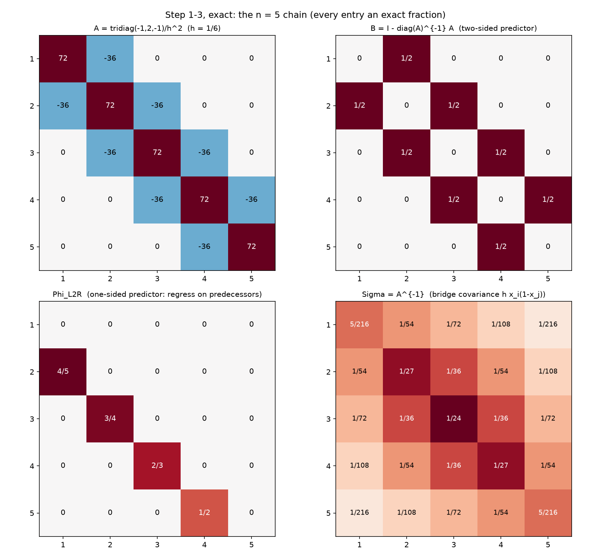
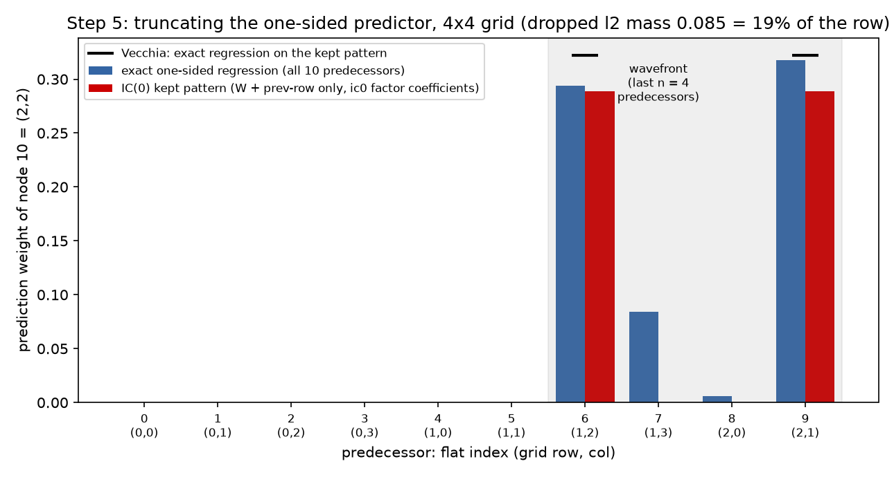
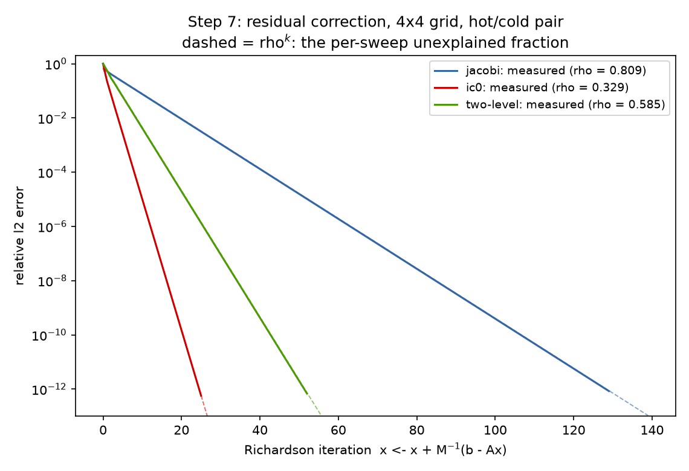
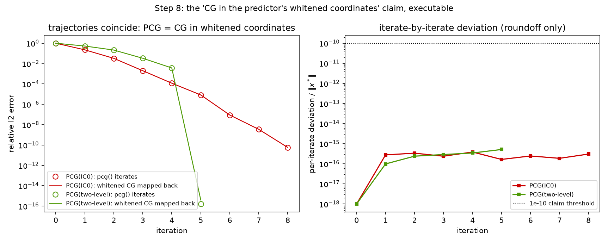

# Preconditioning Is Approximate Prediction

### The suite's capstone, run as a tutorial: eight steps from a 5-node chain in exact fractions to PCG-as-whitened-CG, every displayed number machine-generated

*The tutorial distillation of the suite. Reports [09](09-stiffness-as-precision.md)–[14](14-hierarchical-inverse.md) built the statistical reading of the solver stack in full generality; this report walks the same road in strict step-by-step form on the smallest possible examples — the $n = 5$ Dirichlet chain in **exact rational arithmetic**, then the $4\times4$ grid ($N = 16$) where truncation first bites — so that every object can be printed whole and checked by eye. Notation follows the companion Mathematica notebook `whitening_inverse_transposed.nb` (`~/git0/newton/`, Pourahmadi's regression parameterization), the suite's notation source since [09](09-stiffness-as-precision.md): $B$ the hollow two-sided regression matrix, `D2` the diagonal of inverse residual variances, the identity `precisionMat == (I - B).D2`, `mchol` the modified Cholesky $\Sigma = C D^2 C^\top$, `phiL2R` (regress coordinate $i$ on its predecessors) and `phiR2L` (regress on its successors). Every displayed matrix and every claim below is machine-generated and machine-checked by **two independent companion scripts**: [python/experiments/prediction_tutorial.py](../python/experiments/prediction_tutorial.py) (**43 PASS, 0 FAIL**, exact `Fraction` arithmetic for steps 1–4 and 6, floats only where the object is genuinely numeric; numbers in [results/prediction_tutorial.json](../results/prediction_tutorial.json)) and [mathematica/prediction_tutorial.wls](../mathematica/prediction_tutorial.wls) (**13 PASS, 0 FAIL**, exit 0, *all* arithmetic exact rational — no `N[]` anywhere — with function names `mchol`, `imchol`, `phiL2R`, `phiR2L`, `precisionMat`, `iiMat` mirroring the notebook and cited `(notebook: <name>)` in its comments). The displayed fractions are copied verbatim from the scripts' output. Each step states its goal in one sentence, shows the worked numbers, states the general fact they instantiate, and points to the suite report that develops it fully.*

---

The whole tutorial is one sentence, unpacked eight times:

> **A preconditioner is a prediction model for the unknown field; solving is subtracting predictions; the quality of a preconditioner is exactly the quality of its predictions.** Perfect prediction is a direct solve (Step 4). Every practical preconditioner is a *truncated* prediction — fewer regressors (Step 5) or coarser ones (Step 6) — and the iteration pays the unexplained remainder per sweep (Step 7), unless CG is spending it smarter in the predictor's whitened coordinates (Step 8).

---

## Step 1 — the chain, exact: put one solvable Gaussian on the table

**Goal:** write down the smallest nontrivial Poisson system and its inverse so explicitly that nothing later can hide. Take $n = 5$ interior nodes on $(0,1)$, $h = 1/6$, $x_i = i/6$, and $A = \mathrm{tridiag}(-1, 2, -1)/h^2$ — so $2/h^2 = 72$ and $-1/h^2 = -36$:

```
A =
    [  72   -36     0     0     0 ]
    [ -36    72   -36     0     0 ]
    [   0   -36    72   -36     0 ]
    [   0     0   -36    72   -36 ]
    [   0     0     0   -36    72 ]
Sigma = A^{-1}  (bridge formula Sigma_ij = h x_i (1-x_j), i<=j) =
    [ 5/216    1/54   1/72   1/108   1/216 ]
    [  1/54    1/27   1/36    1/54   1/108 ]
    [  1/72    1/36   1/24    1/36    1/72 ]
    [ 1/108    1/54   1/36    1/27    1/54 ]
    [ 1/216   1/108   1/72    1/54   5/216 ]
```

The upper triangle of $\Sigma$ is the closed form $\Sigma_{ij} = h\,x_i(1 - x_j)$ for $i \le j$ — checked against an independent exact Gauss–Jordan inverse **entry-by-entry in `Fraction` arithmetic, zero tolerance**, and $A\Sigma = I$ is verified as a matrix of exact rational identities (the Wolfram script re-proves both in rationals, writing the same formula as $h\min(x_i,x_j)(1-\max(x_i,x_j))$).

**The general fact:** $A$ is the precision matrix of the Gibbs field $u \sim \mathcal N(A^{-1}b, A^{-1})$, and its inverse is the Brownian-bridge covariance $h(\min(s,t) - st)$ sampled on the grid — sparse conditional structure, dense marginal structure. Developed in [09 §1–2](09-stiffness-as-precision.md); the rank-1-triangle reading of the same formula is [13 §3](13-preconditioning-as-decoupling.md), and its separator explanation [14 §2.2](14-hierarchical-inverse.md).

---

## Step 2 — two-sided prediction: every row of $A$ predicts one node from all the others

**Goal:** extract from $A$ the regression each node runs on the rest of the field — the notebook's $B$ and `D2`. Compute $B = I - \mathrm{diag}(A)^{-1}A$ and $D2 = \mathrm{diag}(A)$, both exact:

```
B  (row i = regression coefficients of u_i on all the others) =
    [   0   1/2     0     0     0 ]
    [ 1/2     0   1/2     0     0 ]
    [   0   1/2     0   1/2     0 ]
    [   0     0   1/2     0   1/2 ]
    [   0     0     0   1/2     0 ]
D2 (inverse residual variances = diag(A)) = diag(72, 72, 72, 72, 72)
```

$B$ is verified hollow (zero diagonal) with **exactly $1/2$ on both neighbors**, and the notebook's central identity holds as an exact rational identity: `precisionMat == (I - B).D2 == A`. One convention note, per [10 §3.1](10-fluctuation-dissipation.md): we write $B$ in the row (PDE/Jacobi) convention — row $i$ predicts $u_i$ — while the notebook's `getB` stacks the per-coordinate coefficient vectors as *columns* (the transpose, matching its data rule `x - x.B`); for a row-convention $B$ the identity in general form is $A = D2\,(I - B)$, and the notebook's order `(I - B).D2` matches here only because the constant diagonal $\mathrm{diag}(A) = 72\,I$ makes $B$ symmetric (both facts checked exactly). The worked row: $\mathbb E[u_3 \mid \mathrm{rest}] = (u_2 + u_4)/2$ with $\mathrm{Var}(u_3 \mid \mathrm{rest}) = 1/A_{33} = h^2/2 = 1/72$ exactly — and an **independent Schur-complement route** (regress $u_3$ on the other four via exact $\Sigma$ submatrices) reproduces the coefficients $(1/2, 1/2)$ on the neighbors and the conditional variance $1/72$, all in exact fractions. Two roads, one regression: read it off the precision row, or run the regression on the covariance.

**The general fact:** the precision matrix *is* a stack of full-conditional regressions — $\mathbb E[u_i \mid u_{-i}]$ averages the neighbors (the discrete mean-value property), $\mathrm{Var}(u_i \mid u_{-i}) = 1/A_{ii}$. And $B$ is *also* the Jacobi iteration matrix: Jacobi is this perfect two-sided predictor applied **synchronously** to stale values, which is why its regressions are individually exact yet its rate is $\cos(\pi h)$ — the schedule, not the model, is the failure. Developed in [09 §3](09-stiffness-as-precision.md) and priced as a bare rate in [12 §2](12-autoregressive-preconditioning.md) (trichotomy branch (i)).

---

## Step 3 — one-sided prediction: order the nodes and regress each on its past (or its future)

**Goal:** replace "predict from everyone else" by "predict from those already visited" — the causal model that can be *unwound*. Running the exact sequential regressions on $\Sigma$ submatrices (the notebook's `phiL2R`) gives, in exact fractions:

```
Phi_L2R (row i = exact regression of u_i on u_1..u_{i-1}) =
    [   0     0     0     0   0 ]
    [ 4/5     0     0     0   0 ]
    [   0   3/4     0     0   0 ]
    [   0     0   2/3     0   0 ]
    [   0     0     0   1/2   0 ]
d^2 (innovation variances, exact) = [ 5/216   1/45   1/48   1/54   1/72 ]
```

Four checked facts, each exact:

- **Markov:** only the immediate predecessor enters, with coefficient $(n+1-i)/(n+2-i)$: $4/5, 3/4, 2/3, 1/2$ for $i = 2..5$ — linear interpolation toward the pinned right wall ([09 §4.2](09-stiffness-as-precision.md), [10 §3.2](10-fluctuation-dissipation.md)).
- **Innovations:** $d_i^2 = h^2\,(n+1-i)/(n+2-i)$ exactly: $5/216, 1/45, 1/48, 1/54, 1/72$. The same ratio appears twice — for $i \ge 2$, $d_i^2 = h^2\varphi_i$: the innovation variance carries the regression coefficient.
- **Normal equations:** $A = (I - \Phi_{\mathrm{L2R}})^\top \mathrm{diag}(1/d^2)\,(I - \Phi_{\mathrm{L2R}})$ exactly in fractions.
- **Whitening:** $z = (I - \Phi_{\mathrm{L2R}})\,u$ has covariance $(I-\Phi)\Sigma(I-\Phi)^\top = \mathrm{diag}(d^2)$ — *exactly* diagonal, printed as exact fractions by the Wolfram script.

The mirror model regresses on successors (`phiR2L`):

```
Phi_R2L (row i = exact regression of u_i on u_{i+1}..u_n) =
    [ 0   1/2     0     0     0 ]
    [ 0     0   2/3     0     0 ]
    [ 0     0     0   3/4     0 ]
    [ 0     0     0     0   4/5 ]
    [ 0     0     0     0     0 ]
dR^2 (innovation variances, exact) = [ 1/72   1/54   1/48   1/45   5/216 ]
```

with coefficient $i/(i+1)$ on the immediate successor ($1/2, 2/3, 3/4, 4/5$) and its own exact normal equations $A = (I - \Phi_{\mathrm{R2L}})^\top \mathrm{diag}(1/d_R^2)(I - \Phi_{\mathrm{R2L}})$. The two directions are one story read both ways: the reversal identity $\mathrm{chol}(\Sigma) = P L^{-\top} P$ with $L = \mathrm{chol}(A)$ holds to max dev $2.8\times10^{-17}$, $L$'s columns encode `phiR2L` ($-L_{i+1,i}/L_{ii} = i/(i+1)$, checked), and `mchol`$(\Sigma) = C D^2 C^\top$ matches $C = (I - \Phi_{\mathrm{L2R}})^{-1}$, $D^2 = \mathrm{diag}(d^2)$ to max devs $2.2\times10^{-16}$ and $6.9\times10^{-18}$ (the Wolfram script proves the `mchol` identity in exact rationals, printing the unit-lower $C$ with rows like $\{1/5, 1/4, 1/3, 1/2, 1\}$).



*Steps 1–3 as annotated heatmaps, every entry printed as its exact fraction: $A$ (tridiagonal, $72/-36$), the hollow two-sided predictor $B$ (all $1/2$'s), the one-sided predictor $\Phi_{\mathrm{L2R}}$ (single subdiagonal $4/5, 3/4, 2/3, 1/2$ — Markov), and the dense bridge covariance $\Sigma$ (peak $1/24$ at the center).*

**The general fact:** Cholesky *is* sequential regression — fix an ordering, regress each variable on its predecessors (or successors), and the triangular factor stores coefficients while the diagonal stores innovation standard deviations; the covariance-side and precision-side factorizations are the same regressions read in opposite scan directions. Developed in [09 §4.2](09-stiffness-as-precision.md), measured in thermal noise in [10 §3](10-fluctuation-dissipation.md), and upgraded to the grid's 180°-rotation mirror in [11 §3](11-regressions-and-multiscale.md).

---

## Step 4 — perfect prediction *is* the direct solve

**Goal:** show that assembling the Step-3 regressions — never inverting $A$ — yields an operator that solves the system in one application. Build

$$M^{-1} \;=\; (I - \Phi)^{-1}\,\mathrm{diag}(d^2)\,(I - \Phi)^{-\top}$$

from the regression coefficients alone ($(I-\Phi)^{-1}$ is the exact inverse of a unit lower bidiagonal — back-substitution). Checked: $M^{-1} = \Sigma$ **exactly in fractions**. Now take $b = e_3$ (unit heat source at the center) and run one Richardson correction from $x_0 = 0$:

```
x* = M^{-1} e_3 (one Richardson step from x0 = 0) =
    [ 1/72   1/36   1/24   1/36   1/72 ]
```

Checked exactly: $x_1$ equals column 3 of $\Sigma$, i.e. $(1/72, 1/36, 1/24, 1/36, 1/72)$, and $A x_1 = e_3$ — one predict-and-correct pass *is* the solve (the Wolfram script reproduces the identical exact vector). The "iteration" converged because there was nothing left to iterate on: the model's unexplained fraction is zero.

**The general fact:** this is [12 §2](12-autoregressive-preconditioning.md)'s trichotomy branch (iii) — the perfect one-sided (causal, triangular) predictor converges in one step, because triangularity lets prediction become substitution: each node is solved given already-solved nodes. On the chain that unwinding is exactly the $O(n)$ Thomas algorithm = Kalman filter + RTS smoother = Gaussian belief propagation of [09 §5](09-stiffness-as-precision.md). The same perfect two-sided regressions of Step 2, scheduled synchronously, take 4777 sweeps at $n = 32$ ([12 §2](12-autoregressive-preconditioning.md)); the difference between one step and thousands is *scheduling, not model quality*.

---

## Step 5 — approximate prediction by truncation: drop regressors (IC(0) = truncated Vecchia)

**Goal:** move to 2-D — `poisson_2d(4)`, $N = 16$, $h = 1/5$, where $\kappa(A_2) = 9.4721 = \cot^2(\pi h/2)$ (checked) — and watch what happens when the one-sided predictor is *truncated to the stencil*. First the exact one-sided row of node $k = 10$ = grid $(2,2)$ (0-based), regressed on its ten predecessors:

```
    k= 6 (i,j)=(1,2):   0.2937  <- prev-row neighbor (1,2), KEPT by IC(0)
    k= 7 (i,j)=(1,3):   0.0843
    k= 8 (i,j)=(2,0):   0.0060
    k= 9 (i,j)=(2,1):   0.3178  <- W neighbor (2,1), KEPT by IC(0)
    innovation variance d^2 = 0.011747  (h^2/4 = 0.010000)
```

The row is supported **exactly on the last-$n$ wavefront**: max $\vert\text{weight}\vert$ on the six pre-wavefront predecessors is $7.2\times10^{-17}$ (the GMRF global Markov property — the wavefront separates node 10 from everything scanned earlier), and the exact predecessor row of node 10 equals the reversed exact successor row of the mirror node 5 via $PAP = A$ (max dev $1.7\times10^{-16}$). Conditioning on a half-plane instead of all four neighbors leaves $d^2 = 0.011747 > h^2/4 = 0.01$ — the one-sided innovation premium of [12 §3](12-autoregressive-preconditioning.md).

Now the three predictors on this row, measured:

| predictor | coefficient on W $(2,1)$ | coefficient on prev-row $(1,2)$ | source |
|---|---:|---:|---|
| exact one-sided regression | 0.3178 | 0.2937 | full wavefront |
| IC(0) (via the `ic0` factor, mirror column 5) | 0.2885 | 0.2885 | algebraic: match $A$ on its pattern |
| Vecchia (exact $\Sigma_2$ submatrices, same pattern) | 0.3224 | 0.3224 | statistical: KL-optimal on the pattern |

The truncation drops $\ell_2$ mass $0.0846$ = **19.2% of the full row's norm 0.4409** — real but subdominant to the kept W coefficient (checked). The assembled surrogate $M_{\mathrm{ic}} = (I - \tilde\Phi)^\top \mathrm{diag}(1/\tilde d^2)(I - \tilde\Phi)$ equals $L_{\mathrm{ic}}L_{\mathrm{ic}}^\top$ to $1.4\times10^{-14}$ — IC(0) *is* a truncated autoregression — but note the checked asymmetry: $P M_{\mathrm{ic}} P \ne M_{\mathrm{ic}}$ (max dev $1.06$) even though $PAP = A$. **Exact regression is reversal-equivariant; IC(0) is not** — a truncated recurrence remembers its elimination direction. And IC(0) vs Vecchia differ measurably: max coefficient deviation $4.99\times10^{-2}$ here (the same phenomenon [11 §4](11-regressions-and-multiscale.md) measured as $8.32\times10^{-2}$ at $n = 8$). Both still precondition:

| surrogate | $\mathrm{spec}(M^{-1}A_2)$ | $\rho(I - M^{-1}A_2)$ | $\kappa(M^{-1}A_2)$ |
|---|---|---:|---:|
| IC(0) | $[0.6714,\ 1.1295]$ | 0.3286 | 1.6824 |
| Vecchia | $[0.8178,\ 1.1971]$ | **0.1971** | **1.4639** |

against $\kappa(A_2) = 9.472$ — and the KL-optimal Vecchia coefficients win on both metrics (checked), the tutorial-sized confirmation of Schäfer–Katzfuss–Owhadi.



*The exact wavefront row of node 10 = $(2,2)$ (blue: weights 0.3178, 0.2937 on the stencil pair, 0.0843 and 0.0060 on the rest of the wavefront, exact zeros before it), the IC(0) kept pattern (red: 0.2885 on both), and the Vecchia coefficients on the same pattern (black dashes: 0.3224) — dropped $\ell_2$ mass 0.085 = 19% of the row.*

**The general fact:** IC(0) keeps only the stencil slots of the exact wavefront regression — the truncated one-sided regression = Vecchia approximation of [09 §6](09-stiffness-as-precision.md) and [11 §4](11-regressions-and-multiscale.md), with the measured IC-vs-Vecchia gap the boundary of that identification. What the dropped weights *are* is fill-in — marginalization-induced regressions on the elimination wavefront ([11 §3](11-regressions-and-multiscale.md), [13 §3](13-preconditioning-as-decoupling.md)) — and why they are small-but-nonzero is the separator-rank story of [14 §2](14-hierarchical-inverse.md): all dependence between a node and the far side of its wavefront is squeezed through the wavefront itself.

---

## Step 6 — approximate prediction by scale: fewer, coarser regressors

**Goal:** truncate along the other axis — predict each node not from *nearby* values but from *aggregate* ones. On the chain, regress the field on one scalar, its own mean $\bar u$; everything stays exact:

```
beta_i = Cov(u_i, ubar)/Var(ubar) (exact) = [ 5/7   8/7   9/7   8/7   5/7 ]
```

Checked exactly: $\mathrm{Var}(\bar u) = 7/360$, $\mathrm{Cov}(u_i, \bar u) = i(6-i)/360$, so the loadings $\beta_i = i(6-i)/7$ are **bridge-shaped** (max at the center, symmetric) and $\sum_i \beta_i = n = 5$. Subtracting the shaped prediction $\beta\,\bar u$ leaves the exact residual covariance

```
residual covariance Sigma - beta Cov(u, ubar)^T (exact) =
    [  5/378      1/378    -1/252     -5/756   -1/189 ]
    [  1/378     11/945   -1/1260   -13/1890   -5/756 ]
    [ -1/252    -1/1260     1/105    -1/1260   -1/252 ]
    [ -5/756   -13/1890   -1/1260     11/945    1/378 ]
    [ -1/189     -5/756    -1/252      1/378    5/378 ]
```

whose rows sum to zero exactly (the mean is fully predicted — the residual field is singular in the $\bar u$ direction), and the variance explained is **$111/175 = 0.6343$ exactly** — one scalar regressor carries 63% of the chain's variance. On the $4\times4$ grid the same ladder is measured in floats: global mean explains $0.2321$, the four $2\times2$ block averages $0.4958$ (the small-grid rerun of [11 §5.1](11-regressions-and-multiscale.md)'s $0.152 \to 0.567$ at $n = 8$, where the refined set is the sixteen $2\times2$-block averages). Assembling the coarse regression into the additive two-level preconditioner $M^{-1} = D^{-1} + Z A_c^{-1} Z^\top$ (Galerkin $A_c = Z^\top A Z$, `block_average_matrix` reused): $\mathrm{spec}(C_0 A) = [0.5000,\ 1.9082]$, $\kappa = 3.8165$ vs $9.4721$ plain, and with optimal damping $\theta = 0.8305$ the Richardson factor is $\rho = 0.5848$ (checked).

**The general fact:** coarse averages are *regressors chosen for reach rather than resolution* — they absorb exactly the long-range dependence that no stencil-width predictor can model, leaving a short-range residual for the local model; recursing the idea is multigrid. Developed in [11 §5](11-regressions-and-multiscale.md); the learned version — NAMG's attention weights as *learned coarse regressors* — is [06](06-neural-preconditioner.md) via [11 §5.3](11-regressions-and-multiscale.md).

---

## Step 7 — residual correction: iterate the imperfect prediction, pay $\rho$ per sweep

**Goal:** run all three imperfect predictors of Steps 5–6 as the bare predict-and-correct iteration $x \leftarrow x + M^{-1}(b - Ax)$ and confirm [12](12-autoregressive-preconditioning.md)'s pricing: the tail rate *is* $\rho(I - M^{-1}A)$, the per-sweep unexplained fraction. Problem: $b = +1$ at grid node $(1,1)$ and $-1$ at $(2,2)$ (1-based; flat indices 0 and 5) — a hot/cold source pair on the $4\times4$ grid. First eight iterations, relative $\ell_2$ error, from the script:

```
    iter   jacobi      ic0         two-level
      1   5.3025e-01  2.3003e-01  5.6769e-01
      2   4.1438e-01  7.5059e-02  2.9871e-01
      3   3.3399e-01  2.4394e-02  1.8110e-01
      4   2.7010e-01  8.0303e-03  1.0423e-01
      5   2.1850e-01  2.6358e-03  6.1351e-02
      6   1.7677e-01  8.6645e-04  3.5776e-02
      7   1.4301e-01  2.8469e-04  2.0945e-02
      8   1.1570e-01  9.3560e-05  1.2242e-02
```

Measured tail rate vs. exact $\rho(I - M^{-1}A)$, all agreeing within 1% relative (in fact to $\sim10^{-5}$):

| $M^{-1}$ | measured tail rate | $\rho(I - M^{-1}A)$ | iterations to $10^{-10}$ |
|---|---:|---:|---:|
| Jacobi | 0.809025 | $0.809017 = \cos(\pi/5)$ | 107 |
| IC(0) | 0.328630 | 0.328625 | 21 |
| two-level | 0.584761 | 0.584760 | 43 |

and the rate ladder matches prediction quality (checked): $\rho_{\mathrm{ic0}} < \rho_{\text{two-level}} < \rho_{\mathrm{jacobi}}$ ($0.329 < 0.585 < 0.809$). On a 16-node problem the stencil regressions of IC(0) are close to the whole story, so IC(0) leads; at $n = 32$ the composite of both axes wins ([11 §5.2](11-regressions-and-multiscale.md)).



*Each solid error curve rides its dashed $\rho^k$ reference: Jacobi at $\rho = 0.809$, two-level at $0.585$, IC(0) at $0.329$ — the measured slopes match the spectral radii to five decimals, [12 §1](12-autoregressive-preconditioning.md)'s "$\rho$ = per-sweep unexplained fraction" verified on the tutorial grid.*

**The general fact:** for any fixed $C$, the error obeys $e_{k+1} = (I - CA)e_k$, so a stationary iteration converges at exactly the fraction of structure its predictor fails to explain per look — [12](12-autoregressive-preconditioning.md)'s frame, of which this step is the $N = 16$ miniature (Jacobi's $\cos(\pi h)$, IC(0)'s truncation gap, the additive two-level's $0.9024$ all live in [12 §4](12-autoregressive-preconditioning.md)'s ladder at $n = 32$).

---

## Step 8 — the CG interaction: PCG *is* CG in the predictor's whitened coordinates (executable)

**Goal:** put CG back and make the suite's oldest asserted identity — "PCG = CG run in the surrogate's whitened coordinates" ([09 §6](09-stiffness-as-precision.md), [13 §5.4](13-preconditioning-as-decoupling.md)) — **executable, iterate by iterate**, rather than an algebra fact quoted from textbooks. This is the step's (and the report's) novel demonstration.

Counts first, same hot/cold problem, relative residual $10^{-10}$: **CG 7, PCG(IC0) 8, PCG(two-level) 5.** (PCG(IC0) $8 > $ CG $7$ is a finite-termination artifact, flagged in the script's info line: at $N = 16$ plain CG already finite-terminates on the few distinct eigenvalues of $A_2$; IC(0)'s $\kappa$ payoff is at scale — [08](08-results.md)/[11](11-regressions-and-multiscale.md).)

Now the identity. For each preconditioner, factor the surrogate and run *plain* CG on the split-preconditioned system, then map every iterate back:

- **IC(0):** $M = L_{\mathrm{ic}}L_{\mathrm{ic}}^\top$; run CG on $L_{\mathrm{ic}}^{-1} A\, L_{\mathrm{ic}}^{-\top}$ with right-hand side $L_{\mathrm{ic}}^{-1}b$, map back $x = L_{\mathrm{ic}}^{-\top}\hat x$. Result: the mapped-back trajectory equals the `pcg()` trajectory at **every** iterate — max relative deviation $3.9\times10^{-16}$ over all 9 iterates, identical iteration count ($8 = 8$).
- **two-level:** here the *inverse* is what is in hand, $M^{-1} = C_0 = RR^\top$ (Cholesky of $C_0$); run CG on $R^\top A R$ with $R^\top b$, map back $x = R\hat x$. Same verdict: max relative deviation $5.2\times10^{-16}$, identical count ($5 = 5$).

Eight orders of magnitude below the $10^{-10}$ claim threshold, at every single iterate, for two structurally different predictors: PCG is not "like" CG on the whitened problem — it **is** CG on the whitened problem, executed in the original coordinates. The preconditioner's entire role is to hand CG the coordinates its prediction model believes are white; CG then does its own, adaptive part: the increments $x_{k+1} - x_k$ of the plain-CG run are verified $A$-orthogonal to max normalized off-diagonal $3.8\times10^{-14}$ over 7 directions — [13 §5.4](13-preconditioning-as-decoupling.md)'s on-the-fly sequential decoupler, [09 §5](09-stiffness-as-precision.md)'s regression on measurements uncorrelated under the field, building at run time the same kind of uncorrelated basis that Cholesky builds ahead of time (Step 3).



*Left: `pcg()` iterates (open circles) sit exactly on the whitened-CG-mapped-back curves for both PCG(IC0) (red, 8 iterations) and PCG(two-level) (green, 5). Right: the per-iterate deviation never leaves the $10^{-16}$ floor — $3.9\times10^{-16}$ (IC0) and $5.2\times10^{-16}$ (two-level) at worst, eight orders below the $10^{-10}$ claim threshold (dotted): the identity holds to roundoff, iterate by iterate.*

**The general fact:** with $M = L_M L_M^\top$, split-preconditioned CG solves $(L_M^{-1}AL_M^{-\top})\hat u = L_M^{-1}b$, and $\kappa(M^{-1}A)$ — tempered by clustering — prices the surrogate's model mismatch. Developed in [09 §6](09-stiffness-as-precision.md), [04](04-krylov-and-pcg.md) (why clustering beats $\kappa$), and [13 §5](13-preconditioning-as-decoupling.md) (pre-decoupling and on-the-fly decoupling compose).

---

## Synthesis: the eight steps, three vocabularies, one suite

Extending [09 §8](09-stiffness-as-precision.md)'s dictionary, one row per step — the statistics name, the physics name, and where the suite develops it at full scale:

| step | numerics object | statistics name | physics name | developed in |
|---|---|---|---|---|
| 1 | $A$ and $\Sigma = A^{-1}$, exact | precision matrix; Brownian-bridge covariance | Dirichlet energy; Gibbs measure; Green's function of the pinned rod | [09 §1–2](09-stiffness-as-precision.md), [13 §3](13-preconditioning-as-decoupling.md), [14 §2.2](14-hierarchical-inverse.md) |
| 2 | $B = I - \mathrm{diag}(A)^{-1}A$, `D2`; `precisionMat == (I-B).D2` (row/column convention note in Step 2) | full-conditional regressions; $\mathrm{Var} = 1/A_{ii}$ | mean-value property; synchronous heat-bath sweep (Jacobi) | [09 §3](09-stiffness-as-precision.md), [12 §2](12-autoregressive-preconditioning.md) |
| 3 | `phiL2R`/`phiR2L`, `mchol`, $\mathrm{chol}(\Sigma) = PL^{-\top}P$ | sequential (Pourahmadi) regression; innovations $d^2$; whitening | node-by-node decimation; transfer along the chain, both directions | [09 §4](09-stiffness-as-precision.md), [10 §3](10-fluctuation-dissipation.md), [11 §3](11-regressions-and-multiscale.md) |
| 4 | $M^{-1} = (I-\Phi)^{-1}\mathrm{diag}(d^2)(I-\Phi)^{-\top} = \Sigma$; one-step Richardson | perfect causal AR: zero unexplained fraction | exact decimation = direct solve; Thomas/Kalman pass | [12 §2](12-autoregressive-preconditioning.md) (iii), [09 §5](09-stiffness-as-precision.md) |
| 5 | IC(0) as truncated wavefront regression; Vecchia on the same pattern | truncated conditioning sets (Vecchia); KL-optimal sparse factor | short-range effective Hamiltonian; dropped fill = screened couplings | [11 §3–4](11-regressions-and-multiscale.md), [13 §3](13-preconditioning-as-decoupling.md), [14 §2](14-hierarchical-inverse.md) |
| 6 | coarse loadings $\beta$; $M^{-1} = D^{-1} + ZA_c^{-1}Z^\top$ | regression on aggregates; variance explained $111/175$, $0.232 \to 0.496$ | block spins; coarse-grained field; multigrid's coarse level | [11 §5](11-regressions-and-multiscale.md), [06](06-neural-preconditioner.md) |
| 7 | stationary Richardson; measured tail = $\rho(I - M^{-1}A)$ | per-sweep unexplained fraction of the predictor | relaxation rate; critical slowing down as $h \to 0$ | [12 §1, §4](12-autoregressive-preconditioning.md) |
| 8 | PCG $\equiv$ CG on $L_M^{-1}AL_M^{-\top}$, verified to $3.9\times10^{-16}$/iterate | CG = sequential regression on uncorrelated measurements, run in the surrogate's whitened coordinates | on-the-fly decoupling; one whitened scale per (cluster of) eigenvalue | [09 §5–6](09-stiffness-as-precision.md), [04](04-krylov-and-pcg.md), [13 §5.4](13-preconditioning-as-decoupling.md) |

---

**Coda: the ladder.** Read bottom-up, the eight steps are one ascending ladder of prediction models, and the suite has now measured every rung. **Exact prediction** — all predecessors, coefficients from the true covariance — is a direct solve: one pass, nothing unexplained (Step 4; [12](12-autoregressive-preconditioning.md)). **Truncated prediction** — keep the stencil slots of the wavefront — is IC(0)/Vecchia: 19% of this row's mass dropped, $\rho = 0.33$ per sweep here, the fill you refused to compute returning as a smooth ghost at scale (Step 5; [11](11-regressions-and-multiscale.md)). **Multiscale prediction** — spend the regressor budget on averages at every reach — is the two-level method and, recursed, multigrid: the one rung whose rate survives $h \to 0$ (Step 6; [11 §5.3](11-regressions-and-multiscale.md), [12 §4](12-autoregressive-preconditioning.md)). **Learned prediction** — let training data choose the conditioning sets and coefficients — is the fitted Vecchia of [10 §5](10-fluctuation-dissipation.md) and the NPO/NAMG of [06](06-neural-preconditioner.md), whose learned restriction is Step 6's coarse regressors chosen by gradient descent instead of geometry. Each rung is the same object — a regression of every node on what the model can afford to condition on — and the two numbers this tutorial taught you to read, $\rho(I - M^{-1}A)$ per sweep and the whitened spectrum CG sees, are the exchange rate between statistical modeling and iteration count. Preconditioning is approximate prediction; the only question a preconditioner ever answers is *who predicts me, and how well*.
